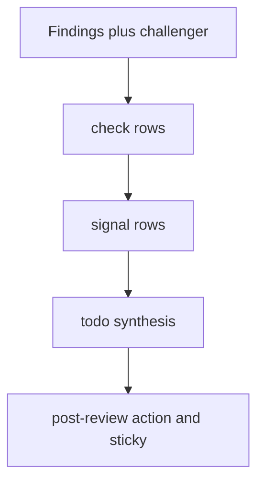

# PR review architecture

Architecture and workflow for Fullsend PR review in this repository.
[`SKILL.md`](SKILL.md) is the orchestrator runbook: it dispatches by **output
kind** only and must not special-case producer names. Named inventory (labels,
dimensions, schema fields, disposition) lives here and in the linked registry /
schema / host scripts.

**Maintenance:** when changing labels, dimensions, the result schema,
meta-prompts, sticky layout, or host disposition, update this file in the same
change set.

## Pipeline

1. A GitHub event matches the opt-in gate: the PR has `fullsend`, plus a trigger
   listed under [Invocation](#invocation).
2. Host adapters (workflow jobs / `pre-review`) write trusted JSON under
   `.fullsend/.run/` (and `collected.json`). The orchestrator never invokes those
   CLIs itself.
3. The orchestrator reads [`.fullsend/dimensions.json`](../../dimensions.json),
   selects rows by `dispatch` / `when` / `re_review`, and records a producer
   ledger before results are known.
4. Selected **`findings`** LLM rows run in parallel with selected **`section:*`**
   rows. CLI **`findings`** / **`context`** envelopes are loaded from disk.
5. The **challenger** adjudicates the merged **findings** set only (not checks,
   not signals, not sections).
6. Every selected **`check:*`** row runs. Shared output contract:
   [`check-output.md`](../../meta-prompts/check-output.md).
7. Every selected **`signal:*`** row runs **after** all checks. Shared output
   contract: [`signal-output.md`](../../meta-prompts/signal-output.md). Each row
   projects `result_fields` onto the review result.
8. The orchestrator synthesizes `todo[]` from the assembled report (findings,
   checks, signals, product ask), then writes `agent-result.json`.
9. [`post-review.sh`](../../scripts/post-review.sh) computes internal `action`,
   renders the sticky comment body, posts the GitHub review, and applies at most
   one outcome label.



### Sticky comment order

Visible sections, in order:

1. Header (action, head SHA, run metadata)
2. Change summary
3. Status
4. Signals (risk / confidence table)
5. Checks (readiness table; omit when empty)
6. Findings (omit when empty)
7. Product ask (omit when `status` is `none`)
8. TODO (omit when empty)
9. Collapsed **Review details**: Producers (with Notes), Challenger, Evidence
   inspected, Labels

Producer **Ran** icons (ledger + `collected.json` for adapters):

| Icon | Meaning |
| --- | --- |
| ✅ | Ran (LLM dispatched, or adapter envelope `status: ok`) |
| ⚪ | Adapter unavailable (`none` / `skipped` — not a clean zero-finding run) |
| ❌ | Adapter `status: error` |
| ➖ | Orchestrator skipped (out of scope / re_review) |
| ❔ | Missing ledger, missing adapter envelope, or unrecognized status |

## Labels

| Label | Applied by | Role |
| --- | --- | --- |
| `fullsend` | Temporary review opt-in | Gate for the workflow while Fullsend is opt-in. Applying it alone on `labeled` does not start a review. |
| `ready-for-review` | Review readiness | With `fullsend`, a `labeled` event starts a run. |
| `fullsend-no-fix` | Fix control | Disables the fix agent. |
| `fullsend-fix` | Fix control | Fix-agent marker. Not set via agent `label_actions`. |
| `ready-for-merge` | Host (post-review) | Internal `approve`, not draft, not a protected-path downgrade. Merge remains a separate step. |
| `requires-manual-review` | Host (post-review) | Internal `comment`, or approve downgraded for draft / protected paths. |
| `rejected` | Host (post-review) | Internal `reject` from finding category `approach-rejected`. PR is closed. |

Internal `request-changes` (blocking findings **or** a check with `status:
fail`) posts GitHub `CHANGES_REQUESTED` and applies **no** outcome label. Sticky
Status uses “Waiting on author” prose.

Control labels that must not appear in agent `label_actions`:
`ready-for-merge`, `requires-manual-review`, `rejected`, `ready-for-review`,
`fullsend-no-fix`, `fullsend-fix`.

### Internal action vs GitHub review vs outcome label

| Internal `action` | Typical sticky Status | Outcome label | GitHub review |
| --- | --- | --- | --- |
| `approve` | Agent bar cleared | `ready-for-merge` (unless draft / protected-path downgrade → `requires-manual-review`) | APPROVE |
| `comment` | Needs judgment / cannot approve | `requires-manual-review` | COMMENT |
| `request-changes` | Waiting on author | none | CHANGES_REQUESTED |
| `reject` | Approach rejected | `rejected` | reject path + close |
| `failure` | Review did not complete | none | failure comment |

## Disposition rules

### Findings

Host blocking: severity `medium` and above, except categories excluded in
[`.fullsend/rating-policy.json`](../../rating-policy.json) (today:
`protected-path` → needs judgment / `comment`, not author `request-changes`).
`low` / `info` can ride with `approve`. Category `approach-rejected` → `reject`.

### Checks

| Check `status` | Host disposition |
| --- | --- |
| `pass`, `warning`, `not-applicable` | No effect on `action` |
| `fail` | `request-changes`; refuse approve |
| `could-not-verify` | Refuse approve; `comment` → `requires-manual-review`; also caps high confidence via incompleteness |

### Signals (`risk` / `confidence`)

Refuse approve (→ `comment`, not `request-changes`) when levels match
`rating-policy.json` refuse sets. Host may still floor confidence for product-ask
mismatch or incomplete checks; it does not invent risk.

### TODO synthesis (orchestrator)

Closed recipe after the report is assembled (kind/status-driven, not producer-id
branches):

1. Blocking findings → remediation / location pointers
2. Check `fail` → that check’s summary
3. Check `could-not-verify`, refuse-approve levels from `rating-policy.json`, section `needs_human` → concrete follow-ups
4. Actionable low/info nits when the path would otherwise approve

Omit `todo` when empty. Sticky bullets only — no `[ ]` task-list syntax.

## Dimensions

### Output kinds

| `output` | Role | Timing | Meta-prompt |
| --- | --- | --- | --- |
| `findings` | Code defects → challenger | Parallel (LLM + CLI envelopes) | `findings-output.md` |
| `context` | Trusted host snapshot | Host adapter only | none |
| `section:*` | Schema object (e.g. `product_ask`) | Parallel with findings | `section-output.md` |
| `check:*` | Readiness row → `checks[]` | After findings/challenger; before signals | `check-output.md` |
| `signal:*` | Schema members from `result_fields` | After all selected checks | `signal-output.md` |

`result_fields` names the schema properties a `section:*` or `signal:*` row
projects onto the result. For `section:*`, if omitted, default to the name after
`section:`. For `signal:*`, `result_fields` is required.

### Registry inventory

Keep this table aligned with [`.fullsend/dimensions.json`](../../dimensions.json).
**Stock** = shipped in [fullsend-ai/agents `skills/pr-review`](https://github.com/fullsend-ai/agents/tree/91f61f3441baedf3f912c9afd4bd574c98793b96/skills/pr-review)
at harness pin `91f61f3`. Everything else is an ODH overlay producer.

| id | output | source | definition / runner |
| --- | --- | --- | --- |
| correctness | `findings` | stock | `sub-agents/correctness.md` |
| security | `findings` | stock | `sub-agents/security.md` |
| intent-coherence | `findings` | stock | `sub-agents/intent-coherence.md` |
| style-conventions | `findings` | stock | `sub-agents/style-conventions.md` |
| style-review | `findings` | ODH | `sub-agents/style-review/SKILL.md` |
| rbac-review | `findings` | ODH | `sub-agents/rbac-review/SKILL.md` |
| docs-currency | `findings` | stock | `sub-agents/docs-currency.md` |
| cross-repo-contracts | `findings` | stock | `sub-agents/cross-repo-contracts.md` |
| jira-snapshot | `context` | ODH | `scripts/fetch-jira-context.sh` |
| coderabbit | `findings` | ODH | `scripts/fetch-coderabbit-context.sh` |
| product-ask-review | `section:product_ask` | ODH | `sub-agents/product-ask-review/SKILL.md` |
| test-impact-review | `check:test-impact` | ODH | `sub-agents/test-impact-review/SKILL.md` |
| pr-description-review | `check:pr-description` | ODH | `sub-agents/pr-description-review/SKILL.md` |
| rating | `signal:rating` (`risk`, `confidence`) | ODH | `sub-agents/rating.md` |

### Adding a producer

1. Add a definition under `sub-agents/` (or a host `scripts/*.sh` for
   `cli-adapter`).
2. Add a row to `dimensions.json` with the correct `output` kind and
   `meta_prompt` / `result_fields` as required.
3. Run `.fullsend/scripts/validate-dimensions.sh`.
4. Update the inventory table above.

Do **not**:

- Add a per-producer output schema (reuse `check-output.md` / `signal-output.md`
  / `section-output.md` / `findings-output.md`).
- Teach [`SKILL.md`](SKILL.md) the new producer id (no “run rating”, no
  “if test-impact…” branches). Kind-level dispatch only.
- Route checks or signals through the challenger.

## Invocation

Workflow: [`.github/workflows/fullsend.yaml`](../../../.github/workflows/fullsend.yaml).
The PR must already have `fullsend`. Additional triggers:

- `opened`, `synchronize`, `ready_for_review`
- `labeled` with `ready-for-review` (not with `fullsend` alone)
- issue comment body exactly `/fs-review`
- `changes_requested` review (fix path)

Local contract checks (no GitHub API):

```bash
.fullsend/scripts/validate-dimensions.sh
.fullsend/scripts/post-review.sh --self-test
```

**Pipeline mode:** `FULLSEND_OUTPUT_DIR` is set. Orchestrator writes
`$FULLSEND_OUTPUT_DIR/agent-result.json` (omit `action` / `body` on success;
host fills both). Host `post-review.sh` posts and labels.

**Interactive mode:** `FULLSEND_OUTPUT_DIR` unset. Orchestrator posts via
`gh pr review` per `SKILL.md` (dev path; CI uses pipeline mode).

## Report schema

Canonical schema: [`.fullsend/schemas/review-result.schema.json`](../../schemas/review-result.schema.json).

| Field | Written by | Notes |
| --- | --- | --- |
| `pr_number`, `repo`, `head_sha`, `schema_version` | Orchestrator | Identity |
| `change_summary` | Orchestrator | From shared PR context, not prior-review text |
| `findings[]` | Findings producers + challenger | Code defects |
| `product_ask` | `section:product_ask` | Omit sticky section when `none` |
| `checks[]` | `check:*` rows | Readiness; disposition-affecting |
| `risk`, `confidence` | `signal:*` via `result_fields` | Sticky Signals table |
| `todo[]` | Orchestrator final pass | Sticky TODO; omit when empty |
| `inspected` | Orchestrator (+ host reconcile) | Producers / could_not_verify |
| `label_actions` | Optional enrichment | Control labels stripped by host |
| `action`, `body` | Host | Disposition + sticky markdown |

## Meta-prompts

Compose after `common-review.md` for every LLM row:

| File | Kind |
| --- | --- |
| [`common-review.md`](../../meta-prompts/common-review.md) | Shared preface |
| [`findings-output.md`](../../meta-prompts/findings-output.md) | `findings` |
| [`section-output.md`](../../meta-prompts/section-output.md) | `section:*` |
| [`check-output.md`](../../meta-prompts/check-output.md) | `check:*` |
| [`signal-output.md`](../../meta-prompts/signal-output.md) | `signal:*` (producer contract) |

## Related files

| Path | Role |
| --- | --- |
| [`SKILL.md`](SKILL.md) | Orchestrator runbook (kind dispatch) |
| [`.fullsend/dimensions.json`](../../dimensions.json) | Producer registry |
| [`.fullsend/rating-policy.json`](../../rating-policy.json) | Host risk/confidence floors and blocking severity |
| [`.fullsend/scripts/post-review.sh`](../../scripts/post-review.sh) | Action, sticky, labels, self-tests |
| [`.fullsend/scripts/pre-review.sh`](../../scripts/pre-review.sh) | Host preflight / adapter prep |
| [`.fullsend/scripts/validate-dimensions.sh`](../../scripts/validate-dimensions.sh) | Registry contract |
| [`.github/workflows/fullsend.yaml`](../../../.github/workflows/fullsend.yaml) | Event routing |
