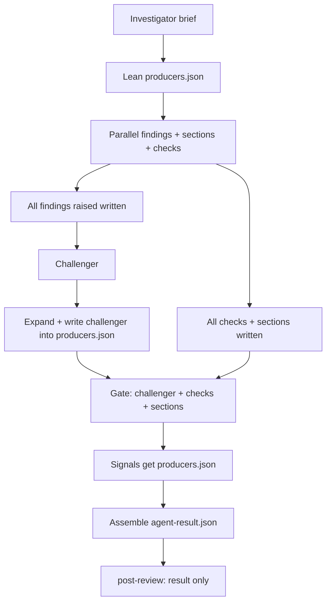

# PR review architecture

Architecture and workflow for Fullsend PR review in this repository.
[`SKILL.md`](SKILL.md) is the orchestrator runbook: it dispatches by **output
kind** only and must not special-case producer names. Named inventory (labels,
dimensions, schema fields, disposition) lives here and in the linked registry /
schema / host scripts.

**Maintenance:** when changing labels, dimensions, the result schema,
meta-prompts, sticky layout, or host disposition, update this file in the same
change set.

## Pipeline

1. A GitHub event matches the opt-in gate: the PR has `fullsend`, plus a trigger
   listed under [Invocation](#invocation).
2. Host adapters (workflow jobs / `pre-review`) write trusted JSON under
   `.fullsend/.run/` (and `collected.json`). The orchestrator never invokes those
   CLIs itself.
3. The orchestrator reads [`.fullsend/dimensions.json`](../../dimensions.json),
   selects rows by `dispatch` / `when` / `re_review`, and writes a lean
   `producers.json` ledger before results are known. A **`context`** LLM row
   with `stage: pre-dispatch` runs here, alone; its brief is written under
   `context/` and every later LLM reviewer is told to read it. The
   challenger is not.
4. Selected **`findings`**, **`section:*`**, and **`check:*`** LLM rows run
   **together** (required). CLI **`findings`** / **`context`** envelopes are
   loaded from disk; adapter status is transferred into `producers.adapters`.
   As each return arrives, the orchestrator rewrites `producers.json`
   (`raised`, checks, sections, `returned`).
5. After **all findings** are raised, the **challenger** adjudicates the
   merged findings set only. The orchestrator expands stub
   `removed_findings` and writes the expanded `challenger` object into
   `producers.json` (checks/sections may still be in flight).
6. After challenger + all sections + all checks, every selected
   **`signal:*`** row runs with the **`producers.json` path** (file contract:
   ledger + raised history + checks/sections + challenger). Shared output
   contract: [`signal-output.md`](../../meta-prompts/signal-output.md).
7. The orchestrator synthesizes `todo[]`, assembles `agent-result.json` from
   `producers.json` (including `result.producers`), and validates.
8. [`post-review.sh`](../../scripts/post-review.sh) reads **`agent-result.json`
   only**, computes internal `action`, renders the sticky comment body, posts
   the GitHub review, and applies at most one outcome label.



### Sticky comment order

Visible sections, in order:

1. Header (action, head SHA, run metadata)
2. Change summary
3. Status
4. Signals (risk / confidence table)
5. Checks (readiness table; omit when empty)
6. Findings (omit when empty; includes severity groups then `### Justified` when present)
7. Product ask (omit when `status` is `none`)
8. TODO (omit when empty; plain-text category labels Findings / Checks /
   Judgement / Nits)
9. Collapsed **Review details**: Producers, Challenger (counts + removed
   audit), Evidence inspected, Labels

### Producers table

Host-rendered provenance under Review details. Sourced from
`result.producers` only (no side ledger / `collected.json` at post time).

| Column | Meaning |
| --- | --- |
| Producer | Human `label` from [`dimensions.json`](../../dimensions.json) (fallback: registry id) |
| Type | Lowercase output kind: `findings`, `check`, `signal`, `section`, `context` (unknown → `—`) |
| Ran | Dispatch / adapter status icon (see below) |
| Result | Kind-aware one-line outcome (not a second Status table) |

**Type resolution:** registry `output` for the dimension id. Collapse
`check:*` / `signal:*` / `section:*` to the prefix before `:`.

**Result by Type:**

| Type | Result cell |
| --- | --- |
| `findings` | As-raised from `producers.raised.<id>`: `N findings: cat1, cat2` or `No findings.` (not post-challenger survivors) |
| `check` | `pass — <summary>` (status + summary); skipped rows use the skip reason |
| `signal` | `risk high · confidence medium` from `result_fields` levels (no `why` prose) |
| `section` | e.g. `product_ask aligned` from each `result_fields` member’s `status` |
| `context` | `Context available.` / adapter reason token / unavailable defaults |
| skipped / unverified | Skip or unverified reason in Result; Type still resolved when known |

Check and signal Result cells intentionally overlap Status → Checks / Signals
for provenance. Status remains the primary outcome surface.

**Challenger audit:** when `producers.challenger.removed_findings` is
non-empty, a collapsed section under Challenger renders non-justified items
like findings, with an audit-only / must-ignore disclaimer and each
`removal_reason`. Disposition and `## Findings` use survivor `findings[]`
only. Host warns if `challenger.removed` ≠ audit list length.

**Justified findings:** items in `removed_findings` with
`challenger_action: justified` are rendered under `## Findings` →
`### Justified (N)` (after the severity groups), not in the Challenger
removed audit. Each shows the original severity, description, and
`removal_reason` labeled as a justification. A fixed disclaimer notes
these do not block disposition. The section is wrapped in HTML markers
(`<!-- fullsend:justified-findings -->`) for downstream tooling.

### PR Justifications

Authors may challenge review findings or testing expectations via a
`## Justifications` section in the PR body. Justifications participate
in two places only:

| Channel | How Justifications are used |
| --- | --- |
| **Challenger** (findings) | If a justification adequately rebuts a finding against the diff, the challenger marks it `challenger_action: justified` and it follows the removed path — visible under `### Justified` with the challenger's reason, but not disposition-blocking. Insufficient justifications leave the finding at its original severity. Host policy categories (`protected-path`, `approach-rejected`) cannot be justified; the host restores them into `findings[]` if mistagged. |
| **test-impact** (check) | A sufficient constraint justification in the Evidence section (why tests could not be added, what alternative verification exists) adjusts Automation/Efficiency scoring to ⚠️ instead of ❌. When Automation is ⚠️ solely because there are no tests, Efficiency stays ➖. Evidence depth still requires verification proof in the description. |

Justifications are **not** a shared ruleset applied to every producer.
Rating, pr-description-review, and other producers are not affected.
Product-ask already has its own `mismatch-justified` path.

Producer **Ran** icons (`result.producers`):

| Icon | Meaning |
| --- | --- |
| ✅ | Ran (LLM dispatched, or adapter `status: ok` on `producers.adapters`) |
| ⚪ | Adapter unavailable (`none` / `skipped` — not a clean zero-finding run) |
| ❌ | Adapter `status: error` |
| ➖ | Orchestrator skipped (out of scope / re_review) |
| ❔ | Missing `result.producers`, missing adapter status, or unrecognized status |

## Labels

| Label | Applied by | Role |
| --- | --- | --- |
| `fullsend` | Temporary review opt-in | Gate for the workflow while Fullsend is opt-in. Applying it alone on `labeled` does not start a review. |
| `ready-for-review` | Review readiness | With `fullsend`, a `labeled` event starts a run. |
| `fullsend-no-fix` | Fix control | Disables the fix agent. |
| `fullsend-fix` | Fix control | Fix-agent marker. Not set via agent `label_actions`. |
| `ready-for-merge` | Host (post-review) | Internal `approve`, not draft, not a protected-path downgrade. Merge remains a separate step. |
| `requires-manual-review` | Host (post-review) | Internal `comment`, or approve downgraded for draft / protected paths. |
| `rejected` | Host (post-review) | Internal `reject` from finding category `approach-rejected`. PR is closed. |

Internal `request-changes` (blocking findings **or** a check with `status:
fail`) posts GitHub `CHANGES_REQUESTED` and applies **no** outcome label. Sticky
Status uses “Waiting on author” prose.

Control labels that must not appear in agent `label_actions`:
`ready-for-merge`, `requires-manual-review`, `rejected`, `ready-for-review`,
`fullsend-no-fix`, `fullsend-fix`.

### Internal action vs GitHub review vs outcome label

| Internal `action` | Typical sticky Status | Outcome label | GitHub review |
| --- | --- | --- | --- |
| `approve` | Agent bar cleared | `ready-for-merge` (unless draft / protected-path downgrade → `requires-manual-review`) | APPROVE |
| `comment` | Needs judgment / cannot approve | `requires-manual-review` | COMMENT |
| `request-changes` | Waiting on author | none | CHANGES_REQUESTED |
| `reject` | Approach rejected | `rejected` | reject path + close |
| `failure` | Review did not complete | none | failure comment |

## Disposition rules

### Findings

Host blocking: severity `medium` and above, except categories excluded in
[`.fullsend/rating-policy.json`](../../rating-policy.json) (today:
`protected-path` → needs judgment / `comment`, not author `request-changes`).
`low` / `info` can ride with `approve`. Category `approach-rejected` → `reject`.

### Checks

| Check `status` | Host disposition |
| --- | --- |
| `pass`, `warning`, `not-applicable` | No effect on `action` |
| `fail` | `request-changes`; refuse approve |
| `could-not-verify` | Refuse approve; `comment` → `requires-manual-review`; also caps high confidence via incompleteness |

#### Test impact vs PR description (Evidence)

| Check | Role |
| --- | --- |
| `pr-description-review` | Surface: Problem / Solution / Evidence — is meaningful test evidence present on the face of the PR body? |
| `test-impact-review` | Depth: **Automation**, **Efficiency**, **Evidence depth** — durable automation (incl. edge cases); efficient tier (unit over Cypress mock; heavy Cypress / unit-light fails unless the description justifies); dig into proof so it covers the change and protects integrity while tests stay green. Missing description call-out → Evidence depth `fail` even if tests exist in the tree. |

`test-impact-review` may return **`fail`**, which maps to `request-changes`. Per-aspect N/A: Automation/Efficiency may be N/A for non-product-code heads (lockfile/manifest/docs with nothing to unit-test), or when there are no tests to evaluate for Efficiency; **Evidence depth remains required** for those heads. Do not N/A the whole check solely because the change is non-code.

### Signals (`risk` / `confidence`)

Refuse approve (→ `comment`, not `request-changes`) when levels match
`rating-policy.json` refuse sets. Host may still floor confidence for product-ask
mismatch or incomplete checks; it does not invent risk.

### TODO synthesis (orchestrator)

Closed recipe after the report is assembled (kind/status-driven, not producer-id
branches). Prefer `{category,text}` objects:

1. `findings` — blocking findings → remediation / location pointers
2. `checks` — check `fail` → that check’s summary
3. `judgement` — check `could-not-verify`, refuse-approve levels from `rating-policy.json`, section `needs_human` → concrete follow-ups
4. `nits` — one bullet per `low`/`info` finding with `actionable: true` (whenever
   such findings exist, not only on otherwise-approve paths)

Omit `todo` when empty. Sticky bullets only — no `[ ]` task-list syntax. Host
renders category labels as plain text (not markdown headers).

## Dimensions

### Output kinds

| `output` | Role | Timing | Meta-prompt |
| --- | --- | --- | --- |
| `findings` | Code defects → challenger | Parallel with sections + checks (LLM + CLI envelopes) | `findings-output.md` |
| `context` | Trusted host snapshot; or, with `stage: pre-dispatch`, an LLM brief every later reviewer reads | Host adapter; or alone, before dispatch | none; `context-output.md` for the LLM brief |
| `section:*` | Schema object (e.g. `product_ask`) | Parallel with findings + checks | `section-output.md` |
| `check:*` | Readiness row → `checks[]` | Parallel with findings + sections; before signals | `check-output.md` |
| `signal:*` | Schema members from `result_fields` | After challenger + all checks + all sections; gets `producers.json` | `signal-output.md` |
`result_fields` names the schema properties a `section:*` or `signal:*` row
projects onto the result. For `section:*`, if omitted, default to the name after
`section:`. For `signal:*`, `result_fields` is required.

### Registry inventory

Keep this table aligned with [`.fullsend/dimensions.json`](../../dimensions.json).
**Stock** = shipped in [fullsend-ai/agents `skills/pr-review`](https://github.com/fullsend-ai/agents/tree/ce2eedd097dcccf17e29f4a7cd337ec4d95d7194/skills/pr-review)
at harness pin `ce2eedd`. Everything else is an ODH overlay producer.

| id | label | output | source | definition / runner |
| --- | --- | --- | --- | --- |
| investigator | Investigator | `context` (`stage: pre-dispatch`) | ODH | `sub-agents/investigator.md` |
| correctness | Correctness | `findings` | stock | `sub-agents/correctness.md` |
| security | Security | `findings` | stock | `sub-agents/security.md` |
| intent-coherence | Intent coherence | `findings` | stock | `sub-agents/intent-coherence.md` |
| style-conventions | Style conventions | `findings` | stock | `sub-agents/style-conventions.md` |
| style-review | Style | `findings` | ODH | `sub-agents/style-review/SKILL.md` |
| rbac-review | RBAC | `findings` | ODH | `sub-agents/rbac-review/SKILL.md` |
| docs-currency | Docs currency | `findings` | stock | `sub-agents/docs-currency.md` |
| cross-repo-contracts | Cross-repo contracts | `findings` | stock | `sub-agents/cross-repo-contracts.md` |
| jira-snapshot | Jira | `context` | ODH | `scripts/fetch-jira-context.sh` |
| coderabbit | CodeRabbit | `findings` | ODH | `scripts/fetch-coderabbit-context.sh` |
| product-ask-review | Product ask | `section:product_ask` | ODH | `sub-agents/product-ask-review/SKILL.md` |
| test-impact-review | Test impact | `check:test-impact` | ODH | `sub-agents/test-impact-review/SKILL.md` |
| pr-description-review | PR description | `check:pr-description` | ODH | `sub-agents/pr-description-review/SKILL.md` |
| rating | Rating | `signal:rating` (`risk`, `confidence`) | ODH | `sub-agents/rating.md` |

### Adding a producer

1. Add a definition under `sub-agents/` (or a host `scripts/*.sh` for
   `cli-adapter`).
2. Add a row to `dimensions.json` with the correct `output` kind, a human
   `label`, and `meta_prompt` / `result_fields` as required.
3. Run `.fullsend/scripts/validate-dimensions.sh`.
4. Update the inventory table above.

Do **not**:

- Add a per-producer output schema (reuse `check-output.md` / `signal-output.md`
  / `section-output.md` / `findings-output.md`).
- Teach [`SKILL.md`](SKILL.md) the new producer id (no “run rating”, no
  “if test-impact…” branches). Kind-level dispatch only.
- Route checks or signals through the challenger.

## Invocation

Workflow: [`.github/workflows/fullsend.yaml`](../../../.github/workflows/fullsend.yaml).
The PR must already have `fullsend`. Additional triggers:

- `opened`, `synchronize`, `ready_for_review`
- `labeled` with `ready-for-review` (not with `fullsend` alone)
- issue comment body exactly `/fs-review`
- `changes_requested` review (fix path)

Local contract checks (no GitHub API):

```bash
.fullsend/scripts/validate-dimensions.sh
.fullsend/scripts/post-review.sh --self-test
```

**Pipeline mode:** `FULLSEND_OUTPUT_DIR` is set. Orchestrator writes
`$FULLSEND_OUTPUT_DIR/agent-result.json` (omit `action` / `body` on success;
host fills both). Host `post-review.sh` posts and labels.

**Interactive mode:** `FULLSEND_OUTPUT_DIR` unset. Orchestrator posts via
`gh pr review` per `SKILL.md` (dev path; CI uses pipeline mode).

## Report schema

Canonical schema: [`.fullsend/schemas/review-result.schema.json`](../../schemas/review-result.schema.json).

| Field | Written by | Notes |
| --- | --- | --- |
| `pr_number`, `repo`, `head_sha`, `schema_version` | Orchestrator | Identity; `schema_version` is `"3"` |
| `change_summary` | Orchestrator | From shared PR context, not prior-review text |
| `findings[]` | Findings producers + challenger survivors | Disposition + sticky Findings |
| `producers` | Orchestrator (from `producers.json`) | Raised history, adapter status, challenger audit, ledger projection — omit working-store `checks`/`sections` (those become top-level); post-review does not re-read side files |
| `product_ask` | `section:product_ask` | Omit sticky section when `none` |
| `checks[]` | `check:*` rows | Readiness; disposition-affecting |
| `risk`, `confidence` | `signal:*` via `result_fields` | Sticky Signals table |
| `todo[]` | Orchestrator final pass | Sticky TODO by category; omit when empty |
| `inspected` | Orchestrator (+ host limits) | `summary` / `could_not_verify` only — no `producers` |
| `label_actions` | Optional enrichment | Control labels stripped by host |
| `action`, `body` | Host | Disposition + sticky markdown |

## Meta-prompts

Compose after `common-review.md` for every LLM row:

| File | Kind |
| --- | --- |
| [`common-review.md`](../../meta-prompts/common-review.md) | Shared preface |
| [`findings-output.md`](../../meta-prompts/findings-output.md) | `findings` |
| [`section-output.md`](../../meta-prompts/section-output.md) | `section:*` |
| [`check-output.md`](../../meta-prompts/check-output.md) | `check:*` |
| [`signal-output.md`](../../meta-prompts/signal-output.md) | `signal:*` (producer contract) |
| [`context-output.md`](../../meta-prompts/context-output.md) | `context` with `stage: pre-dispatch` (investigator brief) |
| [`challenger-justifications.md`](../../meta-prompts/challenger-justifications.md) | Challenger spawn-only: PR Justifications → `justified` action |

## Upstream sync

Stock files track [fullsend-ai/agents](https://github.com/fullsend-ai/agents)
at `ce2eedd` (2026-10-06). The harness base in
[`harness/review.yaml`](../../harness/review.yaml) and the reusable workflow in
[`fullsend.yaml`](../../../.github/workflows/fullsend.yaml) (Fullsend v0.45.0)
move together: the base names built-in providers that earlier releases do not
resolve.

| Path | State |
| --- | --- |
| `sub-agents/{challenger,correctness,cross-repo-contracts,docs-currency,intent-coherence,security,security-triage,style-conventions}.md` | Same text as upstream |
| [`github/SKILL.md`](github/SKILL.md) | Same text as upstream. `SKILL.md` reads its commands by path; the base harness also loads it as the `pr-review-github` skill |
| [`references/re-review.md`](references/re-review.md) | Upstream text; categories map to dimensions through the registry instead of a fixed table |
| [`../issue-labels/SKILL.md`](../issue-labels/SKILL.md) | Same text as upstream `skills/issue-labels/github/SKILL.md`. Listed in the harness under its own name: the base's copy shares the basename `github` with `pr-review/github` and is dropped when the harness is composed |
| [`SKILL.md`](SKILL.md) | Local orchestrator. Carries upstream's time budget, runtime-aware dispatch, PR-head materialisation, challenger accounting and re-review contract, expressed through the registry |
| `scripts/pre-review.sh` | Rebased onto upstream's `ce2eedd` bundle. Local additions (adapter gate and registry, dispatch normalisation, skip signal, registry-driven prior-review validation, self-test) sit on top; its header lists them |
| `scripts/post-review.sh` | Local script, derived from `bb167e2` (the last upstream revision before the multi-forge rewrite), plus four changes from `ce2eedd`: the prior-findings projection, `label_actions` hardening, the PR file-list retry, and a failed job when the result is a `failure` |

Not carried from that revision:

| Upstream change | Here |
| --- | --- |
| GitLab support (`pr-review/gitlab`) | GitHub only. `pre-review.sh` carries upstream's GitLab library as bundled, but its local steps call `gh`. |
| `risk-assessment` sub-agent, `pr-risk-assessment` skill, `risk_assessment` result field | Switched off in the harness. `risk` / `confidence` come from the `signal:*` row and `rating-policy.json`. |
| Verdict keyed on `actionable` findings; review body formatting rules | The host computes the action and renders the body. |
| Per-dimension `pr_head` manifest subsets | The shared context file carries the full manifest for every reviewer. |
| A `low` finding when the time budget skips the challenger | `result.producers` records the skip and the host renders it. |
| Resolving outdated review threads on re-review | Not needed: reviews here are summary-only, with no inline threads. |
| `validation_loop.max_iterations: 1` | The harness keeps 2. |

### Re-review data flow

1. `post-review.sh` writes one `<!-- fullsend:review-findings-v2:<base64> -->`
   marker as the first line of every sticky body. Its payload is the severity,
   category, file and line of each finding that a registry row owns. When a
   finding cannot be represented (a category no row lists) or a dimension
   failed, the payload is a withheld sentinel instead, so the next run reviews
   from scratch.
2. The workflow fetches the prior sticky comment and checks who wrote it.
3. `pre-review.sh` accepts the comment only when it holds exactly one marker
   and no sticky-history delimiter, validates the payload against the registry
   categories, and rewrites `prior-review.txt` to JSON before the sandbox
   starts. Prose from the earlier review never enters the sandbox. This needs
   `keep_history: false` in `config.yaml`.
4. The orchestrator follows [`references/re-review.md`](references/re-review.md).

Reviewers are given their row's `categories` as `Allowed categories`, and the
orchestrator relabels a stray category within its row at collect, because one
unlisted category withholds the whole projection.

The first re-review of a PR whose sticky comment predates the marker runs as a
first review.

## Related files

| Path | Role |
| --- | --- |
| [`SKILL.md`](SKILL.md) | Orchestrator runbook (kind dispatch) |
| [`github/SKILL.md`](github/SKILL.md) | GitHub commands the runbook runs (fetch, materialise PR head, compare) |
| [`references/re-review.md`](references/re-review.md) | Prior-findings and remediation-candidate rules |
| [`../issue-labels/SKILL.md`](../issue-labels/SKILL.md) | Contextual label recommendations (step 7b) |
| [`.fullsend/dimensions.json`](../../dimensions.json) | Producer registry |
| [`.fullsend/rating-policy.json`](../../rating-policy.json) | Host risk/confidence floors and blocking severity |
| [`.fullsend/scripts/post-review.sh`](../../scripts/post-review.sh) | Action, sticky, labels, self-tests |
| [`.fullsend/scripts/pre-review.sh`](../../scripts/pre-review.sh) | Host preflight / adapter prep |
| [`.fullsend/scripts/validate-dimensions.sh`](../../scripts/validate-dimensions.sh) | Registry contract |
| [`.github/workflows/fullsend.yaml`](../../../.github/workflows/fullsend.yaml) | Event routing |
