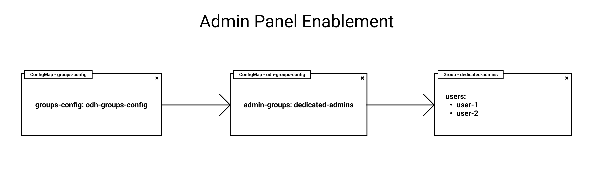

# Settings Panel

The Dashboard now has a new *admin panel* to control several features such as *user interaction tracking*, *bring your own notebook creation*, *PVC size configuration* and more.

To enable this section, there are several config file that must be present in our cluster, the main goal is to add our username to the **admin group we are using as an odh-admin list group**. ODH-Dashboard infers this username from our OpenShift user, if this user is logged by email, it will **dismiss the domain**, meaning if the OpenShift username is **johndoe@redhat.com**, we should add only **johndoe** to de admin list.

## Enable Settings Panel



The current flow to determine which group is the odh-admin group is the following:

1. There is always a `ConfigMap` called **groups-config** with a value with the same name that indicates which `ConfigMap` will store the name of the **odh-group admin**.

```yaml
apiVersion: v1
kind: ConfigMap
metadata:
    name: groups-config
data:
    groups-config: odh-groups-config
```

2. Next, we should have another `ConfigMap`, this time with the same name as the value in **groups-config** (in our example would be odh-groups-config), with two values: **admin_groups** and **allowed_groups**. The value **admin_groups** will tell odh-dashboard the name of the current **group of admins**.

```yaml
apiVersion: v1
kind: ConfigMap
metadata:
    name: odh-groups-config
data:
    admin_groups: dedicated-admins
    allowed_groups: `system:authenticated`
```

3. Finally, we should have a `Group` with the same name as the one mentioned above, here we should have all of our **admin users**. Remember that we **should not have the domain name if we are using emails as username**.

```yaml
apiVersion: user.openshift.io/v1
kind: Group
metadata:
    name: dedicated-admins
users:
    - johndoe
```