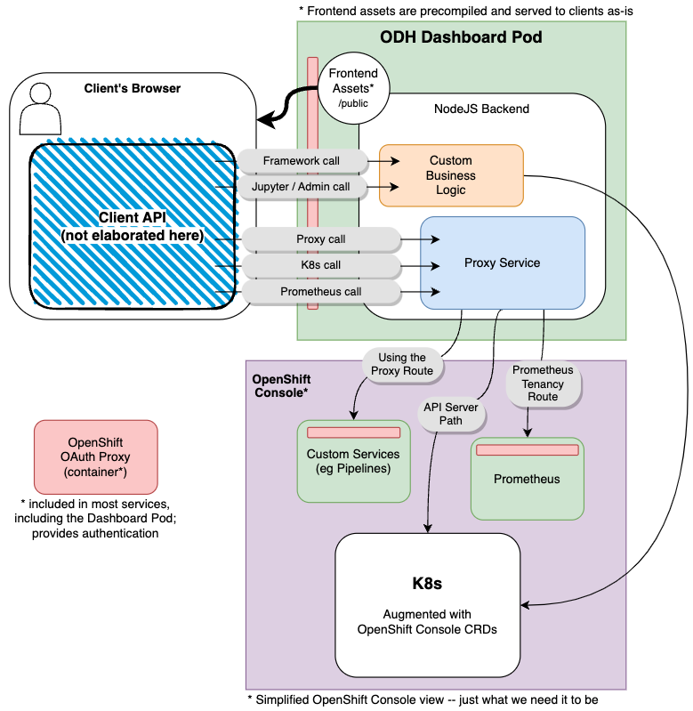
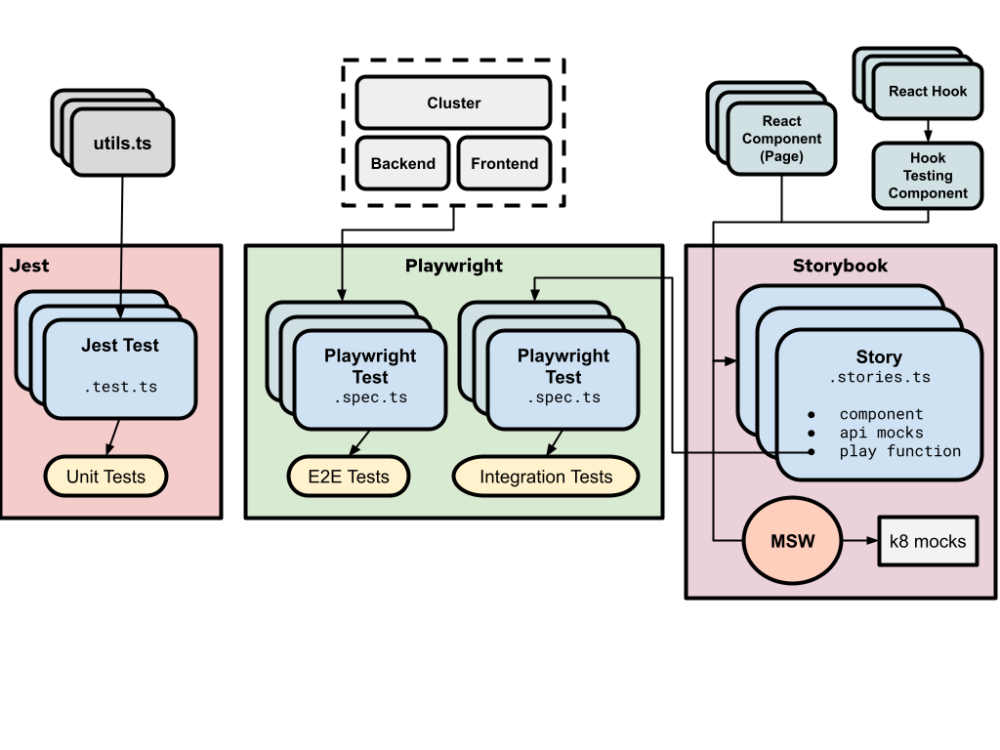

# ODH Dashboard Architecture

## Overview



> **OpenShift OAuth Proxy** is not part of the Dashboard (see [Dashboard Deployment `containers`](https://github.com/opendatahub-io/odh-dashboard/blob/main/manifests/base/deployment.yaml)) but useful to understand its role. See [OpenShift OAuth Proxy repo](https://github.com/openshift/oauth-proxy) for more information. It is typically in the containers of all services we talk to from the proxy API, as well as the Dashboard itself when the client calls the NodeJS server (in the pod).

The main focus point here is that there are 5 kinds of calls from the client. These are split into two different types. The difference in these two types is one takes your request and does it on your behalf (via the service account), and the other does it as you (through direct calls with your bearer token).

### Custom Business Logic Backend

> **Note**: this functionality is deprecated

These are made on your behalf. There is a Dashboard service account (`1`) that makes these calls on your behalf to the k8s server to create, read, update, and delete resources. This is usually done with impunity (`2`).

- Framework call
  - These are calls that get us your username, your allowed/admin status, the feature flags (OdhDashboardConfig), and other various infrastructure based items
- Jupyter / Admin call
  - The Jupyter application uses a similar custom based server-logic to process creating and managing the Notebook that you can create
  - The admin screens all save data on the server using the service-account; most admins will have permissions to do this, and it is only architected this way due to legacy reasons

The effort behind these calls are being discussed how best to remove them and bring all the logic to the frontend. The majority of these calls and their accompanying logic are k8s calls. Some of which require more than basic-user permissions. The basic-user calls will be moved to the client. The more than basic-user calls will be pushed to a new component outside, but part of the umbrella, of the Dashboard (to be described at a future date).

Notes:

- (`1`) Running in development mode locally, this service-account becomes your user. This is the main reason why when starting locally, you need to be a cluster-admin on the cluster
- (`2`) The service account has no regard for permissions to do something (it has its own k8s permissions, but they are very lax on what it can't do). To this extent we have build a shim layer to check your user's permissions before allowing your call to reach the service account

### Proxy/Pass-through based efforts

These are made using your user's k8s permissions. It consumes your OpenShift OAuth Proxy value during the call and makes the call directly to the endpoint of the caller's choosing. This functionality eliminates CORS issues when talking to services that are in OpenShift Console.

- Proxy call
  - These are always POST calls due to the nature of how the HTTP spec works -- we want to send metadata to the endpoint and GETs are not used for this
  - The call is made from the client with the target OpenShift Route path, request params, and the actual method you want to use
- K8s call
  - Powered by the [OpenShift SDK](https://github.com/openshift/dynamic-plugin-sdk)
  - These are crafted with the k8s<Verb>Resource calls and makes use of a known model system
    - Each call takes a `ResourceModel` and additional params like namespace (if applicable) & name (if applicable) and the SDK crafts a url to the endpoint
    - Our server will take this call and proxy it onto the k8s API server
  - See [SDK tidbits](./SDK.md)
- Prometheus call
  - Uses known prometheus endpoints to get data
  - Somewhat deprecated -- it could probably be reworked to use the Proxy call endpoint, but serves as isolated functionality

These all share the same underlying proxy to an endpoint call, they just structure the data differently before calling.

## Client Structure

> **Note**: All content assumes you are looking at the `/frontend` folder.

When building new client features, there are a few things worth noting about the current direction of the codebase.

### Coding Structure

> **Note**: Some folders do not fully comply with this design -- there is a cleanup effort underway -- do not let that dissuade you from following the correct architecture choices noted down below when adding new features / code.

- `/src/api` -- The current API
  - Allowed imports: `/src/utilities`
  - This content should be isolated to the main effort to make the call
  - There is some work here to clean up a little of the data, but effectively this folder should only talk about the very specific call structure needed to do a basic action (aka, less business logic - more functionality); eg, "Get Route" not "Get Notebook Route" or "Get DS Projects Notebook Route"
    - If it's a cornerstone of data and has a specific core use-case, separate the logic; eg "Get Projects" & "Get DS Projects" are both in here
- `/src/api/types/k8s.ts` -- These are the types that are for k8s API data and responses
  - The k8s calls are usually the source of these types -- any resource that is `K8sResourceCommon` is a `${Name}Kind` as it has a `.kind` parameter of the name
- `/src/components` -- All generic components (not tied to a feature or functionality)
  - Allowed imports: `/src/utilities`
  - These components should not contain any application data concepts - no external side effects
  - eg. "IndentSection" - a component for indenting content
- `/src/components/pf-overrides` -- All PatternFly component overrides
  - Allowed imports: `/src/utilities`
  - When a PatternFly component has an issue that has not yet landed, or will not land, in official PatternFly, create an override component that should be used instead.
  - eg. "Table" - a component to build tables and fixes layout
- `/src/concepts` -- Sharable code and logic for multiple areas of the application; Read as "This is conceptually about X resource, doesn't care where it is mounted"
  - Disallowed imports: `/src/pages`
  - eg. Reading project details / shared context
  - eg. Shared conceptual logic -- "Components and utilities to parse and read Notebook resources"
- `/src/pages` -- All specific view/route logic; Read as "This is tied to the nav item for this page"
  - Allowed imports: `*`
  - Should contain constants, utilities, hooks, and anything else that is specifically needed for that area of the application
- `/src/utilities` -- All generic utilities and hook-utilities not tied to a feature or functionality
  - Allowed imports: `none`
  - These utilities should not contain any application data concepts
  - eg. `useFetchState` - the generic fetch and store data hook
  - eg. `time`, `string`, etc - generic utilities for manipulation of not feature-related data
- `/src/types.ts` -- The generic types
  - Allowed to be imported everywhere
  - Should not contain any application data concepts
  - _This will have duplicates from the old design (used in `/src/services`) -- they will likely duplicate some effort in `/src/k8sTypes.ts`_
- `/src/typeHelpers.ts` -- All TypeScript type utilities
  - Allowed to be imported everywhere

> **Note**: if the folder was not mentioned above, it is deprecated and should be avoided when modifying code (within' reason).

### Testing Structure



#### Test Structure

Tests can be divided into the following categories: unit, integration, accessibility, and end to end testing. To keep organized of the different types of tests, there will be a test folder at the root of the frontend project with the following structure.

E2e and integration tests are located in a single root directory:
```
/frontend/src/__tests__
	/e2e => storyName.spec.ts
	/integration => ComponentName.stories.tsx, ComponentName.spec.ts
```

Some nesting can be used to organize testing groups together. For example, the _projects_ page has screens for _details_, _projects_, and, _spawner_ which can be all grouped together under a projects folder.

Unit tests are co-located in a `__tests__` directory adjacent to the target source file they are testing.
```
/frontend/src/**/__tests__
  /targetFile.spec.ts
```

#### Testing Types

##### Unit Testing

Unit tests cover util functions and other non React based functions. Use Jest to test each function using `describe` to group together the utils file and the specific function. Then each test is described using `it`.

_Example_

```ts
describe('Project view screen utils', () => {
  describe('getDisplayNameFromK8sResource', () => {
    it('returns the display name from resource metadata annotations', () => {
      // Test 1
    });
    it('returns the resource name if display name is not present', () => {
      // Test 2
    });
  });
  // Write similar test cases for other functions in the utils file
  describe('getSecretDescription', () => {
    // Test case for getSecretDescription function
  });
});
```

##### Integration Testing

Integration tests will be conducted on specific screens in the app using storybook stories and the playwright testing framework.

###### Test setup steps

1. Identify view components that don't require any props and create a story around the entire screen component that handles the business logic.
2. Create a default export story configuration for the selected component and its child stories. Specify the API mocks using the `msw` parameter.

Configure API mocks using Mock Service Worker (MSW) to simulate API calls. Only mock GET requests for fetching k8s resources; do not mock POST, PUT, or DELETE calls as the tests are run locally.

```ts
export default {
  component: ProjectView,
  parameters: {
    msw: {
      handlers: [
        rest.get(
          '/api/k8s/apis/route.openshift.io/v1/namespaces/test-project/routes/test-notebook',
          (req, res, ctx) => res(ctx.json(mockRouteK8sResource({}))),
        ),
      ],
    },
  },
} as Meta<typeof ProjectView>;
```

3. Each exported member of the file (except the default export) represents a story and can have various parameters. For example, the a11y parameter can be used to set a custom root element for accessibility tests, such as modals. Optionally setup each test by defining the `play` function, such as opening a modal, to ensure correct accessibility testing.

```tsx
export const EditModel = {
  render: Template,
  parameters: {
    a11y: {
      // need to select modal as root
      element: '.pf-c-backdrop',
    },
  },
  play: async ({ canvasElement }) => {
    // load page and wait until settled
    const canvas = within(canvasElement);
    await canvas.findByText('Test Inference Service', undefined, { timeout: 5000 });

    // user flow for editing a project
    await userEvent.click(canvas.getByLabelText('Actions', { selector: 'button' }));
    await userEvent.click(canvas.getByText('Edit', { selector: 'button' }));
  },
};
```

4. Write the Playwright test by creating a new file in the same directory with the same name as the component file but with the `.spec.ts` extension. Test all edge cases for the component in the Playwright test, focusing on individual component behavior rather than longer flows that will be covered in end-to-end (e2e) testing. A typical tests could look like this:

```tsx
import { test, expect } from '@playwright/test';

test('Create project', async ({ page }) => {
  await page.goto(
    './iframe.html?id=tests-stories-pages-projects-projectview--create-project&viewMode=story',
  );

  // wait for page to load
  await page.waitForSelector('text=Create data science project');

  // Test that can submit on valid form
  await page.getByLabel('Name *', { exact: true }).click();
  await page.getByLabel('Name *', { exact: true }).fill('Test Project');
  await page.getByLabel('Description').click();
  await page.getByLabel('Description').fill('Test project description');
  await expect(page.getByRole('button', { name: 'Create' })).toBeEnabled();
});
```

5. Use the `page.goto()` function to navigate to the specific storybook story URL with viewMode=story which can be found by pressing the _open in new tab icon_ in the top right of a specific storybook story in its UI.

To run storybook UI: `cd ./frontend && npm run storybook`

```ts
await page.goto(
  './iframe.html?id=tests-stories-pages-projects-projectview--create-project&viewMode=story',
);
```

6. Wait for the page to load and the story to settle before performing any assertions or actions. Use `page.waitForSelector()` to wait for a specific element to appear as an indication of the story being loaded.

```ts
await page.waitForSelector('text=Create data science project');
```

7. Perform tests and assertions using Playwright's API, interacting with elements and verifying their states.

```ts
await page.getByLabel('Name *', { exact: true }).click();
await page.getByLabel('Name *', { exact: true }).fill('Test Project');
await page.getByLabel('Description').click();
await page.getByLabel('Description').fill('Test project description');
await expect(page.getByRole('button', { name: 'Create' })).toBeEnabled();
```

Note: Adjust the selectors in the code according to the specific component and testing requirements. Use the [Playwright API](https://playwright.dev/docs/locators) to find the appropriate selectors.

1. To execute these tests you can run:

```bash
npm run test:integration
```

This will either attach to an already running instance of storybook UI, or start up a new instance at port `6006.`

##### Accessibility Testing

Accessibility testing is covered automatically by an a11y storybook plugin. Tests will fail if there is an error determined by a11y. Run these tests with

```bash
cd ./frontend && npm run storybook
npm run test:accessibility
```

##### E2E Testing

For end to end testing we will use Playwright just as we did with e2e testing. These are probably the easiest tests to write as there is a handy [VSCode plugin](https://marketplace.visualstudio.com/items?itemName=ms-playwright.playwright) to generate these tests for us. An e2e test covers a wider range of use cases and is not restricted to one screen or page. These tests should be grouped by user stories. Each file is an area to test such as pipelines or projects, and each test is a user story.

For example, a possible e2e test might be under `projects.spec.ts` and a test called “Create, edit, and destroy a project” which would create a project, edit the project, and then delete the project. This test is nice because it does the cleanup for us. But there may be times when this is not the case, so make sure to [teardown](https://playwright.dev/docs/api-testing#setup-and-teardown) any hanging resources.

_Example_

```ts
const cleanTestProject = async (page: Page) => {
  await page.goto('/projects');
  const count = await page.getByRole('link', { name: process.env.TEST_PROJECT_NAME }).count();
  if (count > 0) {
    await page
      .locator('tr', {
        has: page.locator(`text="${process.env.TEST_PROJECT_NAME}"`),
      })
      .getByRole('button', { name: 'Actions' })
      .click();
    await page.getByRole('menuitem', { name: 'Delete project' }).click();
    await page
      .getByRole('textbox', { name: 'Delete modal input' })
      .fill(`${process.env.TEST_PROJECT_NAME}`);
    await page.getByRole('button', { name: 'Delete project' }).click();
  }
};

test.beforeEach(async ({ page }) => await cleanTestProject(page));
test.afterEach(async ({ page }) => await cleanTestProject(page));
```

Remember to try to keep duplicate code to a minimum by utilizing setup and teardown calls.

A full e2e test may look like this. Notice how it completes the user flow by deleting any resources it created. The teardown should be a fallback if the tests fail midway through.

```ts
test('Create, edit, and delete a project', async ({ page }) => {
  await page.goto('');

  // create project
  await page.getByRole('link', { name: 'Data Science Projects' }).click();
  await page.getByRole('button', { name: 'Create data science project' }).click();
  await page.getByLabel('Name *', { exact: true }).fill(`${process.env.TEST_PROJECT_NAME}`);
  await page.getByRole('button', { name: 'Create' }).click();
  expect(await page.getByText('Error creating project').count()).toBe(0);
  expect(
    await page
      .locator('tr', { has: page.locator(`text="${process.env.TEST_PROJECT_NAME}"`) })
      .count(),
  ).toBe(0);
  await page.getByRole('link', { name: 'Data Science Projects', exact: true }).click();

  // edit project
  await page
    .locator('tr', { has: page.locator(`text="${process.env.TEST_PROJECT_NAME}"`) })
    .getByRole('button', { name: 'Actions' })
    .click();
  await page.getByRole('menuitem', { name: 'Edit project' }).click();
  await page.getByLabel('Name *', { exact: true }).fill(`${process.env.TEST_PROJECT_NAME}-name`);
  await page.getByRole('button', { name: 'Update' }).click();
  expect(
    await page
      .locator('tr', { has: page.locator(`text="${process.env.TEST_PROJECT_NAME}-name"`) })
      .count(),
  ).toBe(0);

  // delete project
  await page
    .locator('tr', { has: page.locator(`text="${process.env.TEST_PROJECT_NAME}-name"`) })
    .getByRole('button', { name: 'Actions' })
    .click();
  await page.getByRole('menuitem', { name: 'Delete project' }).click();
  await page
    .getByRole('textbox', { name: 'Delete modal input' })
    .fill(`${process.env.TEST_PROJECT_NAME}-name`);
  await page.getByRole('button', { name: 'Delete project' }).click();
  expect(
    await page
      .locator('tr', { has: page.locator(`text="${process.env.TEST_PROJECT_NAME}"`) })
      .count(),
  ).toBe(0);
});
```

> **Note**: Storybook was evaluated for reuse here, however it ended up causing problems because we would have needed a story for the whole application in some instances which defeats the purpose of using stories. The use case that would work would be to use storybook as a way to encapsulate the UI in smaller chunks and then have Playwright run user flows on those stories. Essentially pushing the _play_ function to a playwright test. The benefit of this is that we could use the VSCode plugin to make creating user flows faster.
