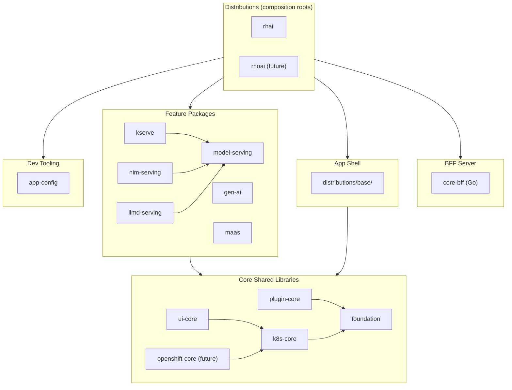
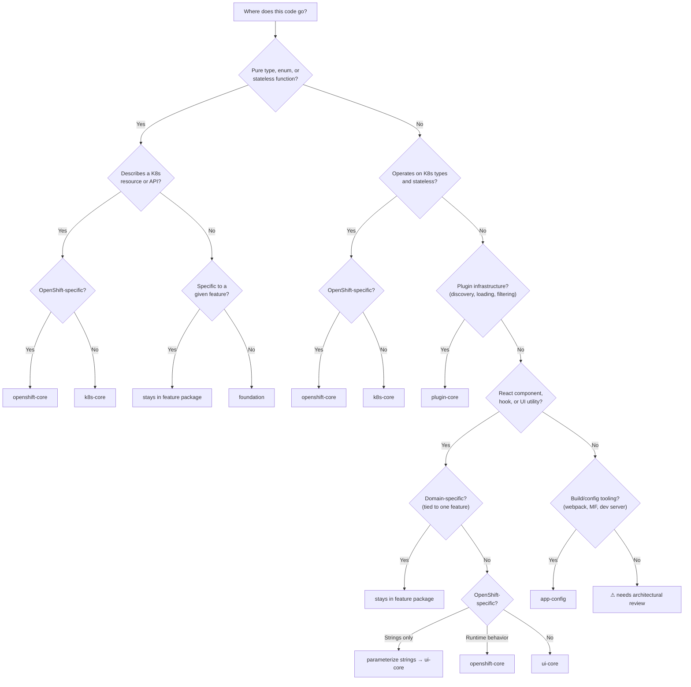

# Package Topology and Import Rules

Rules governing the dependency hierarchy and import boundaries for all packages in the
ODH Dashboard monorepo.

> **Aligned**: July 2, 2026. Attendees: Andy Stoneberg, Christian Vogt,
> Lucas Fernandez Aragon, Andrew Ballantyne, Paulo Rego.

---

## 1. Distributions Code Organization

The distributions architecture organizes code into the following groups:

| Group | What lives here | Packages |
|-------|-----------------|----------|
| **Distributions** | Concrete, deployable dashboard variants. Composition roots that wire everything together. | `distributions/rhaii/`, `distributions/rhoai/` (future) |
| **BFF Server** | Go backend-for-frontend that serves the app shell. | `distributions/core-bff/` |
| **App shell** | Shared framework (masthead, sidebar, routing, error boundary) that distributions extend. | `distributions/base/` |
| **Feature packages** | Domain-specific frontend functionality. Depend on core shared libraries. | `model-serving`, `kserve`, `gen-ai`, `maas`, `model-registry`, etc. |
| **Core shared libraries** | Extension framework, shared UI, K8s types, pure utilities. | `plugin-core`, `ui-core`, `k8s-core`, `openshift-core` (future), `foundation` |
| **Dev tooling** | Build-time tooling: webpack configuration, Module Federation setup, dev server infrastructure. | `app-config` |

The diagram below shows how these groups relate — arrows point from consumer to
dependency, and runtime dependencies flow downward:

---

## 2. Import Rules

### Rule 1: Layer boundary

Feature packages may depend on core shared libraries. They must not depend on the app
shell or on distributions. Core shared libraries must not depend on feature packages.

### Rule 2: Cross-feature imports

Feature packages integrate with each other in three ways, ordered from most to least
preferred:

1. **Type-only imports** — always permitted. `import type { ... }` is erased at
   compile time and creates no runtime dependency or bundle impact.

2. **Extension points** — the preferred runtime integration. Features register and
   consume extensions through the plugin store with no source-level dependency between
   packages.

3. **Direct runtime imports within a hub-and-spoke family** — permitted when:
   - The dependency is declared in `package.json` `dependencies`
   - The dependency is declared in the Module Federation shared config
   - Direction is spoke-to-hub only (hub must not import from spokes)

Direct runtime imports between feature packages outside a hub-and-spoke family are
not permitted.

### Rule 3: Domain-scoped shared packages

A domain-scoped shared package is justified when a feature package needs runtime
access to domain-specific code from another feature that it does not require to be
available.

When all consumers require the source feature to be available (as in a hub-and-spoke
group), they should import directly from that feature package.

---

## 3. The Serving Hub-and-Spoke

Model serving and its related packages follow a hub-and-spoke pattern. Model-serving
is the hub; `kserve`, `nim-serving`, and `llmd-serving` are spokes.

Every spoke declares `reliantAreas` targeting model-serving areas and registers zero
standalone routes — all extensions target model-serving extension points. The dependency
is purely unidirectional: spokes depend on the hub, the hub has zero dependencies on
spokes.

This is the only group of feature packages with direct runtime imports across features
today. Other feature packages integrate through type-only imports or extension points,
neither of which creates a runtime dependency.

---

## 4. Enforcement

The existing `import/no-extraneous-dependencies` ESLint rule catches undeclared
dependencies. Automated enforcement of layer and import direction rules is a separate
effort. PR reviewers enforce these rules using this document as reference.

---

## 5. Core Library Stack

| Package | Litmus test | Scope |
|---------|-------------|-------|
| **foundation** | "Is it a pure type or generic utility with no framework dependency?" | Pure TypeScript types and stateless utilities (e.g., `genRandomChars`). Zero `@odh-dashboard/*` runtime deps. |
| **k8s-core** | "Does it describe a K8s resource type or domain-specific utility?" | K8s resource types and stateless utilities that operate on them. |
| **openshift-core** | "Is it an OpenShift-specific type or runtime behavior?" | OpenShift-specific types and utilities that layer on top of `k8s-core`. |
| **plugin-core** | "Does it need to know how the plugin system works?" | Extension points, plugin store, discovery hooks (`useExtensions`, `useResolvedExtensions`), code ref resolution (`LazyCodeRefComponent`), feature areas (`SupportedArea`, `useIsAreaAvailable`). |
| **ui-core** | "Does it just render data using shared UI patterns?" | Shared React components (tables, resource display, form helpers), shared utilities (formatting, validation), and extension renderers (`ExtensibleDetailTabs`, `ExtensibleActions`). |
| **app-config** | "Does it run only at build time?" | Build-time tooling: webpack configuration, Module Federation setup, dev server infrastructure. If it runs in the browser at runtime, it does not belong here. |

### Where does this code go?

Use the decision flow below when extracting code from `@odh-dashboard/internal` or
deciding where new shared code belongs:

### plugin-core vs ui-core

These packages serve distinct roles in the architecture:

- **plugin-core** — the contract system. It answers: *"what features are installed,
  are they enabled, and how do I connect to them?"* Responsibilities include extension
  point type definitions, the plugin store, discovery hooks (`useExtensions`,
  `useResolvedExtensions`), code ref resolution, and feature areas (`SupportedArea`,
  `useIsAreaAvailable`).
  - `LazyCodeRefComponent` belongs here — it bridges the plugin store to a rendered
    component and is consumed directly by `distributions/base/`.

- **ui-core** — the component catalog. It answers: *"how do I render this data in a
  standard way?"* Responsibilities include shared React components (tables, resource
  display, form helpers), shared utilities (formatting, validation), and extension
  renderers.
  - `ExtensibleDetailTabs` belongs here — it consumes extension data but its job is
    rendering PatternFly layout.

Distributions depend on plugin-core to wire up extensions but have no need for shared
UI components. Feature packages that render data typically depend on both.

---

## 6. OpenShift-Specific Types

Core shared libraries must be **platform-neutral at runtime**. OpenShift-specific
types and runtime behavior belong in `openshift-core`, which layers on top of
`k8s-core`.

Hardcoded platform strings like "find your resources in OpenShift" in shared components
should be parameterized or removed from core packages.

---

## 7. Cypress Test File Location and Import Boundaries

- Feature-specific test specs live inside the feature package (`packages/<pkg>/cypress/`),
  not in the central `packages/cypress/` directory
- Each package's `cypress/` directory can be declared as its own npm workspace
- Test specs must not import application source code — duplicate UI cues or use
  `data-testid` selectors instead
- `packages/cypress/` remains the shared test infrastructure: page objects, commands,
  utilities, fixtures
- The dependency is unidirectional: feature tests import shared infrastructure, never
  the reverse

*Cross-package e2e test orchestration (e.g., flows spanning serving, registration, and
consumption) and per-distribution test strategies are out of scope for this document.*
