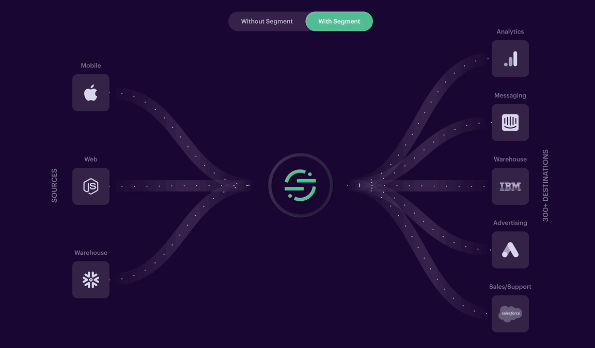
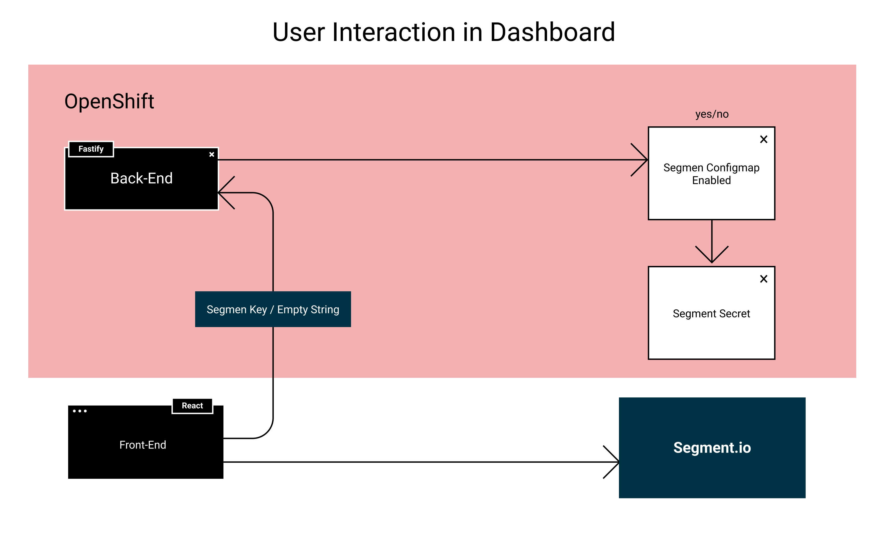

[Segment]: https://segment.com/

# User Interaction

Right now, we are using [Segment] as the user interaction tracker for the Dashboard. Segment is a user-interaction telemetry tracker that provides several features, such as multi-platform support, data normalization, and source integration, it can connect several clients with different analytic destinations.

## How does it work

Each library installed in our clients connects to segment, gathers the user telemetry, and sends formatted logs with the interactions. Then, in the segment dashboard, you can connect multiple of your sources (clients) with destinations, the relation of the connections could be n to n, meaning we can connect multiple sources with multiple destinations.



## Which data do we gather

The built-in library includes several segment tracking methods to help in the user telemetry profiling. This methods are:

* **Identify:** Help to link the users and their actions, add a recognizable userId and traits. When a user loads our webpage, Analytics.js caches traits in the browser localStorage so it can identify multiple sessions.

```json
{
  "anonymousId": "d1e2d51e-b8e1-4eeb-9c70-887db0fa8e88",
  "context": {
    "ip": "104.28.34.163",
    "library": {
      "name": "analytics.js",
      "version": "next-1.33.3"
    },
    "locale": "en-GB",
    "page": {
      "path": "/",
      "referrer": "",
      "search": "",
      "title": "Open Data Hub Dashboard",
      "url": "http://localhost:4010/"
    },
    "userAgent": "Mozilla/5.0 (Macintosh; Intel Mac OS X 10_15_7) AppleWebKit/605.1.15 (KHTML, like Gecko) Version/15.3 Safari/605.1.15"
  },
  "integrations": {},
  "messageId": "ajs-next-932c60cf2389e68722fd266c69e0c8ae",
  "originalTimestamp": "2022-03-01T18:11:39.830Z",
  "receivedAt": "2022-03-01T18:11:41.482Z",
  "sentAt": "2022-03-01T18:11:39.830Z",
  "timestamp": "2022-03-01T18:11:41.482Z",
  "traits": {
    "clusterID": "3a2f1f4a-ca48-44f4-854d-5c01de6493bd"
  },
  "type": "identify",
  "userId": "ba3095ca044ec986f96b25862f5bc39052920d1c"
}
```

* **Track**: This method records actions that the users perform, storing the event, some additional properties and options of the page.

```json
{
  "anonymousId": "5ee0c93a-24f3-4b40-9b24-940893798b79",
  "context": {
    "ip": "188.26.196.156",
    "library": {
      "name": "analytics.js",
      "version": "next-1.33.3"
    },
    "locale": "en-GB",
    "page": {
      "path": "/",
      "referrer": "",
      "search": "",
      "title": "Open Data Hub Dashboard",
      "url": "https://odh-dashboard-my-namepsace.apps.odh-cluster.com/"
    },
    "userAgent": "Mozilla/5.0 (Macintosh; Intel Mac OS X 10_15_7) AppleWebKit/537.36 (KHTML, like Gecko) Chrome/98.0.4758.109 Safari/537.36"
  },
  "event": "Application Enabled",
  "integrations": {},
  "messageId": "ajs-next-d2de956f5d126536c619b502398b8c95",
  "originalTimestamp": "2022-03-01T16:57:02.690Z",
  "properties": {
    "clusterID": "3a2f1f4a-ca48-44f4-854d-5c01de6493bd",
    "name": "jupyter"
  },
  "receivedAt": "2022-03-01T16:57:03.302Z",
  "sentAt": "2022-03-01T16:57:02.690Z",
  "timestamp": "2022-03-01T16:57:03.302Z",
  "type": "track",
  "userId": "ba3095ca044ec986f96b25862f5bc39052920d1c"
}
```

* **Page:** The page method enables page tracking in our webapp, it can also add extra information about the page viewed by the user. A page can have some attributes such as category, name and some additional options.

```json
{
  "anonymousId": "d3a54297-23f8-4c13-953b-1ae27820c86f",
  "context": {
    "ip": "188.26.196.156",
    "library": {
      "name": "analytics.js",
      "version": "next-1.33.3"
    },
    "locale": "en-GB",
    "page": {
      "path": "/applications/explore",
      "referrer": "https://oauth-openshift.apps.my-referrer.com/",
      "search": "",
      "title": "Open Data Hub Dashboard",
      "url": "https:///odh-dashboard-my-namepsace.apps.odh-cluster.com/explore"
    },
    "userAgent": "Mozilla/5.0 (Macintosh; Intel Mac OS X 10_15_7) AppleWebKit/537.36 (KHTML, like Gecko) Chrome/98.0.4758.109 Safari/537.36"
  },
  "integrations": {},
  "messageId": "ajs-next-4005a68e46b12471964f32d7fb2784a4",
  "originalTimestamp": "2022-03-01T16:49:11.528Z",
  "properties": {
    "clusterID": "a8ff924d-c667-4b4f-9d16-f3135b6082ca",
    "path": "/applications/explore",
    "referrer": "https://oauth-openshift.apps.my-referrer.com/",
    "search": "",
    "title": "Open Data Hub Dashboard",
    "url": "https://odh-dashboard-my-namepsace.apps.odh-cluster.com/explore"
  },
  "receivedAt": "2022-03-01T16:49:11.668Z",
  "sentAt": "2022-03-01T16:49:11.528Z",
  "timestamp": "2022-03-01T16:49:11.668Z",
  "type": "page",
  "userId": "ba3095ca044ec986f96b25862f5bc39052920d1c"
}
```

## Implementation



The current implementation is looking for a **segment write key**, in a Secret called `odh-segment-key` when the ConfigMap property `segment-key-enabled` is enabled.

### segment-key-enabled.yaml

```yaml
apiVersion: v1
kind: ConfigMap
metadata:
  name: odh-segment-key-config
  namespace: opendatahub
data:
  segmentKeyEnabled: "true"
```

### odh-segment-key

```yaml
apiVersion: v1
kind: Secret
metadata:
  name: odh-segment-key
  namespace: opendatahub
type: Opaque
data:
   segmentKey: [segment key in base64]
```
