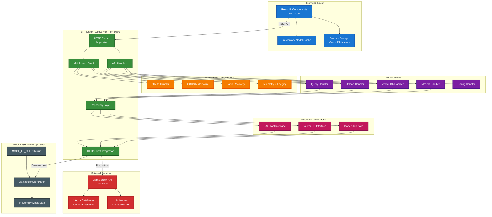
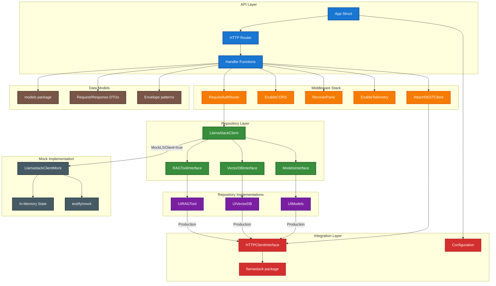

# 0002 - Backend for Frontend (BFF) Architecture Pattern

* Status: ACCEPTED
* Date: 2025-01-25
* Authors: Matias Schimuneck
* Reviewers: TBD

## Context and Problem Statement

The Llama Stack Modular UI needs to interact with multiple backend services (Llama Stack API, vector databases, LLM models) while providing a clean interface for the React frontend. We need to decide on the architectural pattern for the backend layer.

The frontend needs:
- Simplified API calls without complex service orchestration
- CORS handling for browser-based requests
- Authentication and authorization
- Request/response transformation
- Error handling and resilience

## Decision Drivers

* Separation of concerns between frontend and backend complexity
* Need for API aggregation and orchestration
* Browser security requirements (CORS)
* Authentication and authorization centralization
* Simplified frontend development
* Testability and maintainability

## Considered Options

* Direct frontend-to-services communication
* Traditional monolithic backend
* Backend for Frontend (BFF) pattern
* API Gateway pattern
* Microservices with service mesh

## Decision Outcome

Chosen option: "Backend for Frontend (BFF) pattern", because:

- Provides a dedicated backend optimized for the specific frontend needs
- Simplifies frontend development by abstracting complex service interactions
- Centralizes cross-cutting concerns (auth, CORS, logging)
- Allows independent evolution of frontend and backend services
- Maintains good separation of concerns

### Positive Consequences

* Frontend developers can focus on UI/UX without backend complexity
* Centralized authentication and CORS handling
* Clear API contract between frontend and backend
* Easier testing with mock implementations
* Better error handling and user experience

### Negative Consequences

* Additional layer adds some latency
* More infrastructure to maintain
* Risk of becoming a "god service" if not properly designed
* Requires careful API design to avoid tight coupling

## Implementation

The BFF is implemented as a Go-based HTTP server that:
1. Exposes REST endpoints optimized for frontend consumption
2. Orchestrates calls to Llama Stack and other services
3. Handles authentication, CORS, and error transformation
4. Provides mock implementations for development/testing

## Diagrams

### Architecture Overview

### Component Dependencies

## Links

* [Supersedes] Direct service communication approach
* [Related to] [Llama Stack API Documentation] - External service specification
* [Related to] ADR-0001 - Record Architecture Decisions