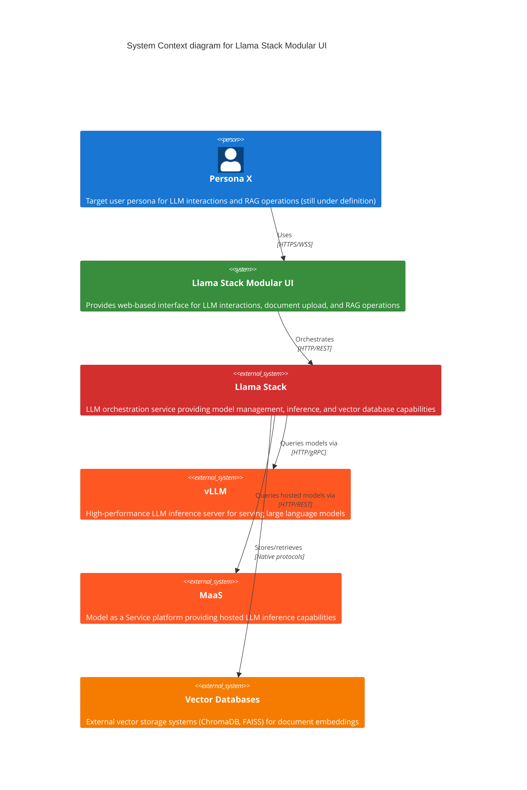
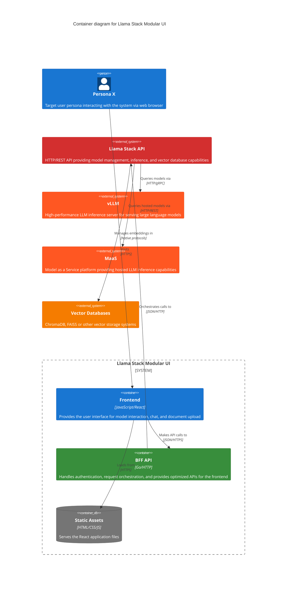
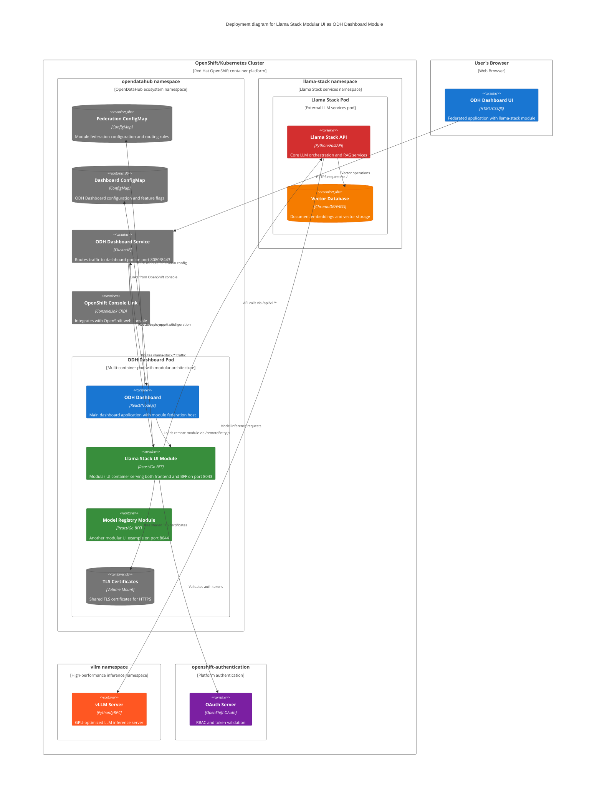

# 0002 - Llama Stack Modular UI System Architecture

* Date: 2025-01-25
* Authors: Matias Schimuneck

## Context and Problem Statement

The Llama Stack Modular UI is a complete system that enables users to interact with Llama Stack services through a web interface for RAG (Retrieval Augmented Generation) operations. We need to define the overall system architecture that includes the frontend, backend-for-frontend (BFF), and integration patterns with external services.

The system requirements:
- User-friendly web interface for model interaction and document upload
- Secure authentication and authorization
- Real-time chat interface with LLM models
- Document processing and vector database management
- API orchestration and service integration
- Development and production environment support

## Decision Drivers

* User experience requirements for intuitive RAG interactions
* Need for secure authentication in OpenShift environments
* Real-time chat capabilities with LLM models
* Document upload and vector database management
* Development vs production environment flexibility
* Maintainable and testable architecture
* Performance and scalability considerations
* Integration with existing OpenDataHub ecosystem

## Considered Options

* Single-page application with direct API calls
* Traditional three-tier architecture (frontend, API server, database)
* Backend-for-Frontend (BFF) pattern with Frontend
* Microservices architecture with API gateway
* Server-side rendered application

## Decision Outcome

Chosen option: "Backend-for-Frontend (BFF) pattern with Frontend", because:

- Provides optimal user experience with responsive React UI
- BFF layer handles complex service orchestration and authentication
- Clear separation between user interface and business logic
- Enables independent development and deployment cycles
- Supports both development (mocked) and production environments
- Integrates well with OpenShift and Kubernetes deployments

### Positive Consequences

* Modern, responsive user interface with React
* Centralized authentication and security handling in BFF
* Clear API contracts between system layers
* Easy testing with comprehensive mock implementations
* Flexible deployment options (standalone or federated)
* Good developer experience with hot-reload and mocking

### Negative Consequences

* Additional complexity with multiple deployment units
* Network latency through BFF layer
* Requires careful API design to avoid chatty interfaces
* More infrastructure components to monitor and maintain

## Implementation

The system is implemented using a multi-container architecture with modern web technologies:

### Frontend Container (React 18 + TypeScript)
- **UI Framework**: PatternFly-based React application using `@patternfly/chatbot` components
- **Build System**: Webpack 5 with TypeScript compilation, hot-reload, and asset optimization
- **API Communication**: Dual approach with axios HTTP client and llama-stack-client npm package
- **State Management**: React Context API for authentication state (no Redux)
- **Routing**: React Router v7 for client-side navigation
- **Testing**: Jest for unit tests, Cypress for E2E testing with mock server support
- **Development**: Hot-reload dev server on port 8080 with proxy to BFF

### Backend-for-Frontend Container (Go 1.23)
- **HTTP Router**: High-performance `julienschmidt/httprouter` for request routing
- **Static Assets**: Serves built frontend files from `/static` directory with SPA fallback
- **API Endpoints**: RESTful APIs under `/api/v1/*` with comprehensive OpenAPI documentation
- **Proxy Layer**: Direct proxy to Llama Stack API via `/llama-stack/*` endpoints
- **Middleware**: CORS, authentication, logging, panic recovery, and telemetry
- **Configuration**: Environment-based config with OAuth 2.0/OIDC support
- **Mock System**: Complete mock implementations for development and testing
- **Documentation**: 750+ line OpenAPI specification with Swagger UI

### Integration Architecture
- **Repository Pattern**: Interface-based business logic abstraction
- **HTTP Clients**: Go HTTP client for Llama Stack API communication
- **Authentication**: OAuth 2.0 token validation with browser storage persistence
- **Error Handling**: Comprehensive error transformation and user-friendly messaging
- **Development Mode**: Configurable mock client with `MOCK_LS_CLIENT` flag

### Modular UI Deployment (ODH Dashboard Integration)
- **Module Federation**: Deployed as a federated module within ODH Dashboard using Webpack 5 Module Federation
- **Multi-Container Pod**: Runs as a sidecar container alongside the main ODH Dashboard in the same Kubernetes pod
- **Shared Resources**: Uses shared TLS certificates, ConfigMaps, and service networking
- **Federation Config**: Configured via `federation-configmap.yaml` with routing rules and remote entry points
- **Service Integration**: Exposed through the main ODH Dashboard service with path-based routing
- **OpenShift Console**: Integrated with OpenShift web console via ConsoleLink CRD
- **RBAC**: Leverages OpenShift OAuth with user token forwarding and RBAC authorization
- **Deployment Modes**: Supports both federated (production) and standalone (development) deployment modes

## Architecture Diagrams (C4 Model)

### Level 1: System Context Diagram

Shows how the Llama Stack Modular UI fits into the broader ecosystem:

### Level 2: Container Diagram

Shows the high-level containers and their interactions within the Llama Stack Modular UI:

### Level 3: Component Diagrams

#### Frontend Components

Shows the internal structure of the Frontend application:

```mermaid
C4Component
    title Component diagram for Frontend

    Container(spa, "Frontend", "React 18/TypeScript", "PatternFly-based React application built with Webpack")
    
    Component(applayout, "App Layout", "React Component", "Main application layout and navigation structure")
    Component(chatbotmain, "Chatbot Main", "PatternFly Chatbot", "Primary chat interface using @patternfly/chatbot components")
    Component(chatmessages, "Messages List", "React Component", "Displays chat conversation history and responses")
    Component(sharemodal, "Share Modal", "React Component", "Handles conversation sharing functionality")
    Component(uploadsettings, "Upload Settings Modal", "React Component", "Document upload configuration interface")
    Component(uploadpanel, "Upload Panel", "React Component", "File upload interface for RAG document processing")
    Component(oauthcomps, "OAuth Components", "React Components", "Authentication UI components and flows")
    Component(notfound, "Not Found", "React Component", "404 error page component")
    
    Component(llamaservice, "Llama Stack Service", "TypeScript Service", "BFF API client using axios and llama-stack-client")
    Component(authservice, "Auth Service", "TypeScript Service", "Authentication and token management service")
    Component(authcontext, "Auth Context", "React Context", "Global authentication state management")
    Component(router, "React Router", "React Router v7", "Client-side routing and navigation")
    Component(axiosconfig, "Axios Config", "HTTP Client", "Configured HTTP client for BFF communication")
    
    ComponentDb(webpack, "Build System", "Webpack 5", "TypeScript compilation, hot-reload, and asset bundling")
    ComponentDb(localStorage, "Browser Storage", "LocalStorage", "Client-side authentication token persistence")
    
    Rel(applayout, chatbotmain, "Contains and manages")
    Rel(chatbotmain, chatmessages, "Displays messages via")
    Rel(chatbotmain, sharemodal, "Opens sharing dialog via")
    Rel(chatbotmain, uploadpanel, "Manages document uploads via")
    Rel(uploadpanel, uploadsettings, "Configures uploads via")
    
    Rel(chatbotmain, llamaservice, "Makes chat completions via")
    Rel(uploadpanel, llamaservice, "Uploads documents via")
    Rel(llamaservice, axiosconfig, "Uses HTTP client")
    Rel(oauthcomps, authservice, "Authenticates users via")
    
    Rel(authservice, authcontext, "Updates auth state via")
    Rel(authcontext, localStorage, "Persists tokens to")
    Rel(llamaservice, authservice, "Gets auth tokens from")
    
    Rel(router, applayout, "Routes to main app")
    Rel(router, oauthcomps, "Routes to auth flows")
    Rel(router, notfound, "Routes to 404 page")
    
    Rel(webpack, spa, "Builds and serves")

    UpdateElementStyle(applayout, $fontColor="white", $bgColor="#1976d2", $borderColor="#0d47a1")
    UpdateElementStyle(chatbotmain, $fontColor="white", $bgColor="#1976d2", $borderColor="#0d47a1")
    UpdateElementStyle(chatmessages, $fontColor="white", $bgColor="#1976d2", $borderColor="#0d47a1")
    UpdateElementStyle(sharemodal, $fontColor="white", $bgColor="#1976d2", $borderColor="#0d47a1")
    UpdateElementStyle(uploadsettings, $fontColor="white", $bgColor="#1976d2", $borderColor="#0d47a1")
    UpdateElementStyle(uploadpanel, $fontColor="white", $bgColor="#1976d2", $borderColor="#0d47a1")
    UpdateElementStyle(oauthcomps, $fontColor="white", $bgColor="#1976d2", $borderColor="#0d47a1")
    UpdateElementStyle(notfound, $fontColor="white", $bgColor="#1976d2", $borderColor="#0d47a1")
    UpdateElementStyle(llamaservice, $fontColor="white", $bgColor="#388e3c", $borderColor="#1b5e20")
    UpdateElementStyle(authservice, $fontColor="white", $bgColor="#388e3c", $borderColor="#1b5e20")
    UpdateElementStyle(axiosconfig, $fontColor="white", $bgColor="#388e3c", $borderColor="#1b5e20")
    UpdateElementStyle(authcontext, $fontColor="white", $bgColor="#f57c00", $borderColor="#e65100")
    UpdateElementStyle(router, $fontColor="white", $bgColor="#f57c00", $borderColor="#e65100")
    UpdateElementStyle(webpack, $fontColor="white", $bgColor="#757575", $borderColor="#424242")
    UpdateElementStyle(localStorage, $fontColor="white", $bgColor="#757575", $borderColor="#424242")
```

#### BFF API Components

Shows the internal structure of the Backend-for-Frontend API:

```mermaid
C4Component
    title Component diagram for BFF API

    Container(bff, "BFF API", "Go 1.23/HTTP", "Backend-for-Frontend service with httprouter and CORS support")
    
    Component(router, "HTTP Router", "julienschmidt/httprouter", "High-performance HTTP request router")
    Component(middleware, "Middleware Chain", "Go middleware", "CORS, logging, authentication, panic recovery, and telemetry")
    Component(staticserver, "Static File Server", "Go http.FileServer", "Serves built frontend assets from /static directory")
    
    Component(openapi, "OpenAPI Handler", "Go handler", "Serves comprehensive API documentation and Swagger UI")
    Component(modelshandler, "Models Handler", "Go handler", "Manages LLM model listing via /api/v1/models")
    Component(uploadhandler, "Upload Handler", "Go handler", "Processes document uploads via /api/v1/upload")
    Component(queryhandler, "Query Handler", "Go handler", "Handles chat completions via /api/v1/query")
    Component(confighandler, "Config Handler", "Go handler", "Provides frontend configuration via /api/v1/config")
    Component(oauthhandler, "OAuth Handler", "Go handler", "Manages OAuth flows via /api/v1/auth/*")
    Component(vectordbhandler, "Vector DB Handler", "Go handler", "Manages vector databases via /api/v1/vector-dbs")
    Component(proxyhandler, "Proxy Handler", "Go handler", "Proxies requests to Llama Stack via /llama-stack/*")
    Component(healthhandler, "Health Handler", "Go handler", "Health checks via /healthcheck")
    
    Component(repositories, "Repository Layer", "Go package", "Business logic abstraction with interface-based design")
    Component(llamaclient, "Llama Stack Client", "Go HTTP client", "HTTP client for external Llama Stack API communication")
    Component(modelsrepo, "Models Repository", "Go service", "Model management and listing operations")
    Component(vectordbrepo, "Vector DB Repository", "Go service", "Vector database registration and management")
    Component(ragtoolrepo, "RAG Tool Repository", "Go service", "Document processing and RAG operations")
    Component(healthrepo, "Health Repository", "Go service", "System health checking and monitoring")
    Component(mocksystem, "Mock System", "Go mocks", "Development and testing mock implementations")
    
    ComponentDb(envconfig, "Environment Config", "EnvConfig struct", "Port, OAuth, Llama Stack URL, and feature flags")
    ComponentDb(openapi_spec, "OpenAPI Spec", "YAML", "Comprehensive API specification with 750+ lines")
    ComponentDb(auth, "Auth System", "OAuth 2.0/OIDC", "Token validation and user authentication")
    
    Rel(router, middleware, "All requests through")
    Rel(middleware, staticserver, "Routes / to")
    Rel(middleware, modelshandler, "Routes /api/v1/models to")
    Rel(middleware, uploadhandler, "Routes /api/v1/upload to")
    Rel(middleware, queryhandler, "Routes /api/v1/query to")
    Rel(middleware, confighandler, "Routes /api/v1/config to")
    Rel(middleware, oauthhandler, "Routes /api/v1/auth/* to")
    Rel(middleware, vectordbhandler, "Routes /api/v1/vector-dbs to")
    Rel(middleware, proxyhandler, "Routes /llama-stack/* to")
    Rel(middleware, healthhandler, "Routes /healthcheck to")
    Rel(middleware, openapi, "Routes /openapi* to")
    
    Rel(modelshandler, modelsrepo, "Uses for model operations")
    Rel(uploadhandler, ragtoolrepo, "Uses for document processing")
    Rel(queryhandler, ragtoolrepo, "Uses for chat completions")
    Rel(vectordbhandler, vectordbrepo, "Uses for DB management")
    Rel(healthhandler, healthrepo, "Uses for health checks")
    Rel(proxyhandler, llamaclient, "Direct proxy to Llama Stack")
    
    Rel(repositories, llamaclient, "Production API calls")
    Rel(repositories, mocksystem, "Development/testing calls")
    Rel(oauthhandler, auth, "Token validation")
    Rel(confighandler, envconfig, "Reads runtime config")
    Rel(openapi, openapi_spec, "Serves API documentation")

    UpdateElementStyle(router, $fontColor="white", $bgColor="#1976d2", $borderColor="#0d47a1")
    UpdateElementStyle(middleware, $fontColor="white", $bgColor="#1976d2", $borderColor="#0d47a1")
    UpdateElementStyle(staticserver, $fontColor="white", $bgColor="#1976d2", $borderColor="#0d47a1")
    UpdateElementStyle(openapi, $fontColor="white", $bgColor="#1976d2", $borderColor="#0d47a1")
    UpdateElementStyle(modelshandler, $fontColor="white", $bgColor="#388e3c", $borderColor="#1b5e20")
    UpdateElementStyle(uploadhandler, $fontColor="white", $bgColor="#388e3c", $borderColor="#1b5e20")
    UpdateElementStyle(queryhandler, $fontColor="white", $bgColor="#388e3c", $borderColor="#1b5e20")
    UpdateElementStyle(confighandler, $fontColor="white", $bgColor="#388e3c", $borderColor="#1b5e20")
    UpdateElementStyle(oauthhandler, $fontColor="white", $bgColor="#388e3c", $borderColor="#1b5e20")
    UpdateElementStyle(vectordbhandler, $fontColor="white", $bgColor="#388e3c", $borderColor="#1b5e20")
    UpdateElementStyle(proxyhandler, $fontColor="white", $bgColor="#388e3c", $borderColor="#1b5e20")
    UpdateElementStyle(healthhandler, $fontColor="white", $bgColor="#388e3c", $borderColor="#1b5e20")
    UpdateElementStyle(repositories, $fontColor="white", $bgColor="#f57c00", $borderColor="#e65100")
    UpdateElementStyle(modelsrepo, $fontColor="white", $bgColor="#f57c00", $borderColor="#e65100")
    UpdateElementStyle(vectordbrepo, $fontColor="white", $bgColor="#f57c00", $borderColor="#e65100")
    UpdateElementStyle(ragtoolrepo, $fontColor="white", $bgColor="#f57c00", $borderColor="#e65100")
    UpdateElementStyle(healthrepo, $fontColor="white", $bgColor="#f57c00", $borderColor="#e65100")
    UpdateElementStyle(llamaclient, $fontColor="white", $bgColor="#7b1fa2", $borderColor="#4a148c")
    UpdateElementStyle(mocksystem, $fontColor="white", $bgColor="#7b1fa2", $borderColor="#4a148c")
    UpdateElementStyle(envconfig, $fontColor="white", $bgColor="#757575", $borderColor="#424242")
    UpdateElementStyle(openapi_spec, $fontColor="white", $bgColor="#757575", $borderColor="#424242")
    UpdateElementStyle(auth, $fontColor="white", $bgColor="#757575", $borderColor="#424242")
```

### Level 4: Deployment Diagram

Shows how the Llama Stack Modular UI is deployed as a module within the ODH Dashboard ecosystem:

## Links

* [Related to] ADR-0001 - Record Architecture Decisions
* [Related to] ADR-0003 - Core User Flows
* [Related to] [C4 Model](https://c4model.com/) - Software architecture visualization approach used in these diagrams
* [Related to] [Llama Stack Documentation](https://llama-stack.readthedocs.io/) - External service specification
* [Related to] [React Architecture Guidelines](https://react.dev/learn/thinking-in-react) - Frontend development patterns
* [Related to] [OpenDataHub Dashboard](https://github.com/opendatahub-io/odh-dashboard) - Parent project architecture