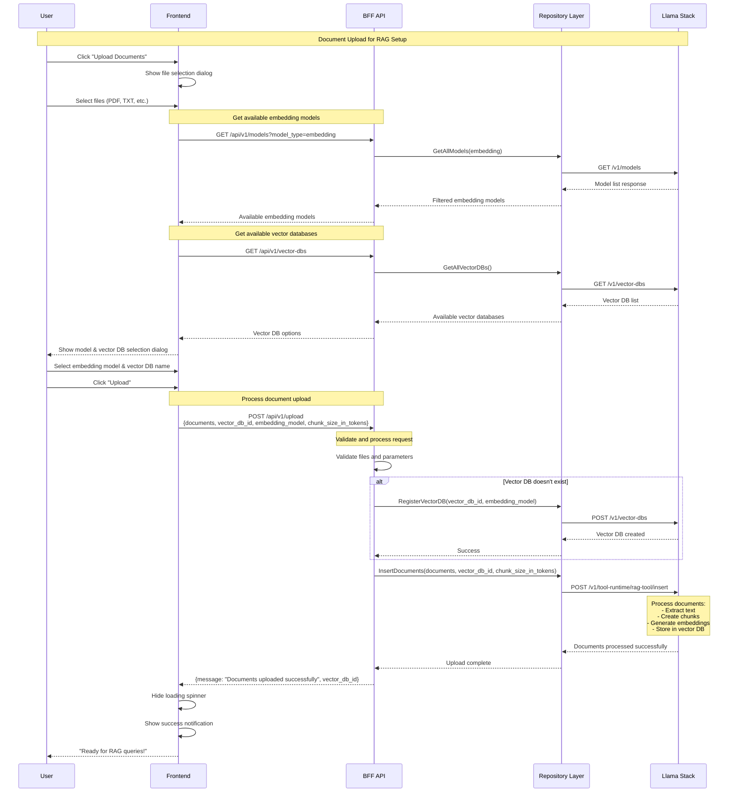
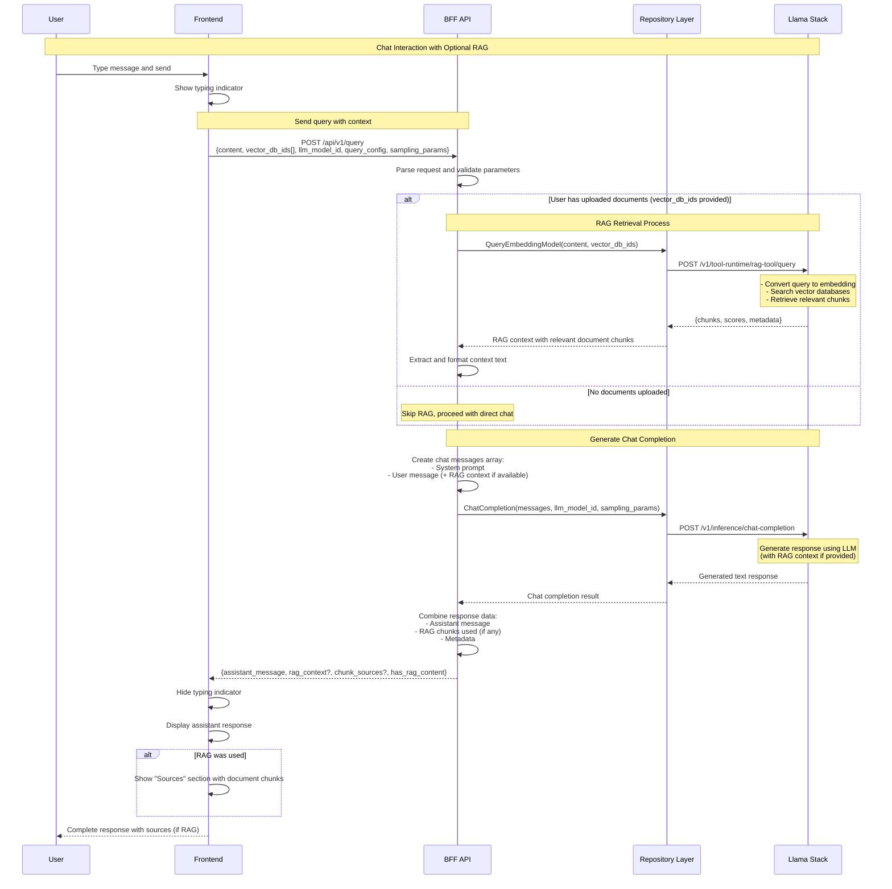

# 0003 - Core User Flows

* Date: 2025-01-25
* Authors: Matias Schimuneck

## Context and Problem Statement

The Llama Stack Modular UI implements two core user workflows that define the primary user experience: document upload for RAG (Retrieval Augmented Generation) setup and chat completion for user interactions. This document defines how these flows work through the BFF architecture pattern, showing the interactions between frontend, BFF, and Llama Stack services.

The two primary user flows are:
- **File Upload Flow**: User uploads documents, system creates vector database and processes documents for RAG
- **Chat Completion Flow**: User sends queries, system optionally performs RAG retrieval and generates responses

## Decision Drivers

* Clear documentation of the two primary user workflows
* Understanding of document processing and RAG setup
* Chat interaction patterns with and without RAG context
* API contracts between frontend, BFF, and Llama Stack
* Error handling and user feedback mechanisms
* Developer onboarding and debugging support

## Decision Outcome

Document the file upload and chat completion flows using sequence diagrams that show:
- Document upload, vector database creation, and embedding generation
- Chat completion with optional RAG retrieval and context integration
- BFF API endpoints and their interactions with Llama Stack services
- Error handling and user feedback patterns

## Core User Flows

### Flow 1: File Upload and RAG Setup



### Flow 2: Chat Completion with Optional RAG



## Flow Characteristics

### File Upload Flow
- **Multi-Step Process**: File selection → Model selection → Upload → Processing
- **Document Structure**: Files converted to Document objects with content, metadata, and IDs
- **Vector DB Management**: Automatic creation if vector database doesn't exist
- **Document Processing**: Text extraction, chunking, embedding generation, and storage
- **User Experience**: Clear progress indicators, success notifications, and error handling
- **Validation**: File type validation, parameter validation, and error recovery
- **State Management**: UI tracks upload progress and completion status

### Chat Completion Flow  
- **Conditional RAG**: Performs retrieval only when vector databases are available
- **Context Integration**: RAG results seamlessly integrated into chat prompt
- **Dual Mode Operation**: Works with or without uploaded documents
- **Configurable Parameters**: Supports query configuration and sampling parameters for fine-tuning
- **Response Enhancement**: Returns assistant message plus source attribution when RAG is used
- **User Feedback**: Typing indicators, streaming responses, and source citations
- **Error Resilience**: Graceful degradation if RAG retrieval fails

## API Contracts

### File Upload Flow Endpoints
- **Frontend → BFF**: `GET /api/v1/models?model_type=embedding` - Get available embedding models
- **Frontend → BFF**: `GET /api/v1/vector-dbs` - Get existing vector databases  
- **Frontend → BFF**: `POST /api/v1/upload` - Upload documents with config
  ```json
  {
    "documents": [
      {
        "document_id": "doc1",
        "content": "Document text content here...",
        "metadata": {
          "filename": "file1.pdf",
          "source": "upload"
        }
      }
    ],
    "vector_db_id": "my-documents",
    "embedding_model": "sentence-transformers/all-MiniLM-L6-v2", 
    "chunk_size_in_tokens": 500
  }
  ```

### Chat Completion Flow Endpoints
- **Frontend → BFF**: `POST /api/v1/query` - Send query with optional RAG
  ```json
  {
    "content": "What is the main topic of the documents?",
    "vector_db_ids": ["my-documents"],
    "llm_model_id": "llama3.2:3b",
    "query_config": {
      "max_chunks": 5,
      "max_tokens_in_context": 1000,
      "chunk_template": "Result {index}\nContent: {chunk.content}\nMetadata: {metadata}\n"
    },
    "sampling_params": {
      "strategy": {"type": "greedy"},
      "max_tokens": 500
    }
  }
  ```

### BFF → Llama Stack Internal Calls
- `GET /v1/models` - Model discovery and filtering
- `POST /v1/vector-dbs` - Vector database creation when needed
- `POST /v1/tool-runtime/rag-tool/insert` - Document processing and embedding
- `POST /v1/tool-runtime/rag-tool/query` - RAG retrieval for chat context
- `POST /v1/inference/chat-completion` - LLM response generation

## State Management

### File Upload Flow State
- **Upload Progress**: Track file selection, model configuration, and processing status
- **Vector DB Selection**: Store user's chosen vector database name and embedding model  
- **Validation State**: File type validation, size limits, and configuration errors
- **Success State**: Completion notifications and readiness for chat queries

### Chat Flow State
- **Conversation History**: Messages exchanged between user and assistant
- **RAG Context**: Available vector databases and their document content
- **UI Feedback**: Typing indicators, response streaming, and source attribution
- **Error Handling**: Network failures, API errors, and graceful degradation

### Persistence Strategy
- **Frontend**: Temporary UI state, no persistent storage of sensitive data
- **BFF**: Stateless request processing, no session persistence
- **Llama Stack**: Persistent storage of vector databases, embeddings, and metadata

## Performance Considerations

### File Upload Flow Optimizations
- **Chunked Upload**: Process large files in smaller chunks to prevent timeouts
- **Background Processing**: Asynchronous document processing with progress updates
- **Validation Early**: Client-side file validation before server upload
- **Compression**: Compress documents before transmission when beneficial

### Chat Flow Optimizations  
- **RAG Caching**: Cache embedding queries for repeated similar questions
- **Model Warming**: Keep frequently used models loaded in memory
- **Streaming Responses**: Real-time response delivery for better user experience
- **Context Management**: Limit RAG context size to optimize inference speed

### System-Wide Performance
- **Connection Pooling**: Reuse HTTP connections to Llama Stack
- **Error Recovery**: Fast failure detection and graceful degradation
- **Resource Limits**: Prevent resource exhaustion from large uploads or queries


## Links

* [Related to] ADR-0002 - Llama Stack Modular UI System Architecture
* [Related to] ADR-0001 - Record Architecture Decisions
* [External] [Llama Stack API Documentation](https://llama-stack.readthedocs.io/) - RAG tool and chat completion APIs
* [Related to] [Frontend Implementation](../../frontend/src/app/services/llamaStackService.ts) - API client code
* [Related to] [BFF Handlers](../../bff/internal/api/) - BFF endpoint implementations 