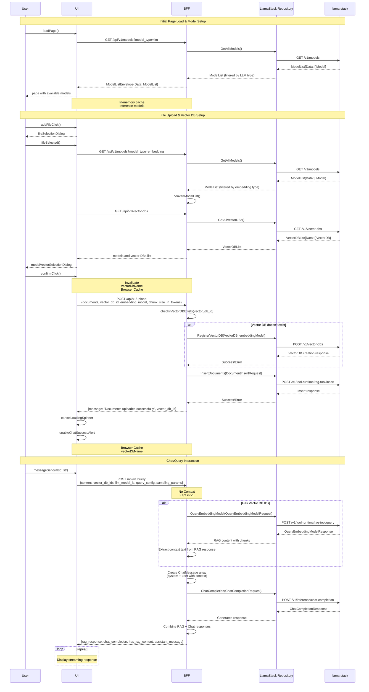

# 0003 - V1 End-to-End Flow Documentation

* Status: ACCEPTED
* Date: 2025-01-25
* Authors: Matias Schimuneck
* Reviewers: TBD

## Context and Problem Statement

The Llama Stack Modular UI v1 implements a complete end-to-end flow for RAG (Retrieval Augmented Generation) operations. We need to document the target interaction flow between the frontend, BFF, and Llama Stack services after the frontend migration to use BFF endpoints.

**Current State**: Frontend calls Llama Stack directly via `/llama-stack/v1/*` endpoints
**Target State**: Frontend will use BFF endpoints at `/api/v1/*` for proper architecture separation

The target v1 flow includes:
- Initial page load and model discovery via BFF
- File upload and vector database setup through BFF
- Chat/query interactions with RAG capabilities via BFF

## Decision Drivers

* Need for clear documentation of system interactions
* Debugging and troubleshooting support
* Onboarding new developers
* Understanding data flow and API contracts
* Identifying optimization opportunities

## Decision Outcome

Document the target v1 end-to-end flow using sequence diagrams that show:
- Target BFF API endpoints and method calls after frontend migration
- Real data structures and responses
- Error handling and conditional logic
- Caching mechanisms and state management

**Note**: This documents the target architecture. The current frontend implementation calls Llama Stack directly and needs to be migrated to use these BFF endpoints.

## V1 End-to-End Flow

### Target Request Flow Sequence (Post-Migration)

## Key Flow Characteristics

### Phase 1: Model Discovery
- **Purpose**: Load available LLM models for inference
- **Caching**: Models are cached in-memory on the frontend
- **Filtering**: BFF filters models by type (LLM vs embedding)
- **Error Handling**: Graceful degradation if model service unavailable

### Phase 2: Document Upload
- **Vector DB Management**: Automatic creation if doesn't exist
- **Document Processing**: Chunking and embedding via Llama Stack
- **State Management**: Browser cache tracks active vector DB
- **User Feedback**: Loading states and success notifications

### Phase 3: RAG Query & Chat
- **Conditional RAG**: Only performs RAG if vector DBs specified
- **Context Integration**: RAG results integrated into chat prompt
- **Fallback Behavior**: Works without RAG for general queries
- **Response Combination**: Returns both RAG and chat completion data

## API Contracts

### BFF Endpoints
- `GET /api/v1/models?model_type={llm|embedding}` - Model discovery
- `GET /api/v1/vector-dbs` - Vector database listing
- `POST /api/v1/upload` - Document upload and processing
- `POST /api/v1/query` - RAG query and chat completion

### Llama Stack Endpoints
- `GET /v1/models` - Model metadata
- `GET /v1/vector-dbs` - Vector database list
- `POST /v1/vector-dbs` - Vector database creation
- `POST /v1/tool-runtime/rag-tool/insert` - Document insertion
- `POST /v1/tool-runtime/rag-tool/query` - RAG query
- `POST /v1/inference/chat-completion` - Chat completion

## State Management

### Frontend State
- **Model Cache**: In-memory storage of available models
- **Vector DB Cache**: Browser storage of active vector database name
- **UI State**: Loading spinners, success alerts, form validation

### Backend State
- **Stateless Design**: No session state maintained in BFF
- **Llama Stack State**: Vector databases and documents persisted in Llama Stack
- **Error Recovery**: Each request is independent and recoverable

## Performance Considerations

### Optimization Points
- **Model Caching**: Reduces repeated API calls during session
- **Conditional RAG**: Skips expensive embedding queries when not needed
- **Streaming Support**: Ready for streaming chat completions
- **Error Boundaries**: Isolated failures don't break entire flow

### Future Improvements
- **Model Preloading**: Warm up models on startup
- **Result Caching**: Cache frequent RAG queries
- **Batch Operations**: Multiple document uploads
- **WebSocket Support**: Real-time streaming responses

## Migration Notes

### Current Implementation Issues
- Frontend directly calls `/llama-stack/v1/models` bypassing BFF
- No centralized authentication/authorization through BFF
- Missing CORS handling and error transformation
- Direct dependency on Llama Stack API structure

### Migration Tasks
1. **Update Frontend API Calls**: Change from `/llama-stack/v1/*` to `/api/v1/*`
2. **Implement Upload Flow**: Add file upload functionality using BFF `/api/v1/upload`
3. **Update Query Flow**: Use BFF `/api/v1/query` instead of direct chat completion
4. **Add Error Handling**: Leverage BFF error transformation and user-friendly messages
5. **Authentication Integration**: Use BFF authentication middleware

### Benefits Post-Migration
- Proper separation of concerns via BFF pattern
- Centralized authentication and CORS handling
- Better error handling and user experience
- Ability to use mock services for development
- API versioning and backward compatibility

## Links

* [Related to] ADR-0002 - BFF Architecture Pattern
* [Related to] ADR-0001 - Record Architecture Decisions
* [External] Llama Stack API Documentation 