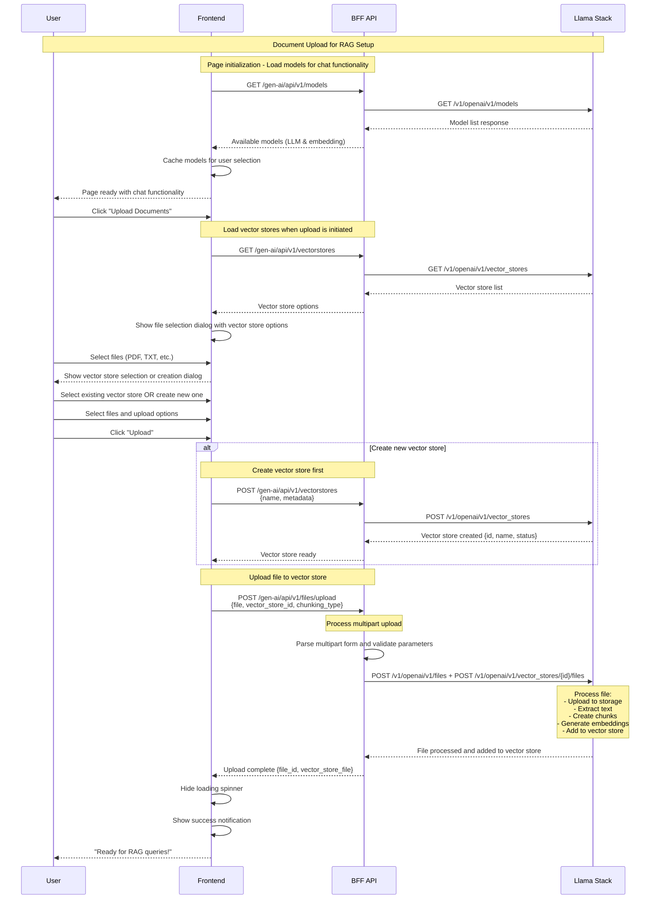
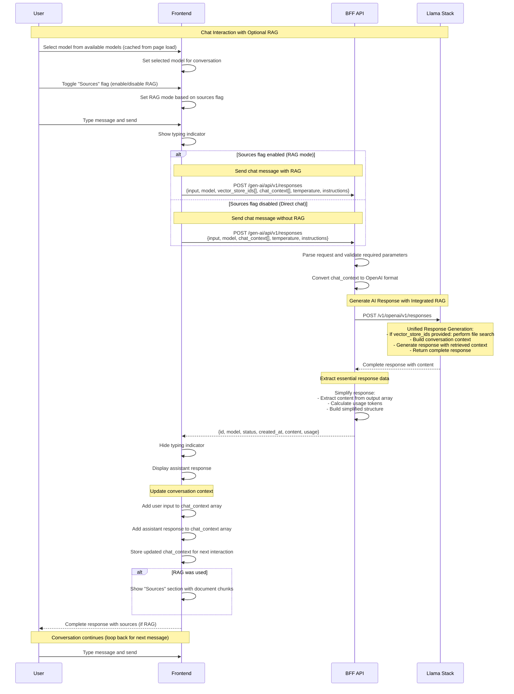
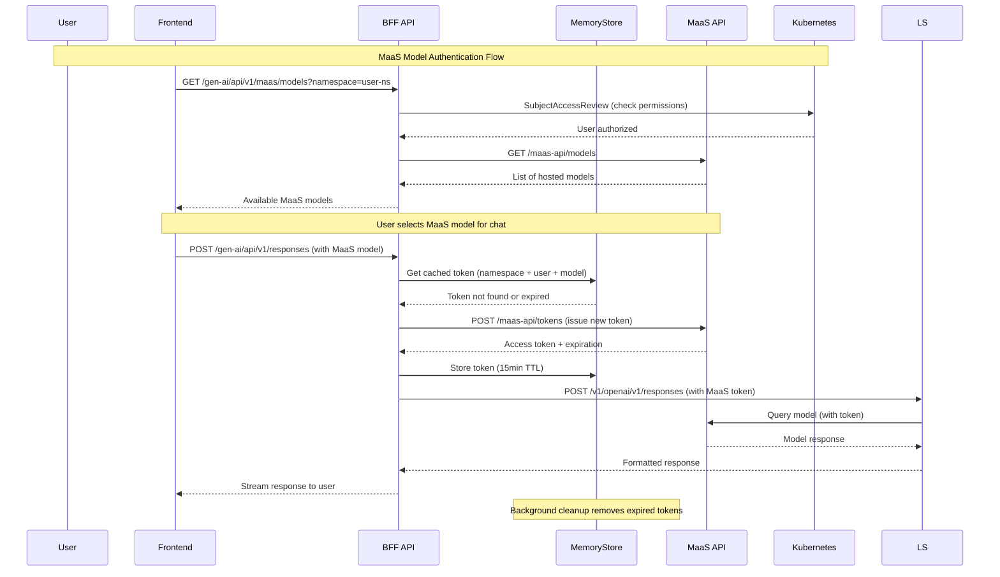
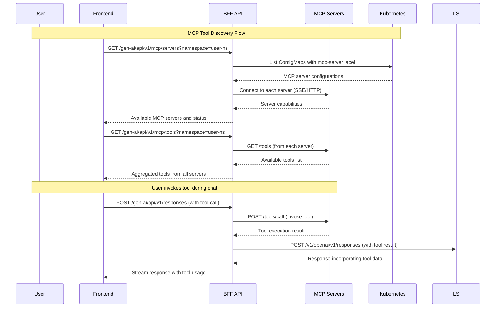
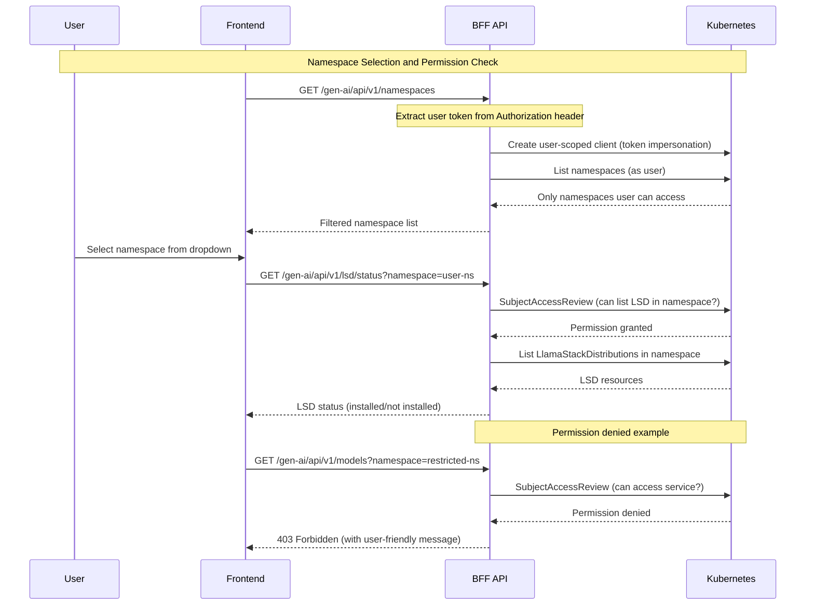

# 0003 - Core User Flows

* Date: 2025-07-25
* Updated: 2025-12-16
* Authors: Matias Schimuneck

## Context and Problem Statement

The Gen AI implements two core user workflows that define the primary user experience: document upload for RAG (Retrieval Augmented Generation) setup and chat completion for user interactions. This document defines how these flows work through the BFF architecture pattern, showing the interactions between frontend, BFF, and Llama Stack services.

The two primary user flows are:
- **File Upload Flow**: User uploads documents, system creates vector database and processes documents for RAG
- **Chat Completion Flow**: User sends queries, system optionally performs RAG retrieval and generates responses

## Decision Drivers

* Clear documentation of the two primary user workflows
* Understanding of document processing and RAG setup
* Chat interaction patterns with and without RAG context
* API contracts between frontend, BFF, and Llama Stack
* Error handling and user feedback mechanisms
* Developer onboarding and debugging support

## Decision Outcome

Document the file upload and chat completion flows using sequence diagrams that show:
- Document upload, vector database creation, and embedding generation
- Chat completion with optional RAG retrieval and context integration
- BFF API endpoints and their interactions with Llama Stack services
- Error handling and user feedback patterns

## Core User Flows

### Flow 1: File Upload and RAG Setup



### Flow 2: Chat Completion with Optional RAG



## Flow Characteristics

### File Upload Flow
- **Simplified Process**: Vector store creation → File upload with chunking → Ready for RAG
- **OpenAI SDK Integration**: Uses official SDK for all Llama Stack communication
- **Vector Store Management**: Create new stores or use existing ones via dedicated endpoints
- **File Processing**: Upload files directly to vector stores with automatic chunking
- **User Experience**: Streamlined flow with clear progress indicators
- **Validation**: Comprehensive parameter validation and error handling
- **Chunking Control**: Support for auto and static chunking strategies

### Chat Completion Flow  
- **Unified Response API**: Single endpoint handles both simple chat and RAG queries
- **Integrated RAG**: Vector store IDs automatically enable file search functionality
- **Conversation Context**: Multi-turn conversations via chat_context parameter
- **Generation Control**: Temperature, top_p, and instructions for response customization
- **Simplified Responses**: Clean response structure with only essential fields
- **Error Handling**: Proper error forwarding from Llama Stack
- **Performance Optimized**: Reduced response payload size by 90%

## API Contracts

### File Upload Flow Endpoints
- **Frontend → BFF**: `GET /gen-ai/api/v1/models` - Get available models (all types)
- **Frontend → BFF**: `GET /gen-ai/api/v1/vectorstores` - Get existing vector stores with pagination
- **Frontend → BFF**: `POST /gen-ai/api/v1/vectorstores` - Create new vector store
  ```json
  {
    "name": "My Documents",
    "metadata": {
      "department": "support",
      "category": "faq"
    }
  }
  ```
- **Frontend → BFF**: `POST /gen-ai/api/v1/files/upload` - Upload file to vector store
  ```json
  // Multipart form data:
  {
    "file": "<binary file data>",
    "vector_store_id": "vs_abc123-def456",
    "purpose": "assistants",
    "chunking_type": "static",
    "max_chunk_size_tokens": 600,
    "chunk_overlap_tokens": 200
  }
  ```

### Chat Completion Flow Endpoints
- **Frontend → BFF**: `POST /gen-ai/api/v1/responses` - Generate AI response with optional RAG
  ```json
  {
    "input": "What is the main topic of the documents?",
    "model": "ollama/llama3.2:3b",
    "vector_store_ids": ["vs_abc123-def456"],
    "chat_context": [
      {
        "role": "user",
        "content": "Previous question"
      },
      {
        "role": "assistant",
        "content": "Previous response"
      }
    ],
    "temperature": 0.7,
    "top_p": 0.9,
    "instructions": "You are a helpful assistant"
  }
  ```

### BFF → Llama Stack Internal Calls (via OpenAI SDK)
- `GET /v1/openai/v1/models` - Model discovery using OpenAI-compatible endpoint
- `POST /v1/openai/v1/vector_stores` - Vector store creation
- `POST /v1/openai/v1/files` + `POST /v1/openai/v1/vector_stores/{id}/files` - File upload and embedding
- `POST /v1/openai/v1/responses` - Unified response generation with integrated RAG

## State Management

### File Upload Flow State
- **Upload Progress**: Track file selection, model configuration, and processing status
- **Vector DB Selection**: Store user's chosen vector database name and embedding model  
- **Validation State**: File type validation, size limits, and configuration errors
- **Success State**: Completion notifications and readiness for chat queries

### Chat Flow State
- **Conversation History**: Messages exchanged between user and assistant
- **RAG Context**: Available vector databases and their document content
- **UI Feedback**: Typing indicators, response streaming, and source attribution
- **Error Handling**: Network failures, API errors, and graceful degradation

### Persistence Strategy
- **Frontend**: Temporary UI state, no persistent storage of sensitive data
- **BFF**: Stateless request processing, no session persistence
- **Llama Stack**: Persistent storage of vector databases, embeddings, and metadata

## Performance Considerations

### File Upload Flow Optimizations
- **Chunked Upload**: Process large files in smaller chunks to prevent timeouts
- **Background Processing**: Asynchronous document processing with progress updates
- **Validation Early**: Client-side file validation before server upload
- **Compression**: Compress documents before transmission when beneficial

### Chat Flow Optimizations  
- **RAG Caching**: Cache embedding queries for repeated similar questions
- **Model Warming**: Keep frequently used models loaded in memory
- **Streaming Responses**: Real-time response delivery for better user experience
- **Context Management**: Limit RAG context size to optimize inference speed

### System-Wide Performance
- **Connection Pooling**: Reuse HTTP connections to Llama Stack
- **Error Recovery**: Fast failure detection and graceful degradation
- **Resource Limits**: Prevent resource exhaustion from large uploads or queries


### Flow 3: MaaS Model Token Management

User authenticates with MaaS models and manages access tokens:



### Flow 4: MCP Tool Discovery and Invocation

User discovers and invokes tools from MCP servers:



### Flow 5: Namespace Selection and RBAC Enforcement

User selects namespace and system enforces RBAC permissions:



## Links

* [Related to] ADR-0002 - Gen AI System Architecture
* [Related to] ADR-0001 - Record Architecture Decisions
* [Related to] ADR-0005 - Authentication and Authorization Architecture (namespace RBAC)
* [Related to] ADR-0008 - Caching Strategy (MaaS token caching)
* [Related to] ADR-0009 - MaaS Service Autodiscovery
* [External] [Llama Stack API Documentation](https://llama-stack.readthedocs.io/) - RAG tool and chat completion APIs
* [Related to] [Frontend Implementation](../../frontend/src/app/services/llamaStackService.ts) - API client code
* [Related to] [BFF Handlers](../../bff/internal/api/) - BFF endpoint implementations 