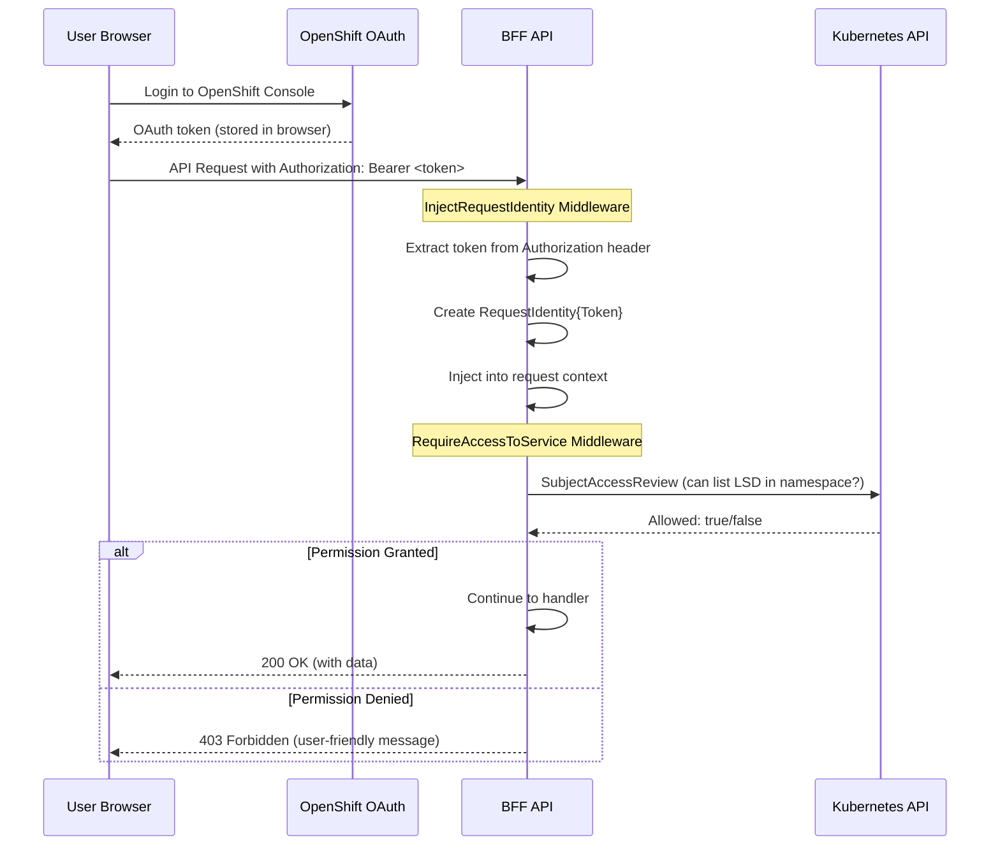

# 0005 - Authentication and Authorization Architecture

* Date: 2025-12-16
* Authors: Matias Schimuneck

## Context and Problem Statement

The BFF operates in a multi-tenant OpenShift environment where users must be authenticated and authorized to access namespaced resources. The system needs to:
- Authenticate users via OAuth 2.0/OIDC tokens from OpenShift
- Authorize access to Kubernetes resources using RBAC
- Support user impersonation for namespace-scoped operations
- Propagate user identity across service boundaries
- Secure access to external services (Llama Stack, MaaS, MCP)
- Work seamlessly in both development (auth disabled) and production (auth required) modes

## Decision Drivers

* Security requirement for multi-tenant isolation in OpenShift
* Need for fine-grained RBAC authorization at namespace level
* Kubernetes API requires user tokens for permission checks
* External services (MaaS, LlamaStack) need user tokens for authentication
* Development experience requires ability to disable auth for local testing
* Performance consideration for token validation overhead
* Compliance with OpenShift security patterns

## Considered Options

* **Option 1**: Session-based authentication with server-side storage
  - Doesn't align with stateless BFF pattern, requires session store
* **Option 2**: API keys per user
  - Poor security, difficult key rotation, not OpenShift-native
* **Option 3**: OAuth 2.0 token-based with RBAC (chosen)
  - OpenShift-native, stateless, fine-grained permissions
* **Option 4**: Service account only (no user impersonation)
  - Can't enforce per-user RBAC, security risk

## Decision Outcome

Chosen option: "OAuth 2.0 token-based authentication with RBAC via Kubernetes SubjectAccessReview", because:
- Leverages OpenShift's built-in OAuth 2.0/OIDC infrastructure
- Stateless BFF (no session storage required)
- Fine-grained RBAC via Kubernetes SubjectAccessReview
- User impersonation enables namespace-level isolation
- Token forwarding to external services (LlamaStack, MaaS)
- Configurable for development (auth disabled) and production (auth required)

### Positive Consequences

* Strong multi-tenant isolation through RBAC
* Stateless architecture (horizontally scalable)
* OpenShift-native authentication (no custom auth system)
* User-scoped operations (audit trail, security)
* Flexible configuration (dev vs prod environments)
* Token reuse across services (no multiple auth flows)

### Negative Consequences

* Latency overhead from SubjectAccessReview checks (~10-50ms per check)
* Requires valid OpenShift token for all API requests in production
* Development requires either mock auth or running OpenShift cluster
* Token expiration requires frontend to handle refresh

## Implementation

### Core Components

#### 1. RequestIdentity Pattern

User identity extracted from HTTP headers and propagated via context:

```go
type RequestIdentity struct {
    Token    string // Kubernetes authentication token (OAuth 2.0)
    MCPToken string // Optional MCP server authentication token
}
```

#### 2. InjectRequestIdentity Middleware

Extracts token from configurable HTTP header:

```go
func (app *App) InjectRequestIdentity(next http.Handler) http.Handler {
    // Skip for non-API paths (static assets, healthcheck)
    // Skip if auth disabled (development mode)
    
    identity, err := app.kubernetesClientFactory.ExtractRequestIdentity(r.Header)
    if err != nil {
        // Return 401 Unauthorized
    }
    
    ctx := context.WithValue(r.Context(), RequestIdentityKey, identity)
    next.ServeHTTP(w, r.WithContext(ctx))
}
```

**Token Extraction:**
- Header: Configurable (default: `Authorization`)
- Prefix: Configurable (default: `Bearer `)
- Validation: Non-empty token after prefix removal

#### 3. RequireAccessToService Middleware

Enforces RBAC authorization for namespace-scoped resources:

```go
func (app *App) RequireAccessToService(next httprouter.Handle) httprouter.Handle {
    // Skip if auth disabled
    
    identity := ctx.Value(RequestIdentityKey).(*RequestIdentity)
    namespace := ctx.Value(NamespaceQueryParameterKey).(string)
    
    k8sClient := k8sFactory.GetClient(ctx) // User-scoped client
    canAccess, err := k8sClient.CanListLlamaStackDistributions(ctx, identity, namespace)
    
    if !canAccess {
        // Return 403 Forbidden
    }
    
    next(w, r, ps)
}
```

#### 4. RBAC via SubjectAccessReview

Checks user permissions before allowing operations:

```go
func (kc *TokenKubernetesClient) CanListLlamaStackDistributions(
    ctx context.Context,
    identity *RequestIdentity,
    namespace string,
) (bool, error) {
    // Create user-scoped config with user's token
    userConfig := rest.CopyConfig(kc.Config)
    userConfig.BearerToken = identity.Token
    
    // Create SubjectAccessReview
    sar := &authzv1.SubjectAccessReview{
        Spec: authzv1.SubjectAccessReviewSpec{
            ResourceAttributes: &authzv1.ResourceAttributes{
                Namespace: namespace,
                Verb:      "list",
                Group:     "genai.opendatahub.io",
                Resource:  "llamastackdistributions",
            },
        },
    }
    
    resp, err := clientset.AuthorizationV1().SubjectAccessReviews().Create(ctx, sar, metav1.CreateOptions{})
    return resp.Status.Allowed, nil
}
```

### Authentication Flow



### User Impersonation for Namespace Listing

Different approach for listing user-accessible namespaces:

```go
func (kc *TokenKubernetesClient) ListNamespaces(ctx context.Context, identity *RequestIdentity) ([]corev1.Namespace, error) {
    // Create user-scoped client with user's token
    userConfig := rest.CopyConfig(kc.Config)
    userConfig.BearerToken = identity.Token
    userClient, err := client.New(userConfig, client.Options{Scheme: kc.Client.Scheme()})
    
    // Try cluster-wide list (admin path)
    nsList := &corev1.NamespaceList{}
    err = userClient.List(ctx, nsList)
    if err == nil {
        return nsList.Items, nil  // User has cluster-admin
    }
    
    // Fallback: List OpenShift Projects (filtered by user permissions)
    projectList := &unstructured.UnstructuredList{}
    projectList.SetGroupVersionKind(schema.GroupVersionKind{
        Group:   "project.openshift.io",
        Version: "v1",
        Kind:    "ProjectList",
    })
    err = userClient.List(ctx, projectList)
    return convertToNamespaces(projectList), nil
}
```

### Configuration Options

**AuthMethod** modes:
- `user_token`: Full authentication required (production default)
- `disabled`: No authentication (development/testing only)

**Configurable Headers**:
```go
// Environment variables
AUTH_TOKEN_HEADER=Authorization        // Default
AUTH_TOKEN_PREFIX="Bearer "            // Default (note the space)

// Allows integration with different auth proxies
AUTH_TOKEN_HEADER=X-Forwarded-Access-Token
AUTH_TOKEN_PREFIX=""
```

### Security Considerations

**Token Handling:**
- Tokens never logged in plaintext (see ADR-0004 Logging Strategy)
- Tokens extracted per-request, never cached
- Tokens forwarded to downstream services (LlamaStack, MaaS, MCP)
- No token storage in BFF (stateless)

**RBAC Enforcement:**
- Permission checks before every namespace-scoped operation
- User can only see/modify resources in authorized namespaces
- Service account token used for cluster-wide operations (cluster domain discovery)
- User token used for all user-scoped operations

**Defense in Depth:**
- Middleware chain ensures auth before business logic
- Multiple validation points (token extraction, RBAC check)
- Graceful degradation when auth disabled (development only)

## Alternatives Considered

### JWT Validation in BFF
**Rejected** because:
- Kubernetes API already validates tokens
- Would duplicate validation logic
- SubjectAccessReview provides both validation + authorization
- Adds complexity without security benefit

### Role-based Permissions in BFF
**Rejected** because:
- Kubernetes RBAC is the source of truth
- Duplicating role checks would cause drift
- SubjectAccessReview gives real-time permission checking
- Easier to manage in Kubernetes (RoleBindings)

## Performance Trade-offs

**SubjectAccessReview Overhead:**
- Each namespace-scoped request: +10-50ms latency
- Acceptable for human-interactive workloads (chat, file upload)
- Alternative (no RBAC) has unacceptable security risk

**Mitigation:**
- Cache SAR results per request context (same namespace, multiple ops)
- Future: Consider short-lived cache (30s) for repeated namespace access
- Currently: Accept latency for security benefit

## Links

* [Related to] ADR-0002 - System Architecture (middleware chain)
* [Related to] ADR-0003 - Core User Flows (namespace selection flow)
* [Related to] ADR-0004 - Logging Strategy (token redaction)
* [Related to] ADR-0010 - Kubernetes Client Architecture (user impersonation)
* [External] [Kubernetes SubjectAccessReview](https://kubernetes.io/docs/reference/access-authn-authz/authorization/) - Authorization API
* [External] [OpenShift OAuth](https://docs.openshift.com/container-platform/latest/authentication/understanding-authentication.html) - Authentication system

