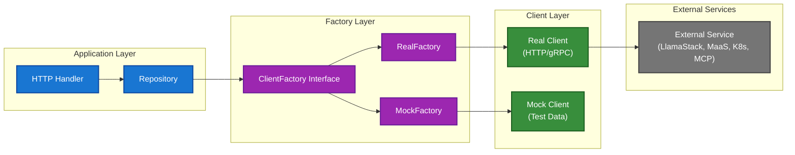

# 0006 - Factory Pattern for Client Management

* Date: 2025-12-16
* Authors: Matias Schimuneck

## Context and Problem Statement

The BFF integrates with multiple external services (LlamaStack, MaaS, MCP, Kubernetes), each requiring:
- Different client initialization patterns
- Authentication with user tokens
- Mock implementations for testing and development
- Configuration-driven creation (URLs, TLS settings)
- Per-request client instantiation with user context

Without a consistent pattern, client creation would be scattered across handlers, making testing difficult and coupling business logic to infrastructure details.

## Decision Drivers

* Need for comprehensive test coverage with mocked services
* Development workflow requires ability to run without external dependencies
* Production requires real service integration with proper authentication
* Configuration must support multiple environments (dev, staging, prod)
* Clients need per-request creation with user-specific authentication tokens
* Clean separation between business logic and infrastructure concerns
* Dependency injection for better testability

## Considered Options

* **Option 1**: Direct client instantiation in handlers
  - Simple but couples logic to infrastructure, hard to test
* **Option 2**: Singleton clients shared across requests
  - Doesn't work with per-request user authentication
* **Option 3**: Factory pattern with Real and Mock implementations (chosen)
  - Clean abstraction, easy testing, configuration-driven
* **Option 4**: Dependency injection framework
  - Overkill for Go, adds complexity and external dependencies

## Decision Outcome

Chosen option: "Factory pattern with Real and Mock implementations", because:
- Clean interface abstraction for each service type
- Mock factories enable comprehensive unit testing without external services
- Configuration-driven (environment variables control real vs mock)
- Supports per-request client creation with user authentication
- Consistent pattern across all external service integrations
- No external DI framework needed (Go's interfaces are sufficient)

### Positive Consequences

* Comprehensive test coverage with isolated unit tests
* Development workflow works without external services
* Easy to add new service integrations following same pattern
* Clear separation of concerns (business logic vs infrastructure)
* Production and development use same code paths (just different factory)
* Flexible configuration per environment

### Negative Consequences

* Additional abstraction layer (factory interface + implementations)
* More files to maintain (factory, real client, mock client per service)
* Developers must understand factory pattern
* Slight performance overhead from interface calls (negligible)

## Implementation

### Factory Pattern Structure

Each external service has:
1. **Client Interface**: Defines service operations
2. **Factory Interface**: Defines client creation
3. **Real Factory**: Creates production clients
4. **Mock Factory**: Creates test/development clients

### 1. LlamaStack Client Factory

**Interface:**
```go
type LlamaStackClientInterface interface {
    ListModels(ctx context.Context) ([]openai.Model, error)
    CreateVectorStore(ctx context.Context, params CreateVectorStoreParams) (*openai.VectorStore, error)
    CreateResponseStream(ctx context.Context, params CreateResponseParams) (*ssestream.Stream, error)
    // ... more operations
}

type LlamaStackClientFactory interface {
    CreateClient(baseURL string, authToken string, insecureSkipVerify bool, rootCAs *x509.CertPool) LlamaStackClientInterface
}
```

**Real Factory:**
```go
type RealClientFactory struct{}

func (f *RealClientFactory) CreateClient(baseURL, authToken string, insecureSkipVerify bool, rootCAs *x509.CertPool) LlamaStackClientInterface {
    return NewLlamaStackClient(baseURL, authToken, insecureSkipVerify, rootCAs)
    // Uses OpenAI Go SDK v2.1.0
}
```

**Mock Factory:**
```go
type MockClientFactory struct{}

func (f *MockClientFactory) CreateClient(baseURL, authToken string, insecureSkipVerify bool, rootCAs *x509.CertPool) LlamaStackClientInterface {
    return NewMockLlamaStackClient()
    // Returns predefined test data
}
```

### 2. MaaS Client Factory

**Interface:**
```go
type MaaSClientInterface interface {
    ListModels(ctx context.Context) ([]models.MaaSModel, error)
    IssueToken(ctx context.Context, request models.MaaSTokenRequest) (*models.MaaSTokenResponse, error)
    RevokeAllTokens(ctx context.Context) error
}

type MaaSClientFactory interface {
    CreateClient(baseURL string, authToken string, insecureSkipVerify bool, rootCAs *x509.CertPool) MaaSClientInterface
}
```

**Usage:** MaaS clients created per-request with autodiscovered URL and user token

### 3. MCP Client Factory

**Interface:**
```go
type MCPClientInterface interface {
    ListTools(ctx context.Context, serverURL, mcpToken string) ([]models.MCPTool, error)
    GetServerConfig(ctx context.Context, serverURL, mcpToken string) (*models.MCPServerConfig, error)
    CallTool(ctx context.Context, serverURL, mcpToken, toolName string, args map[string]interface{}) (*models.MCPToolResult, error)
}

type MCPClientFactory interface {
    GetClient(ctx context.Context) (MCPClientInterface, error)
    ExtractRequestIdentity(httpHeader http.Header) (*integrations.RequestIdentity, error)
}
```

**Special Features:**
- Extracts both K8s token and MCP token from headers
- Supports SSE and streamable-HTTP transports
- Validates transport types with fallback

### 4. Kubernetes Client Factory

**Interface:**
```go
type KubernetesClientInterface interface {
    ListNamespaces(ctx context.Context, identity *RequestIdentity) ([]corev1.Namespace, error)
    CanListLlamaStackDistributions(ctx context.Context, identity *RequestIdentity, namespace string) (bool, error)
    GetAAModels(ctx context.Context, identity *RequestIdentity, namespace string) ([]models.AAModel, error)
    CreateLlamaStackDistribution(ctx context.Context, identity *RequestIdentity, namespace, name string, models []models.AAModel) (*LlamaStackDistribution, error)
    // ... more K8s operations
}

type KubernetesClientFactory interface {
    GetClient(ctx context.Context) (KubernetesClientInterface, error)
    ExtractRequestIdentity(httpHeader http.Header) (*RequestIdentity, error)
    ValidateRequestIdentity(identity *RequestIdentity) error
}
```

**Usage:** Creates user-scoped K8s clients with user token for impersonation

### Configuration-Driven Factory Selection

```go
// In app.go - factory selection based on configuration
func NewApp(cfg config.EnvConfig, logger *slog.Logger) (*App, error) {
    // LlamaStack factory
    var llamaStackClientFactory llamastack.LlamaStackClientFactory
    if cfg.MockLSClient {
        llamaStackClientFactory = lsmocks.NewMockClientFactory()
    } else {
        llamaStackClientFactory = llamastack.NewRealClientFactory()
    }
    
    // MaaS factory
    var maasClientFactory maas.MaaSClientFactory
    if cfg.MockMaaSClient {
        maasClientFactory = maasmocks.NewMockClientFactory()
    } else {
        maasClientFactory = maas.NewRealClientFactory()
    }
    
    // MCP factory
    var mcpFactory mcp.MCPClientFactory
    if cfg.MockMCPClient {
        mcpFactory = mcpmocks.NewMockedMCPClientFactory(cfg, logger)
    } else {
        mcpFactory, _ = mcp.NewMCPClientFactory(cfg, logger, cfg.InsecureSkipVerify, rootCAs)
    }
    
    // Kubernetes factory
    var k8sFactory k8s.KubernetesClientFactory
    if cfg.MockK8sClient {
        k8sFactory, _ = k8smocks.NewMockedKubernetesClientFactory(...)
    } else {
        k8sFactory, _ = k8s.NewKubernetesClientFactory(cfg, logger)
    }
    
    // ... use factories to create per-request clients
}
```

### Per-Request Client Creation

Clients created in middleware and injected into context:

```go
func (app *App) AttachLlamaStackClient(next httprouter.Handle) httprouter.Handle {
    return func(w http.ResponseWriter, r *http.Request, ps httprouter.Params) {
        identity := ctx.Value(RequestIdentityKey).(*RequestIdentity)
        
        // Create client per-request with user token
        client := app.llamaStackClientFactory.CreateClient(
            serviceURL,
            identity.Token,  // User's auth token
            app.config.InsecureSkipVerify,
            app.rootCAs,
        )
        
        ctx = context.WithValue(ctx, LlamaStackClientKey, client)
        next(w, r.WithContext(ctx), ps)
    }
}
```

### Factory Pattern Benefits



### Testing Benefits

Unit tests can run without external services:

```go
func TestHandler(t *testing.T) {
    // Use mock factory
    mockFactory := lsmocks.NewMockClientFactory()
    
    app := &App{
        llamaStackClientFactory: mockFactory,
        // ... other config
    }
    
    // Test handler without real LlamaStack service
    // Mock returns predictable test data
}
```

## Factory Implementations Summary

| Service | Real Factory | Mock Factory | Interface Methods | Per-Request |
|---------|-------------|--------------|-------------------|-------------|
| LlamaStack | `llamastack.RealClientFactory` | `lsmocks.MockClientFactory` | 15 operations | ✓ |
| MaaS | `maas.RealClientFactory` | `maasmocks.MockClientFactory` | 3 operations | ✓ |
| MCP | `mcp.SimpleClientFactory` | `mcpmocks.MockedMCPClientFactory` | 3 operations | ✓ |
| Kubernetes | `k8s.TokenClientFactory` | `k8smocks.MockedTokenClientFactory` | 12+ operations | ✓ |

## Trade-offs

**Abstraction Overhead:**
- Extra interfaces and factory implementations
- More files to maintain
- **Benefit**: Clean architecture, easy testing

**Per-Request Client Creation:**
- New client allocated per request
- **Benefit**: Thread-safe, user-scoped authentication
- **Impact**: Minimal (client creation is fast, ~1ms)

**Mock vs Real Code Paths:**
- Different implementations might behave differently
- **Mitigation**: Contract tests verify real and mock behave consistently
- **Benefit**: Tests run in milliseconds vs seconds

## Links

* [Related to] ADR-0002 - System Architecture (client factories in BFF)
* [Related to] ADR-0005 - Authentication Architecture (token forwarding to clients)
* [Related to] ADR-0007 - Repository Pattern (repositories depend on factories)
* [External] [Factory Pattern](https://refactoring.guru/design-patterns/factory-method) - Design pattern explanation
* [Implementation] See `internal/integrations/*/factory.go` files

