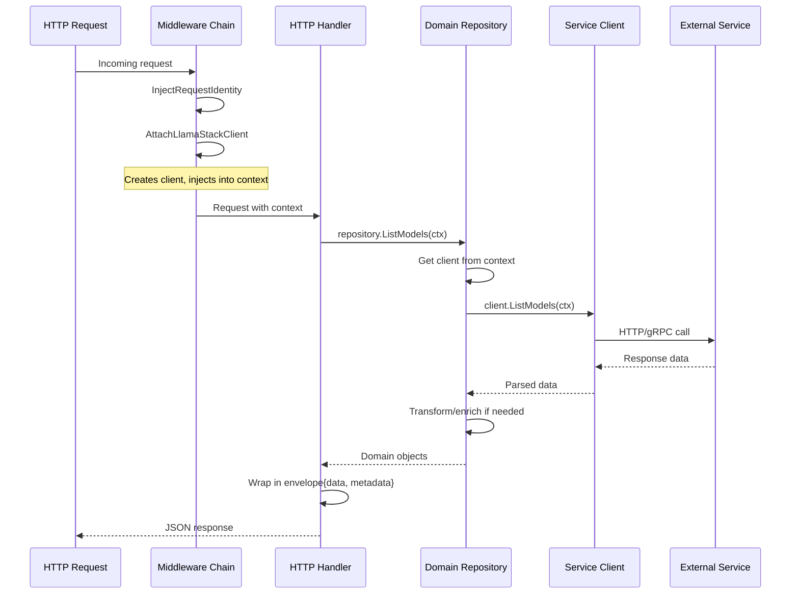
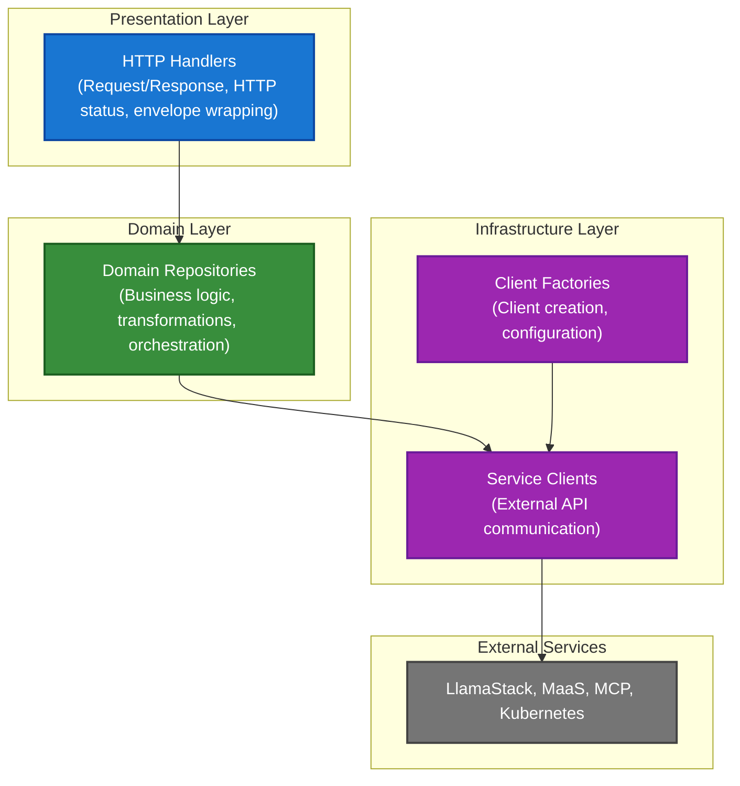

# 0007 - Domain Repository Pattern

* Date: 2025-12-16
* Authors: Matias Schimuneck

## Context and Problem Statement

The BFF handles multiple domain operations (Models, VectorStores, Files, Responses, MaaS, MCP, Kubernetes resources). Without proper organization, business logic would be scattered across HTTP handlers, making the code hard to maintain, test, and reason about.

We need an architectural pattern that:
- Organizes business logic by domain
- Separates concerns between HTTP handling and domain operations
- Enables easy testing of business logic without HTTP layer
- Provides a clear place for data transformations and validation
- Supports dependency on multiple service clients (factories)

## Decision Drivers

* Clear separation of concerns (HTTP vs business logic)
* Testability of business logic without HTTP infrastructure
* Single responsibility principle (one repository per domain)
* Consistent pattern across all domain operations
* Easy to locate and modify domain-specific logic
* Support for complex operations requiring multiple clients
* Maintainability as system grows

## Considered Options

* **Option 1**: All logic in HTTP handlers
  - Simple initially but leads to fat handlers, hard to test
* **Option 2**: Service layer pattern
  - Similar to repository but adds unnecessary abstraction
* **Option 3**: Domain Repository Pattern (chosen)
  - Clear domain boundaries, testable, separation of concerns
* **Option 4**: CQRS with separate command/query handlers
  - Overkill for current scale, adds complexity

## Decision Outcome

Chosen option: "Domain Repository Pattern", because:
- Clear separation: Handlers orchestrate, Repositories implement domain logic
- One repository per domain (Models, VectorStores, Files, etc.)
- Repositories get clients from context (injected by middleware)
- Testable business logic without HTTP layer
- Consistent pattern across all domains
- Natural place for data transformations and enrichment

### Positive Consequences

* Business logic isolated in repositories (not scattered across handlers)
* Easy to test domain logic (mock clients, no HTTP infrastructure)
* Clear single responsibility (one domain per repository)
* Handlers remain thin (orchestration only)
* Easy to locate domain-specific code
* Supports complex multi-client operations

### Negative Consequences

* Additional abstraction layer (repository between handler and client)
* More files to maintain (one per domain)
* Some operations are simple passthroughs (low added value)
* Developers must understand the pattern

## Implementation

### Repository Structure

```go
// Repositories struct holds all domain repositories
type Repositories struct {
    HealthCheck            *HealthCheckRepository
    Models                 *ModelsRepository
    MaaSModels             *MaaSModelsRepository
    AAModels               *AAModelsRepository
    VectorStores           *VectorStoresRepository
    Files                  *FilesRepository
    Responses              *ResponsesRepository
    Template               *TemplateRepository
    Namespace              *NamespaceRepository
    LlamaStackDistribution *LlamaStackDistributionRepository
    MCPClient              *MCPClientRepository
}
```

### Domain Repository Example

```go
// ModelsRepository handles model-related operations
type ModelsRepository struct {
    // Stateless - no fields needed
    // Clients come from context
}

func NewModelsRepository() *ModelsRepository {
    return &ModelsRepository{}
}

// ListModels retrieves and transforms model data
func (r *ModelsRepository) ListModels(ctx context.Context) ([]openai.Model, error) {
    // Get client from context (injected by middleware)
    client, err := helper.GetContextLlamaStackClient(ctx)
    if err != nil {
        return nil, err
    }
    
    // Domain logic: call client, transform data if needed
    models, err := client.ListModels(ctx)
    if err != nil {
        return nil, err
    }
    
    // Could add transformations, filtering, enrichment here
    return models, nil
}
```

### Handler → Repository → Client Flow



### Repository Responsibilities by Domain

| Repository | Domain | Key Operations | Dependencies |
|-----------|--------|----------------|--------------|
| **ModelsRepository** | LlamaStack models | List, filter, transform models | LlamaStackClient |
| **MaaSModelsRepository** | MaaS hosted models | List, validate MaaS models | MaaSClient |
| **AAModelsRepository** | K8s AI Assets | List InferenceServices/LLMInferenceServices | K8sClient |
| **VectorStoresRepository** | Vector databases | Create, list, delete vector stores | LlamaStackClient |
| **FilesRepository** | Document upload | Upload, list, delete files | LlamaStackClient |
| **ResponsesRepository** | Chat completions | Create responses, stream, handle RAG | LlamaStackClient, MaaSClient |
| **NamespaceRepository** | K8s namespaces | List user namespaces, RBAC checks | K8sClient |
| **LlamaStackDistributionRepository** | LSD lifecycle | Install, status, delete LSD | K8sClient, MaaSClient |
| **MCPClientRepository** | MCP tools | List tools, invoke, get status | MCPClient |
| **TemplateRepository** | Code generation | Generate deployment code | None |
| **HealthCheckRepository** | Service health | Health checks, readiness | None |

### Stateless Repository Design

Repositories are stateless - they don't store data:

```go
type ModelsRepository struct {
    // No fields - stateless
}

// Client comes from context, not constructor
func (r *ModelsRepository) ListModels(ctx context.Context) ([]openai.Model, error) {
    client, err := helper.GetContextLlamaStackClient(ctx)
    // ...
}
```

**Why stateless?**
- Clients are per-request (user-scoped authentication)
- No shared state means thread-safe by design
- No lifecycle management needed
- Simple initialization (no constructor parameters)

### Complex Repository Example

Some repositories coordinate multiple clients:

```go
type ResponsesRepository struct{}

func (r *ResponsesRepository) CreateResponse(ctx context.Context, params CreateResponseParams) (*Response, error) {
    // Get LlamaStack client from context
    lsClient, err := helper.GetContextLlamaStackClient(ctx)
    
    // Get MaaS client from context (may be nil)
    maasClient := helper.GetContextMaaSClient(ctx)
    
    // Domain logic: coordinate both clients
    // 1. Check if model is MaaS model
    // 2. If MaaS, get/cache access token
    // 3. Add token to request params
    // 4. Call LlamaStack with enriched params
    
    return lsClient.CreateResponse(ctx, enrichedParams)
}
```

### Testing Benefits

Repositories can be tested without HTTP infrastructure:

```go
func TestModelsRepository_ListModels(t *testing.T) {
    // Create mock client
    mockClient := &MockLlamaStackClient{
        ModelsFunc: func(ctx context.Context) ([]openai.Model, error) {
            return []openai.Model{{ID: "test-model"}}, nil
        },
    }
    
    // Inject into context
    ctx := context.WithValue(context.Background(), LlamaStackClientKey, mockClient)
    
    // Test repository directly
    repo := NewModelsRepository()
    models, err := repo.ListModels(ctx)
    
    assert.NoError(t, err)
    assert.Len(t, models, 1)
}
```

### Repository Initialization

Repositories created once at app startup:

```go
func NewApp(cfg config.EnvConfig, logger *slog.Logger) (*App, error) {
    // ...factories initialized...
    
    repositories := repositories.NewRepositoriesWithMCP(mcpFactory, logger)
    
    app := &App{
        repositories: repositories,
        // ... other fields
    }
    return app, nil
}
```

### Handler Usage Pattern

Handlers use repositories for business logic:

```go
func (app *App) LlamaStackModelsHandler(w http.ResponseWriter, r *http.Request, ps httprouter.Params) {
    ctx := r.Context()
    
    // Call repository for domain logic
    models, err := app.repositories.Models.ListModels(ctx)
    if err != nil {
        app.serverErrorResponse(w, r, err)
        return
    }
    
    // Wrap in envelope and return
    envelope := ModelsEnvelope{Data: models}
    app.WriteJSON(w, http.StatusOK, envelope, nil)
}
```

## Architectural Layers



## Trade-offs

**Additional Abstraction:**
- Pro: Clean architecture, testable business logic
- Con: More files, one extra layer

**Stateless Design:**
- Pro: Thread-safe, no lifecycle, simple
- Con: Can't cache data across requests (use app-level cache instead)

**Context-based Dependencies:**
- Pro: Flexible, per-request clients, no constructor complexity
- Con: Runtime errors if middleware chain broken

## Alternatives Considered

### Service Layer Pattern
Similar to repository but often includes additional business logic orchestration layer. Rejected because:
- Current needs met by simpler repository pattern
- Would add layer without clear benefit
- Repository pattern sufficient for domain operations

### Active Record Pattern
Combine data and behavior in domain models. Rejected because:
- Go doesn't have ORM like Ruby/Rails
- Stateless BFF doesn't store domain data
- Clients handle data persistence (LlamaStack, K8s)

## Links

* [Related to] ADR-0002 - System Architecture (repository layer diagram)
* [Related to] ADR-0006 - Factory Pattern (repositories depend on factories)
* [External] [Repository Pattern](https://martinfowler.com/eaaCatalog/repository.html) - Martin Fowler
* [Implementation] See `internal/repositories/*.go` files

