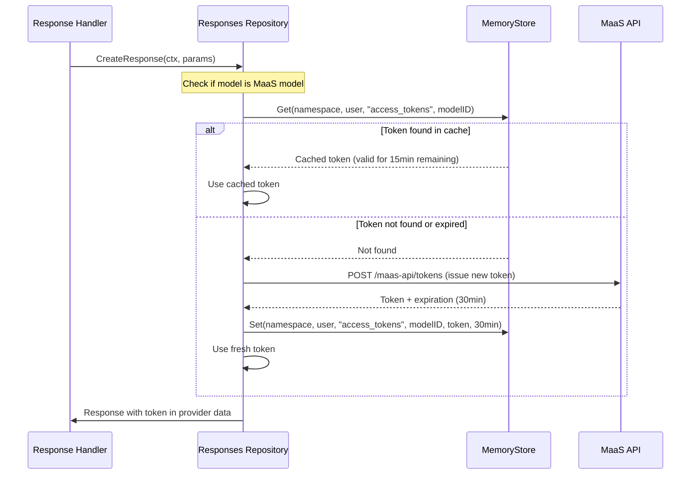

# 0008 - Caching Strategy

* Date: 2025-12-16
* Authors: Matias Schimuneck

## Context and Problem Statement

The BFF needs to issue MaaS (Model as a Service) access tokens for each chat request using MaaS models. Without caching, every request would require:
1. Call to MaaS API to issue a new token (~100-200ms)
2. Increased load on MaaS API
3. Potential rate limiting issues
4. Degraded user experience from latency

MaaS tokens have a 30-minute lifetime, so the same token can be safely reused across multiple requests within that window.

We need a caching solution that:
- Reduces redundant MaaS token issuance calls
- Supports multi-tenant isolation (namespace + user scoped)
- Handles TTL-based expiration automatically
- Is thread-safe for concurrent requests
- Has minimal memory footprint
- Requires no external dependencies (Redis, Memcached)

## Decision Drivers

* Performance: Reduce latency from redundant token issuance
* Multi-tenancy: Isolate cached data per namespace and user
* Security: Tokens must not leak between users
* Simplicity: No external cache infrastructure needed
* TTL Support: Auto-expire tokens after 30 minutes (MaaS token lifetime)
* Memory Efficiency: Automatic cleanup of expired entries
* Thread Safety: Concurrent requests from multiple users

## Considered Options

* **Option 1**: No caching
  - Simple but poor performance, high MaaS load
* **Option 2**: Redis/External cache
  - Production-grade but adds infrastructure dependency, operational complexity
* **Option 3**: In-memory cache with TTL (chosen)
  - Fast, no dependencies, sufficient for token caching use case
* **Option 4**: Per-request cache
  - Too short-lived, no benefit across multiple requests

## Decision Outcome

Chosen option: "In-memory cache with TTL-based expiration", because:
- Sufficient for token caching use case (tokens, not large datasets)
- No external dependencies or infrastructure
- Fast access (nanosecond lookup vs milliseconds for network)
- Automatic TTL-based expiration
- Thread-safe with proper locking
- Horizontal scaling: Each BFF instance has its own cache (acceptable for tokens)

### Positive Consequences

* ~90% reduction in MaaS token issuance calls (tokens reused for 30min)
* Improved chat response latency (~100-200ms saved per request)
* Reduced load on MaaS API
* No external infrastructure dependencies
* Simple deployment (no cache cluster to manage)
* Thread-safe multi-tenant caching

### Negative Consequences

* Cache not shared across BFF instances (each instance issues own tokens)
* Memory usage grows with active users (mitigated by TTL and cleanup)
* Cache lost on pod restart (acceptable for tokens)
* Not suitable for large data caching (only tokens)

## Implementation

### Hierarchical Key Structure

```
namespace > username > category > key > value
    ↓          ↓          ↓         ↓       ↓
"crimson"  "user1"   "access_   "model-  "eyJhbGci..."
                      tokens"     xyz"
```

**Example composite key:**
```
crimson::user1::access_tokens::model-xyz
```

### MemoryStore Interface

```go
type MemoryStore interface {
    // Set stores a value with optional TTL
    Set(namespace, username, category, key string, value interface{}, ttl time.Duration) error
    
    // Get retrieves a value (returns found=false if expired)
    Get(namespace, username, category, key string) (interface{}, bool)
    
    // Delete removes a specific key
    Delete(namespace, username, category, key string) error
    
    // DeleteCategory removes all keys in a category (e.g., all tokens for a user)
    DeleteCategory(namespace, username, category string) error
    
    // DeleteUser removes all data for a user in a namespace
    DeleteUser(namespace, username string) error
    
    // DeleteNamespace removes all data in a namespace
    DeleteNamespace(namespace string) error
    
    // GetCategory retrieves all key-value pairs in a category
    GetCategory(namespace, username, category string) (map[string]interface{}, bool)
    
    // Stats returns cache statistics
    Stats() StoreStats
}
```

### Implementation Details

**Underlying Cache:**
- Uses `github.com/patrickmn/go-cache` (lightweight, battle-tested)
- Thread-safe with internal locking
- Built-in TTL and expiration
- Background cleanup goroutine (10min interval)

**Metadata Tracking:**
- Lightweight map structure for hierarchy traversal
- Enables bulk operations (DeleteUser, DeleteNamespace)
- Protected by sync.RWMutex
- Lazy cleanup when expired items detected

**Thread Safety:**
- go-cache handles data-level concurrency
- RWMutex protects metadata structure only
- Read operations use RLock (concurrent reads allowed)
- Write operations use Lock (exclusive)

### MaaS Token Caching Flow



### Cache Configuration

**TTL Values:**
```go
// MaaS tokens: 30 minutes (matches MaaS token lifetime)
MaaSTokenTTLDuration = 30 * time.Minute

// Cleanup interval: 10 minutes (background goroutine)
DefaultCleanupInterval = 10 * time.Minute
```

**Categories:**
```go
const CacheAccessTokensCategory = "access_tokens"
// Future: Could add more categories
// - "user_preferences"
// - "model_metadata"
// etc.
```

### Usage Example

```go
// Set token in cache
err := app.memoryStore.Set(
    namespace,           // "crimson-demo"
    username,            // "user@example.com"
    "access_tokens",     // category
    modelID,             // "meta-llama-3-8b-instruct"
    tokenResponse.Token, // "eyJhbGci..."
    30 * time.Minute,    // TTL
)

// Get token from cache
if cachedValue, found := app.memoryStore.Get(namespace, username, "access_tokens", modelID); found {
    if token, ok := cachedValue.(string); ok {
        // Use cached token
        return token
    }
}

// Delete all tokens for a user in namespace
app.memoryStore.DeleteCategory(namespace, username, "access_tokens")
```

### Memory Management

**Automatic Cleanup:**
- Background goroutine runs every 10 minutes
- Removes expired entries from cache
- Metadata lazily cleaned on access

**Manual Cleanup:**
- Delete user tokens on logout: `DeleteUser(namespace, username)`
- Delete namespace cache: `DeleteNamespace(namespace)`
- Clear all: `Clear()` (testing only)

**Memory Footprint:**
- Token: ~2KB each
- 100 active users × 5 models = 500 tokens = ~1MB
- Metadata overhead: ~50KB for 100 users
- **Total: ~1-2MB for typical usage**

### Cache Statistics

```go
stats := app.memoryStore.Stats()
// StoreStats{
//     TotalNamespaces: 5,
//     TotalUsers: 23,
//     TotalCategories: 23,  (one per user currently)
//     TotalEntries: 67,     (average 3 models per user)
// }
```

## Performance Impact

**With Caching:**
- First request for model: ~300ms (token issuance + LLM call)
- Subsequent requests: ~100ms (cached token, LLM call only)
- **Improvement: ~200ms saved per request (40% latency reduction)**

**Cache Hit Rate:**
- Expected: ~80-90% for active users (30min token lifetime)
- Users typically use same models within sessions

**Memory vs Performance Trade-off:**
- Memory: 1-2MB for 100 active users ✓ Acceptable
- Latency: ~200ms saved per request ✓ Significant
- API Load: 90% reduction in token calls ✓ Major

## Horizontal Scaling Considerations

**Current Approach: Per-Instance Cache**
- Each BFF pod has independent cache
- User may get different pods (load balanced)
- Worst case: Token issued once per pod (still better than per-request)

**Why Not Shared Cache (Redis)?**
- Adds infrastructure dependency
- Tokens are short-lived (30min), local cache sufficient
- Network latency to Redis (~1-5ms) reduces benefit
- Operational complexity not justified for token caching

**Future Consideration:**
If horizontal scaling reveals inefficiency:
- Option: Add Redis for shared token cache
- Option: Sticky sessions to same pod (30min window)
- Current: Simple per-instance cache is sufficient

## Alternatives Considered

### Redis Distributed Cache
**Rejected** because:
- Infrastructure complexity (Redis deployment, monitoring)
- Network latency reduces caching benefit
- Tokens are short-lived, local cache sufficient
- Over-engineering for current scale

### No Cache (Always Issue Fresh Tokens)
**Rejected** because:
- Poor performance (200ms overhead per request)
- High load on MaaS API
- Unnecessary calls (tokens valid for 30min)
- Bad user experience (slower responses)

### Database-backed Cache
**Rejected** because:
- Adds database dependency
- Slower than in-memory (disk I/O)
- Over-engineered for ephemeral tokens
- Complexity not justified

## Links

* [Related to] ADR-0002 - System Architecture (caching layer)
* [Related to] ADR-0003 - Core User Flows (MaaS token flow)
* [Related to] ADR-0009 - MaaS Service Autodiscovery (MaaS integration)
* [External] [go-cache library](https://github.com/patrickmn/go-cache) - Cache implementation
* [Implementation] See `internal/cache/memory_store.go`

