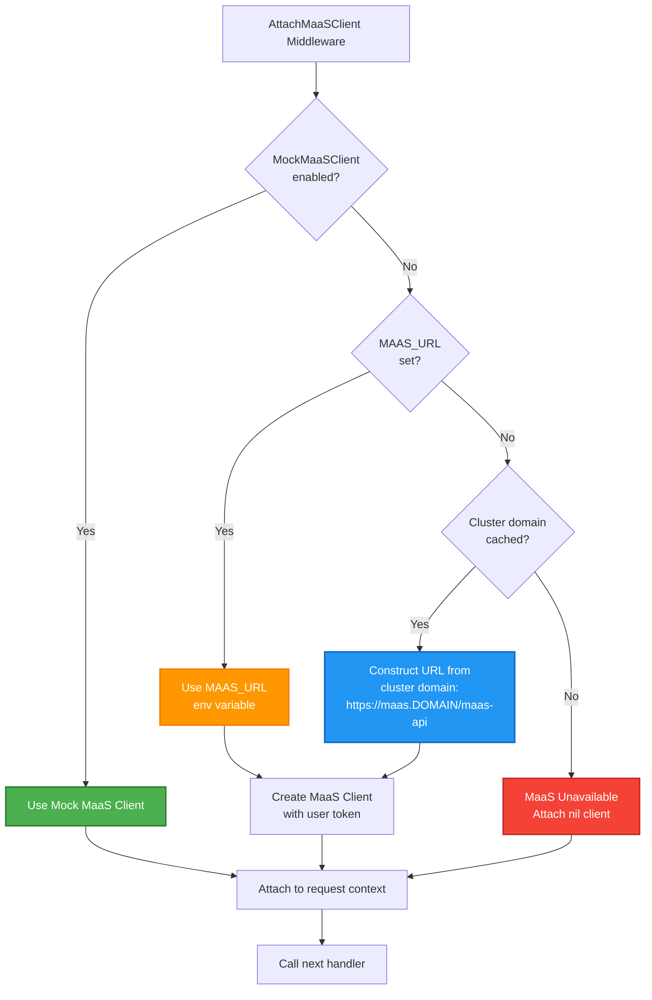
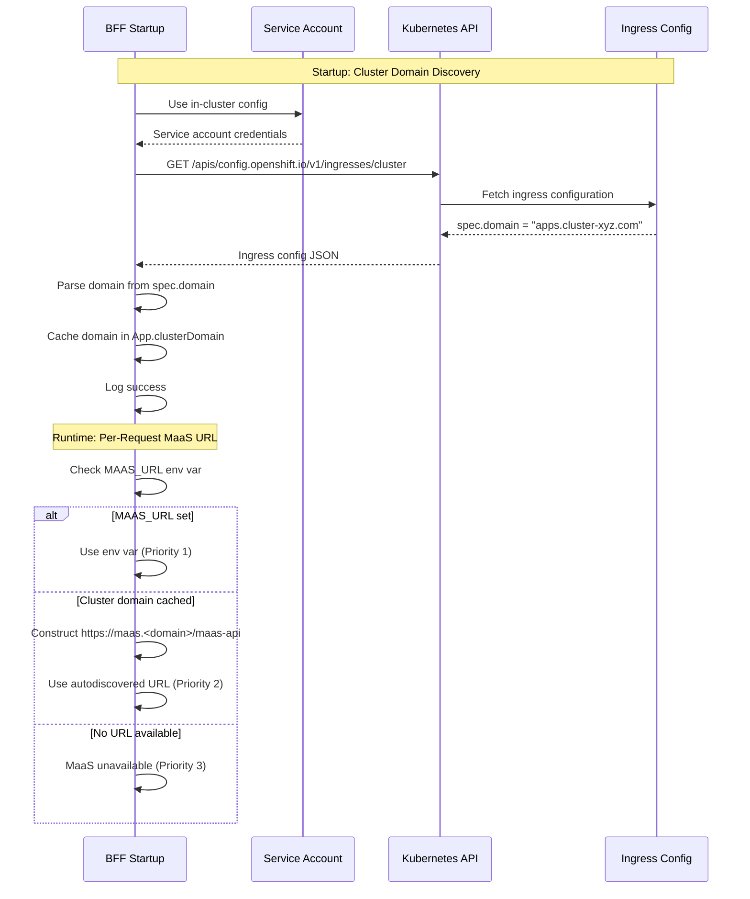

# 0009 - MaaS Service Autodiscovery

* Date: 2025-12-16
* Authors: Matias Schimuneck

## Context and Problem Statement

The BFF needs to connect to MaaS (Model as a Service) API to provide users with access to hosted LLM models. The MaaS service endpoint varies by environment:
- **Production**: MaaS deployed in OpenShift cluster at `https://maas.<cluster-domain>/maas-api`
- **Development**: MaaS might be port-forwarded (`http://localhost:8081`) or not available
- **Testing**: Mock MaaS client used

We need a configuration strategy that:
- Works in production without hardcoding cluster-specific URLs
- Allows developers to override for local development
- Gracefully handles MaaS unavailability
- Discovers cluster domain automatically in OpenShift
- Requires minimal configuration from users

## Decision Drivers

* Production deployments need automatic service discovery (no manual URL configuration)
* Development workflow needs flexibility (local port-forward, mock, or skip MaaS)
* Multiple OpenShift clusters have different domains (can't hardcode)
* MaaS is optional (system should work without it, just without MaaS models)
* Service account has cluster-wide read permissions for ingress config
* Zero-configuration preference for production

## Considered Options

* **Option 1**: Hardcode MaaS URL
  - Simple but breaks across environments and clusters
* **Option 2**: Require MAAS_URL environment variable always
  - Works but requires manual configuration in production
* **Option 3**: Three-tier priority with autodiscovery (chosen)
  - Flexible, works in prod and dev, graceful fallback
* **Option 4**: Service discovery via Kubernetes DNS
  - Requires MaaS service to exist, no fallback for dev

## Decision Outcome

Chosen option: "Three-tier configuration priority with cluster domain autodiscovery", because:
- Production: Zero-configuration autodiscovery via cluster domain
- Development: Flexible override via MAAS_URL environment variable
- Graceful degradation when MaaS unavailable
- Works across all OpenShift clusters (no hardcoded domains)
- Service account can discover cluster domain at startup
- Minimal operational burden

### Positive Consequences

* Production requires no MaaS URL configuration (autodiscovered)
* Development workflow flexible (port-forward, mock, or skip)
* Works across all OpenShift clusters automatically
* Graceful degradation (system usable without MaaS)
* Cached at startup (no repeated discovery overhead)
* Clear configuration priority order

### Negative Consequences

* Requires service account with ingress read permissions
* Startup failure if neither MAAS_URL nor cluster domain available (acceptable in prod)
* Different behavior in dev (env var) vs prod (autodiscovery) - mitigated by clear priority
* Cluster domain cached at startup (won't detect changes until restart)

## Implementation

### Configuration Priority (Highest to Lowest)



### Priority 1: MAAS_URL Environment Variable (Development Override)

```bash
# Developer sets explicit URL
export MAAS_URL=http://localhost:8081

# Or in make command
make dev-start MAAS_URL=http://localhost:8081
```

**Usage:**
```go
if app.config.MaaSURL != "" {
    serviceURL = app.config.MaaSURL
    logger.Debug("Using MAAS_URL environment variable (developer override)", "serviceURL", serviceURL)
}
```

**When to use:**
- Local development with port-forwarded MaaS
- Testing against specific MaaS instance
- Development environment with custom MaaS deployment

### Priority 2: Cluster Domain Autodiscovery (Production Default)

**Startup Discovery:**
```go
// In app.go during initialization
func NewApp(cfg config.EnvConfig, logger *slog.Logger) (*App, error) {
    var clusterDomain string
    if !cfg.MockK8sClient {
        if domain, err := k8s.GetClusterDomainUsingServiceAccount(context.Background(), logger); err != nil {
            logger.Error("Failed to get cluster domain at startup, MaaS autodiscovery will be unavailable", "error", err)
        } else {
            clusterDomain = domain  // e.g., "apps.cluster.example.com"
            logger.Info("Cached cluster domain for MaaS autodiscovery", "domain", clusterDomain)
        }
    }
    
    app := &App{
        clusterDomain: clusterDomain,  // Cached for request-time use
        // ...
    }
}
```

**Cluster Domain Discovery:**
```go
func GetClusterDomainUsingServiceAccount(ctx context.Context, logger *slog.Logger) (string, error) {
    // Use in-cluster config (pod's service account)
    cfg, err := rest.InClusterConfig()
    if err != nil {
        return "", err
    }
    
    // Query OpenShift Ingress configuration
    // GET /apis/config.openshift.io/v1/ingresses/cluster
    restClient, err := rest.RESTClientFor(config)
    result := restClient.Get().Resource("ingresses").Name("cluster").Do(ctx)
    
    // Parse response for spec.domain field
    // Returns: "apps.cluster-xyz.openshift.com"
    var obj map[string]interface{}
    json.Unmarshal(rawBytes, &obj)
    domain := obj["spec"].(map[string]interface{})["domain"].(string)
    
    return domain, nil
}
```

**Request-Time URL Construction:**
```go
if app.clusterDomain != "" {
    // Construct MaaS URL using cached cluster domain
    serviceURL = fmt.Sprintf("https://maas.%s/maas-api", app.clusterDomain)
    // Example: "https://maas.apps.cluster-xyz.openshift.com/maas-api"
    logger.Debug("Using autodiscovered MaaS endpoint from cached cluster domain",
        "clusterDomain", app.clusterDomain,
        "serviceURL", serviceURL)
}
```

**When to use:**
- Production OpenShift deployments (default)
- Staging environments
- Any cluster where MaaS follows standard naming

**Required Permissions:**
```yaml
# Service account needs:
apiVersion: rbac.authorization.k8s.io/v1
kind: ClusterRole
rules:
- apiGroups: ["config.openshift.io"]
  resources: ["ingresses"]
  verbs: ["get"]
```

### Priority 3: MaaS Unavailable (Graceful Degradation)

```go
else {
    // Neither MAAS_URL nor cluster domain available
    logger.Debug("MaaS unavailable: no MAAS_URL configured and cluster domain not available")
    ctx = context.WithValue(ctx, constants.MaaSClientKey, nil)
    next(w, r.WithContext(ctx), ps)
    return
}
```

**Behavior:**
- MaaS client is `nil` in context
- Handlers check for nil before using
- MaaS models not available in model list
- Chat works with LlamaStack models only

### Discovery Sequence Diagram



## Configuration Examples

### Production (Autodiscovery)

```yaml
# No MAAS_URL needed!
# BFF autodiscovers: https://maas.apps.cluster-xyz.openshift.com/maas-api

apiVersion: v1
kind: Pod
metadata:
  name: odh-dashboard
spec:
  serviceAccountName: odh-dashboard-sa  # Needs ingress read permission
  containers:
  - name: gen-ai-bff
    image: gen-ai-bff:latest
    # No MAAS_URL environment variable needed
```

### Development (Local Port-Forward)

```bash
# Port-forward MaaS service
oc port-forward -n maas svc/maas-api 8081:8080

# Set env var for local development
export MAAS_URL=http://localhost:8081
make dev-start
```

### Development (Mock)

```bash
# Use mock MaaS client (no real MaaS needed)
export MOCK_MAAS_CLIENT=true
make dev-start
```

## Error Handling

**Startup Failures:**
```go
if domain, err := k8s.GetClusterDomainUsingServiceAccount(ctx, logger); err != nil {
    logger.Error("Failed to get cluster domain at startup, MaaS autodiscovery will be unavailable", "error", err)
    // Continue startup - MaaS optional
} else {
    clusterDomain = domain
    logger.Info("Cached cluster domain for MaaS autodiscovery", "domain", clusterDomain)
}
```

**Runtime Behavior When MaaS Unavailable:**
- Models API: Returns only LlamaStack models (no MaaS models)
- Chat API: Works with LlamaStack models, fails gracefully if user selects MaaS model
- User Experience: Clear indication that MaaS models unavailable

## Service Account Permissions

**Minimum Required:**
```yaml
apiVersion: rbac.authorization.k8s.io/v1
kind: ClusterRole
metadata:
  name: gen-ai-bff-cluster-domain-reader
rules:
- apiGroups: ["config.openshift.io"]
  resources: ["ingresses"]
  resourceNames: ["cluster"]
  verbs: ["get"]
```

**Bound to Service Account:**
```yaml
apiVersion: rbac.authorization.k8s.io/v1
kind: ClusterRoleBinding
metadata:
  name: gen-ai-bff-cluster-domain
roleRef:
  apiGroup: rbac.authorization.k8s.io
  kind: ClusterRole
  name: gen-ai-bff-cluster-domain-reader
subjects:
- kind: ServiceAccount
  name: odh-dashboard-sa
  namespace: opendatahub
```

## Performance Considerations

**Startup Discovery:**
- Happens once at BFF startup
- ~50-100ms overhead (acceptable startup cost)
- Cached in app.clusterDomain (zero runtime overhead)

**Runtime URL Construction:**
- Simple string formatting: `fmt.Sprintf("https://maas.%s/maas-api", domain)`
- Nanosecond overhead
- No network calls

**Benefits:**
- Zero hardcoded URLs in production
- Works across all OpenShift clusters
- No per-request discovery overhead

## Alternatives Considered

### Kubernetes Service DNS

**Approach:** Use `maas-api.maas.svc.cluster.local`

**Rejected** because:
- Only works if MaaS in same cluster
- Doesn't work for external MaaS deployments
- Hardcodes namespace ("maas")
- Ingress discovery more flexible

### ConfigMap with MaaS URL

**Approach:** Store MaaS URL in ConfigMap, read at startup

**Rejected** because:
- Requires manual configuration in every cluster
- ConfigMap must be updated when cluster domain changes
- Autodiscovery eliminates this operational burden

### Environment Variable Required

**Approach:** Always require MAAS_URL environment variable

**Rejected** because:
- Manual configuration in every cluster
- Autodiscovery is more elegant
- MAAS_URL still available as override

## Trade-offs

**Startup Dependency:**
- Pro: Discover once at startup, cache for lifetime
- Con: Cluster domain changes require restart (rare event)

**Service Account Permissions:**
- Pro: Read-only access to ingress config (minimal)
- Con: Additional RBAC configuration needed

**Environment-Specific Behavior:**
- Pro: Flexible for dev and prod
- Con: Different configuration paths to understand

## Links

* [Related to] ADR-0002 - System Architecture (MaaS integration)
* [Related to] ADR-0003 - Core User Flows (MaaS model usage flow)
* [Related to] ADR-0006 - Factory Pattern (MaaS client factory)
* [Related to] ADR-0008 - Caching Strategy (MaaS token caching)
* [External] [OpenShift Ingress Config](https://docs.openshift.com/container-platform/latest/networking/ingress-operator.html) - Ingress configuration
* [Implementation] See `internal/api/app.go` (startup) and `internal/api/middleware.go` (runtime)

