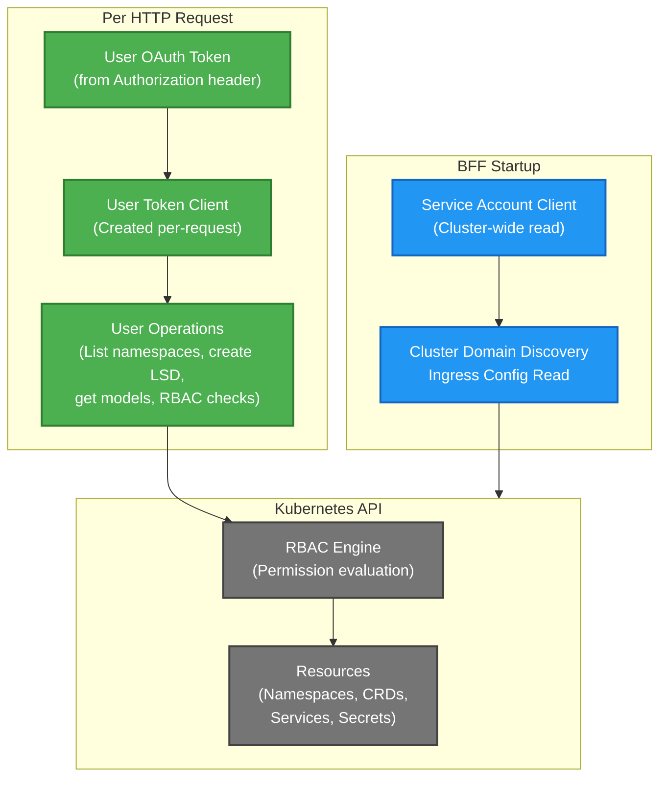
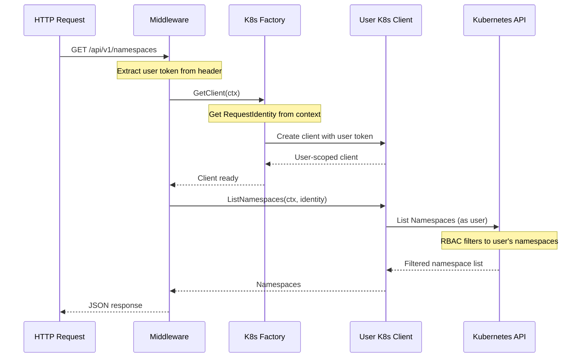

# 0010 - Kubernetes Client Architecture

* Date: 2025-12-16
* Authors: Matias Schimuneck

## Context and Problem Statement

The BFF needs to interact with Kubernetes resources (InferenceServices, LLMInferenceServices, LlamaStackDistributions, Namespaces, ServiceAccounts, Secrets, ConfigMaps) for:
- Listing user-accessible namespaces based on RBAC
- Discovering deployed AI models (InferenceService, LLMInferenceService)
- Managing LlamaStackDistribution lifecycle (install, status, delete)
- Reading service account tokens for model authentication
- Checking user permissions before operations

The client must:
- Enforce RBAC (users only see/modify resources they have permissions for)
- Support user impersonation (operations performed as the requesting user)
- Work with multiple Kubernetes CRDs (KServe, Llama Stack Operator)
- Handle both cluster-scoped (discovery) and namespace-scoped (user operations) resources
- Be testable without a real Kubernetes cluster

## Decision Drivers

* Security: Multi-tenant isolation through RBAC
* RBAC Enforcement: Users can only access permitted namespaces and resources
* User Impersonation: Operations must run with user's permissions, not service account
* CRD Support: Need to work with custom resources (InferenceService, LlamaStackDistribution)
* Testability: Must support comprehensive unit testing without real cluster
* Performance: Balance between security checks and response latency
* OpenShift Integration: Leverage OpenShift Projects API for namespace filtering

## Considered Options

* **Option 1**: Single shared service account client
  - Simple but can't enforce per-user RBAC, security risk
* **Option 2**: Static user clients (one per user, long-lived)
  - Memory issues, lifecycle complexity, token expiration
* **Option 3**: Per-request user client with token impersonation (chosen)
  - Secure, user-scoped, short-lived, RBAC enforced
* **Option 4**: Kubernetes API proxy with authentication
  - Complex, reinvents Kubernetes client library

## Decision Outcome

Chosen option: "Per-request token-based client with user impersonation", because:
- Creates Kubernetes client per-request using user's OAuth token
- All Kubernetes operations run with user's permissions (RBAC enforced)
- Short-lived clients (request scope) - no lifecycle management
- Supports SubjectAccessReview for explicit permission checking
- Compatible with OpenShift RBAC and Projects API
- Factory pattern enables comprehensive testing with mocks

### Positive Consequences

* Strong RBAC enforcement (users can't bypass permissions)
* Audit trail shows actual user performing operations
* No shared state between users (security)
* Works with OpenShift's fine-grained RBAC
* Testable with mock Kubernetes environment (envtest)
* Supports namespace filtering based on user permissions

### Negative Consequences

* Client creation overhead per request (~1-2ms)
* SubjectAccessReview adds latency (~10-50ms per check)
* More complex than shared client approach
* Requires careful error handling for permission denials

## Implementation

### Dual-Client Architecture

The BFF uses TWO Kubernetes clients:

1. **Service Account Client**: Cluster-wide operations (discovery, cluster domain)
2. **User Token Client**: User-scoped operations (per-request, RBAC enforced)



### TokenKubernetesClient Structure

```go
type TokenKubernetesClient struct {
    Client    client.Client     // controller-runtime client (service account)
    Logger    *slog.Logger
    Token     BearerToken        // Service account token
    Config    *rest.Config       // Base configuration
    EnvConfig config.EnvConfig
}
```

**Created once at factory initialization:**
- Uses service account credentials (in-cluster config)
- Used for cluster-wide operations only
- Baseline for creating user clients

### Per-Request User Client Creation

```go
func (kc *TokenKubernetesClient) ListNamespaces(ctx context.Context, identity *RequestIdentity) ([]corev1.Namespace, error) {
    // Create user-scoped configuration
    userConfig := rest.CopyConfig(kc.Config)
    userConfig.BearerToken = identity.Token  // User's OAuth token
    userConfig.BearerTokenFile = ""
    
    // Create user-scoped client
    userClient, err := client.New(userConfig, client.Options{Scheme: kc.Client.Scheme()})
    
    // Try cluster-wide list (works if user is cluster-admin)
    nsList := &corev1.NamespaceList{}
    err = userClient.List(ctx, nsList)
    if err == nil {
        return nsList.Items, nil  // User has cluster-admin
    }
    
    // Fallback: Use OpenShift Projects API (auto-filtered by RBAC)
    projectList := &unstructured.UnstructuredList{}
    projectList.SetGroupVersionKind(schema.GroupVersionKind{
        Group: "project.openshift.io", Version: "v1", Kind: "ProjectList",
    })
    err = userClient.List(ctx, projectList)
    
    // Kubernetes RBAC automatically filters to user-accessible projects
    return convertProjectsToNamespaces(projectList), nil
}
```

### RBAC Permission Checking

**SubjectAccessReview Pattern:**

```go
func (kc *TokenKubernetesClient) CanListLlamaStackDistributions(
    ctx context.Context,
    identity *RequestIdentity,
    namespace string,
) (bool, error) {
    // Create user-scoped config
    userConfig := rest.CopyConfig(kc.Config)
    userConfig.BearerToken = identity.Token
    
    clientset, err := kubernetes.NewForConfig(userConfig)
    
    // Create SubjectAccessReview to check permission
    sar := &authzv1.SubjectAccessReview{
        Spec: authzv1.SubjectAccessReviewSpec{
            ResourceAttributes: &authzv1.ResourceAttributes{
                Namespace: namespace,
                Verb:      "list",
                Group:     "genai.opendatahub.io",
                Resource:  "llamastackdistributions",
            },
        },
    }
    
    resp, err := clientset.AuthorizationV1().SubjectAccessReviews().Create(ctx, sar, metav1.CreateOptions{})
    
    return resp.Status.Allowed, nil  // true if user has permission
}
```

**When to Check:**
- Before listing namespaced resources
- Before creating/updating/deleting resources
- Middleware enforces checks before handlers execute

### OpenShift Projects API Fallback

For namespace listing, leverage OpenShift's Projects API:

```go
// OpenShift Projects API auto-filters to user-accessible projects
projectList := &unstructured.UnstructuredList{}
projectList.SetGroupVersionKind(schema.GroupVersionKind{
    Group:   "project.openshift.io",
    Version: "v1",
    Kind:    "ProjectList",
})

err = userClient.List(ctx, projectList)
// Result automatically filtered by OpenShift RBAC
// User only sees projects they have access to
```

**Benefits:**
- Automatic RBAC filtering by OpenShift
- No manual permission checks per namespace
- Works for non-admin users

### AI Assets Model Discovery

Discover deployed models using user's permissions:

```go
func (kc *TokenKubernetesClient) GetAAModels(ctx context.Context, identity *RequestIdentity, namespace string) ([]models.AAModel, error) {
    // List InferenceServices (KServe v1beta1)
    inferenceServices, err := kc.listInferenceServices(ctx, namespace)
    
    // List LLMInferenceServices (KServe v1alpha1)
    llmInferenceServices, err := kc.listLLMInferenceServices(ctx, namespace)
    
    // Convert to AAModel format
    aaModels := append(
        convertInferenceServicesToAAModels(inferenceServices),
        convertLLMInferenceServicesToAAModels(llmInferenceServices)...,
    )
    
    return aaModels, nil
}
```

**Service Discovery:**
- Finds Kubernetes Services for InferenceService/LLMInferenceService
- Constructs internal cluster URLs
- Handles headless services (port detection)
- Detects service account tokens for model authentication

### LlamaStackDistribution Lifecycle Management

**Create LSD:**
```go
func (kc *TokenKubernetesClient) CreateLlamaStackDistribution(
    ctx context.Context,
    identity *RequestIdentity,
    namespace, name string,
    models []models.AAModel,
    maasClient maas.MaaSClient,
) (*lsdapi.LlamaStackDistribution, error) {
    // 1. Generate Llama Stack configuration (run.yaml)
    runYAML, err := kc.generateLlamaStackConfig(ctx, namespace, models, maasClient)
    
    // 2. Create LlamaStackDistribution CRD
    lsd := &lsdapi.LlamaStackDistribution{
        ObjectMeta: metav1.ObjectMeta{
            Name: lsdName,
            Namespace: namespace,
            Labels: {OpenDataHubDashboardLabelKey: "true"},
        },
        Spec: lsdapi.LlamaStackDistributionSpec{
            Image: distributionImage,
            // ... config
        },
    }
    
    if err := kc.Client.Create(ctx, lsd); err != nil {
        return nil, err
    }
    
    // 3. Create ConfigMap with Llama Stack configuration
    configMap := &corev1.ConfigMap{
        ObjectMeta: metav1.ObjectMeta{
            Name: "llama-stack-config",
            Namespace: namespace,
            OwnerReferences: []metav1.OwnerReference{
                // Points to LSD for garbage collection
            },
        },
        Data: {"run.yaml": runYAML},
    }
    
    if err := kc.Client.Create(ctx, configMap); err != nil {
        return nil, err
    }
    
    return lsd, nil
}
```

### Scheme Registration

Support for multiple CRDs:

```go
func BuildScheme() (*runtime.Scheme, error) {
    scheme := runtime.NewScheme()
    
    // Core Kubernetes types
    clientgoscheme.AddToScheme(scheme)
    
    // Custom Resource Definitions
    lsdapi.AddToScheme(scheme)                    // LlamaStackDistribution
    kservev1alpha1.AddToScheme(scheme)            // LLMInferenceService
    kservev1beta1.AddToScheme(scheme)             // InferenceService
    
    return scheme, nil
}
```

### Request Flow



### Testing with envtest

Mock factory uses Kubernetes envtest for realistic testing:

```go
func NewMockedKubernetesClientFactory(...) (*MockedTokenClientFactory, error) {
    testEnv, err := envtest.Start()  // Starts local K8s API server
    
    // Create test users with specific permissions
    testUsers := []TestUser{
        {Username: "admin-user", ClusterAdmin: true},
        {Username: "regular-user", ClusterAdmin: false, Namespaces: []string{"user-ns"}},
    }
    
    // Setup RBAC for test users
    setupRBACForTestUsers(testEnv, testUsers)
    
    return &MockedTokenClientFactory{
        testEnv: testEnv,
        users: testUsers,
    }, nil
}
```

## Key Operations

| Operation | Scope | Uses User Token | RBAC Check |
|-----------|-------|-----------------|------------|
| **GetClusterDomain** | Cluster | Service Account | No |
| **ListNamespaces** | Cluster/User | User Token | Implicit (Projects API) |
| **CanListLlamaStackDistributions** | Namespace | User Token | Yes (SAR) |
| **GetAAModels** | Namespace | User Token | Implicit (List) |
| **CreateLlamaStackDistribution** | Namespace | Service Account | Pre-checked |
| **DeleteLlamaStackDistribution** | Namespace | Service Account | Pre-checked |

### Service Account vs User Token Decision Matrix

**Service Account (BFF's identity):**
- Cluster domain discovery
- Creating/deleting LlamaStackDistributions (after permission check)
- Creating ConfigMaps owned by LSD
- Reading cluster ingress config

**User Token (request user's identity):**
- Listing namespaces (filtered by RBAC)
- Permission checks (SubjectAccessReview)
- Listing InferenceServices/LLMInferenceServices
- Any operation that should respect user permissions

## Security Model

**Namespace Isolation:**
```go
// User can ONLY see namespaces they have access to
namespaces := kc.ListNamespaces(ctx, userIdentity)
// Returns: ["user-project-1", "user-project-2"]
// Does NOT return: ["other-user-project"]  ← Filtered by RBAC
```

**Permission Enforcement:**
```go
// Check before allowing operation
canAccess, err := kc.CanListLlamaStackDistributions(ctx, identity, namespace)
if !canAccess {
    return 403 Forbidden  // User doesn't have permission
}
```

**Service Account Discovery:**
```go
// Find service account token for model authentication
// Only searches within user's authorized namespace
secretName := kc.findServiceAccountTokenSecret(ctx, namespace, serviceAccountName)
```

## Performance Characteristics

**Client Creation:**
- Per-request overhead: ~1-2ms
- Acceptable for human-interactive workload
- No client pooling needed (creation is fast)

**SubjectAccessReview:**
- Permission check: ~10-50ms
- Cached per request context (same namespace, multiple ops)
- Acceptable trade-off for security

**Namespace Listing:**
- Cluster-admin path: ~20-30ms (direct list)
- Regular user path: ~50-80ms (Projects API)
- Runs once per namespace selection, not per request

## Alternatives Considered

### Client Pooling
**Rejected** because:
- Tokens are per-user, can't pool across users
- Per-request creation is fast enough (~1-2ms)
- Pooling adds complexity (lifecycle, expiration, cleanup)
- Security risk if tokens leaked between users

### Caching Permission Checks
**Rejected** for v1, **Considered for future**:
- Could cache SAR results (30s TTL)
- Risk: Permissions change mid-session
- Current: Real-time permission checking (secure)
- Future: Add caching if performance issue identified

### Single Service Account for All Operations
**Rejected** because:
- Can't enforce per-user RBAC
- Audit logs show BFF service account, not real user
- Security vulnerability (privilege escalation)
- Against multi-tenancy best practices

## Error Handling

**Permission Denied:**
```go
canAccess, err := kc.CanListLlamaStackDistributions(ctx, identity, namespace)
if err != nil {
    // K8s API error (network, timeout)
    return 500 Internal Server Error
}
if !canAccess {
    // User doesn't have permission
    return 403 Forbidden ("You don't have permission to access resources in namespace X")
}
```

**Invalid Token:**
```go
identity, err := factory.ExtractRequestIdentity(r.Header)
if err != nil {
    return 401 Unauthorized ("Missing or invalid authentication token")
}
```

**Resource Not Found:**
- 404 if resource doesn't exist
- 403 if exists but user has no access (avoid information disclosure)

## Links

* [Related to] ADR-0002 - System Architecture (K8s client factory)
* [Related to] ADR-0005 - Authentication Architecture (user impersonation, RBAC)
* [Related to] ADR-0006 - Factory Pattern (K8s client factory)
* [External] [Kubernetes Client-Go](https://github.com/kubernetes/client-go) - Client library
* [External] [Controller-Runtime Client](https://pkg.go.dev/sigs.k8s.io/controller-runtime/pkg/client) - Higher-level client
* [External] [SubjectAccessReview](https://kubernetes.io/docs/reference/access-authn-authz/authorization/) - Permission checking
* [External] [OpenShift Projects API](https://docs.openshift.com/container-platform/latest/rest_api/project_apis/project-project-openshift-io-v1.html) - Namespace filtering
* [Implementation] See `internal/integrations/kubernetes/token_k8s_client.go`

