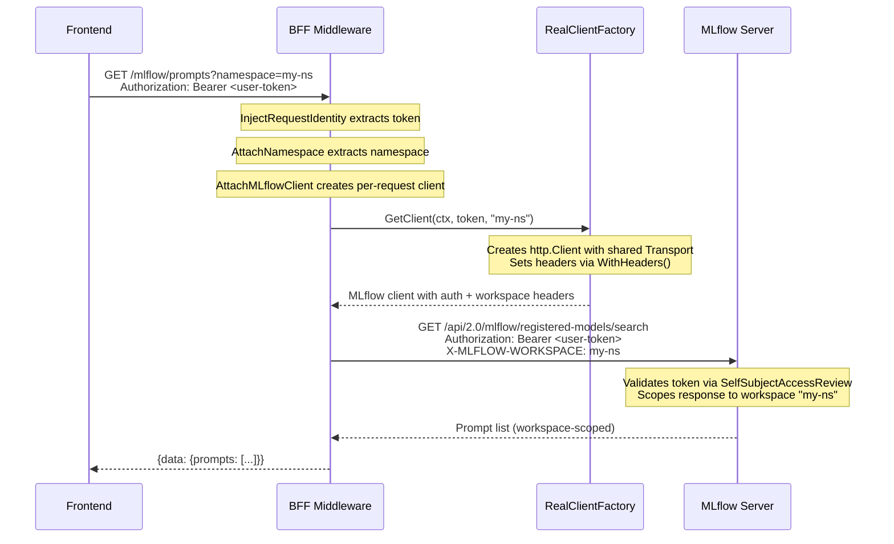

# 0014 - MLflow Per-Request Client with Auth and Workspace Isolation

* Date: 2026-02-28
* Authors: Eder Ignatowicz

## Context and Problem Statement

The MLflow integration (ADR-0011) was initially implemented with a **singleton client** created at startup with just a URL — no auth tokens, no TLS CA bundles, no workspace headers. The real MLflow operator ([opendatahub-io/mlflow-operator](https://github.com/opendatahub-io/mlflow-operator)) requires:

- **kubernetes-auth**: MLflow validates user tokens via `SelfSubjectAccessReview` → BFF must forward `Authorization: Bearer <token>`
- **Workspace isolation**: `X-MLFLOW-WORKSPACE=<namespace>` header — MLflow is one instance per RHOAI cluster, multi-tenancy is via this header mapping namespace → workspace
- **TLS**: Service on port 8443 with in-pod TLS (service-ca certs)

The BFF already has the auth token in context (`RequestIdentityKey`) and namespace in context (`NamespaceQueryParameterKey`) — we needed to forward them to MLflow per-request.

## Decision

Per-request client creation via the existing factory pattern (ADR-0006), matching LlamaStack, MaaS, and Kubernetes clients. A singleton client cannot carry per-user auth headers — per-request is the only viable approach.

The factory stores cluster-wide config at startup (URL, TLS transport) and creates a lightweight client per-request with the user's token and namespace. The `http.Transport` is shared for connection pooling; only the `http.Client` wrapper is per-request (~1ms overhead, same as other integrations).

## Implementation

### Factory Interface Change

```go
type MLflowClientFactory interface {
    GetClient(ctx context.Context, token, namespace string) (ClientInterface, error)
}
```

Token and namespace are explicit parameters, not read implicitly from context — matches the principle of explicit data flow.

### RealClientFactory

```go
type RealClientFactory struct {
    url       string
    transport *http.Transport  // shared across requests, has TLS config
}

func NewRealClientFactory(url string, rootCAs *x509.CertPool, insecureSkipVerify bool) MLflowClientFactory {
    transport := &http.Transport{
        TLSClientConfig: &tls.Config{
            RootCAs:            rootCAs,
            InsecureSkipVerify: insecureSkipVerify,
        },
        // Match Go's DefaultTransport pool settings
        MaxIdleConns:        100,
        MaxIdleConnsPerHost: 10,
        IdleConnTimeout:     90 * time.Second,
    }
    return &RealClientFactory{url: url, transport: transport}
}

func (f *RealClientFactory) GetClient(_ context.Context, token, namespace string) (ClientInterface, error) {
    httpClient := &http.Client{
        Transport: f.transport,
        Timeout:   30 * time.Second,
    }

    headers := map[string]string{
        "Authorization":      "Bearer " + token,
        "X-MLFLOW-WORKSPACE": namespace,
    }

    return NewClient(
        sdkmlflow.WithTrackingURI(f.url),
        sdkmlflow.WithHeaders(headers),
        sdkmlflow.WithHTTPClient(httpClient),
    )
}
```

Key design:
- `http.Transport` is shared (connection pooling, TLS sessions)
- `http.Client` is lightweight per-request (just Transport + Timeout)
- SDK's `WithHeaders` injects both auth and workspace headers

### NewClient Signature

```go
func NewClient(opts ...sdkmlflow.Option) (*Client, error)
```

Changed from `NewClient(trackingURI string, insecure bool)` to variadic SDK options. Callers pass `WithTrackingURI`, `WithHeaders`, `WithHTTPClient`, etc. directly. This avoids an ever-growing parameter list as the SDK adds features.

### Middleware

```go
func (app *App) AttachMLflowClient(next ...) httprouter.Handle {
    return func(w http.ResponseWriter, r *http.Request, ps httprouter.Params) {
        ctx := r.Context()

        var token string
        if app.config.AuthMethod != config.AuthMethodDisabled {
            identity, ok := ctx.Value(constants.RequestIdentityKey).(*integrations.RequestIdentity)
            if !ok || identity == nil {
                app.serverErrorResponse(w, r, fmt.Errorf("missing RequestIdentity in context"))
                return
            }
            token = identity.Token
        }

        namespace, _ := ctx.Value(constants.NamespaceQueryParameterKey).(string)

        mlflowClient, err := app.mlflowClientFactory.GetClient(ctx, token, namespace)
        // ... error handling (ErrMLflowNotConfigured → 503, other errors → 500),
        //     then context injection via constants.MLflowClientKey
    }
}
```

### Three-Mode Factory Selection (unchanged logic)

```go
if cfg.MockMLflowClient {
    mlflowFactory = mlflowmocks.NewMockClientFactory()
} else if cfg.MLflowURL != "" {
    mlflowFactory = mlflowpkg.NewRealClientFactory(cfg.MLflowURL, rootCAs, cfg.InsecureSkipVerify)
} else {
    mlflowFactory = mlflowpkg.NewUnavailableClientFactory()  // returns 503
}
```

### Mock and Unavailable Factories

Both match the new `GetClient(ctx, token, namespace)` signature but ignore the auth parameters:
- `MockClientFactory`: connects to local MLflow via `uv` (no auth needed)
- `UnavailableClientFactory`: always returns `ErrMLflowNotConfigured`

## MLflow URL Discovery

### Why No Autodiscovery

Unlike other integrations, MLflow has no viable autodiscovery mechanism:

| Integration | Autodiscovery | Why It Works |
|---|---|---|
| LlamaStack | CRD `.Status.ServiceURL` | CR is namespace-scoped, user-readable |
| MaaS | DNS convention from cluster domain | BFF service account reads ingress config |
| MLflow | **None** | See below |

MLflow autodiscovery is blocked by:
1. **MLflow CR** (`mlflows.mlflow.opendatahub.io`): cluster-scoped but **no `ServiceURL` in status** (only `Conditions`). Regular users cannot read it (`Forbidden`).
2. **Service lookup**: regular users cannot list/get services in the MLflow namespace.
3. **ConsoleLink**: readable by all users but contains the **external/gateway URL**, not the in-cluster service URL. Using it means an unnecessary network hop through the OpenShift Gateway.

### Current Approach

`MLFLOW_URL` environment variable set at deployment time. The deployer (operator/Helm/kustomize) knows where MLflow lives and configures:

```bash
MLFLOW_URL=https://mlflow.{mlflow-namespace}.svc:8443
```

For local development:
```bash
MLFLOW_URL=https://localhost:8443  # with port-forward
```

### Request Flow



## Configuration

### Environment Variables

| Variable | Purpose | Example |
|---|---|---|
| `MLFLOW_URL` | MLflow tracking server URL | `https://mlflow.opendatahub.svc:8443` |
| `MOCK_MLFLOW_CLIENT` | Enable mock MLflow (local dev) | `true` |
| `INSECURE_SKIP_VERIFY` | Skip TLS verification | `true` (dev only) |
| `MLFLOW_NAMESPACE` | For port-forward target (dev only) | `opendatahub` |

### Development

```bash
# Full mock mode (no real MLflow needed)
make dev-start-mock

# Real MLflow via port-forward
oc port-forward -n ${MLFLOW_NAMESPACE} svc/mlflow 8443:8443
MLFLOW_URL=https://localhost:8443 INSECURE_SKIP_VERIFY=true make dev-start

# Real MLflow via external URL (gateway hop, for quick testing)
MLFLOW_URL=https://rh-ai.apps.cluster.example.com/mlflow INSECURE_SKIP_VERIFY=true make dev-start
```

## Files Modified

| File | Change |
|---|---|
| `internal/integrations/mlflow/client.go` | `NewClient` accepts variadic SDK options |
| `internal/integrations/mlflow/factory.go` | Per-request factory with shared transport, `WithHeaders` for auth + workspace |
| `internal/integrations/mlflow/mlflowmocks/mock_factory.go` | Matches new `GetClient(ctx, token, namespace)` signature |
| `internal/api/middleware.go` | `AttachMLflowClient` extracts token + namespace, passes to factory |
| `internal/api/app.go` | Passes `rootCAs` and `insecureSkipVerify` to `NewRealClientFactory` |
| `Makefile` | MLflow port-forward in `dev-portforward`, `MLFLOW_URL` in `dev-bff` targets |
| `.env.development` | Added `MLFLOW_URL`, `MLFLOW_NAMESPACE` placeholders |
| `.env.local.example` | Added `MLFLOW_URL`, `MLFLOW_NAMESPACE` with defaults |

## Links

* [Related to ADR-0006] - Factory pattern for client management
* [Related to ADR-0011] - MLflow prompt registry integration
* [Related to ADR-0005] - Authentication architecture (token forwarding)
* [Related to ADR-0009] - MaaS autodiscovery (contrast: MLflow has no autodiscovery)
* [opendatahub-io/mlflow-operator](https://github.com/opendatahub-io/mlflow-operator) - MLflow operator with kubernetes-auth
* [opendatahub-io/mlflow-go](https://github.com/opendatahub-io/mlflow-go) - Go SDK with `WithHeaders` support
