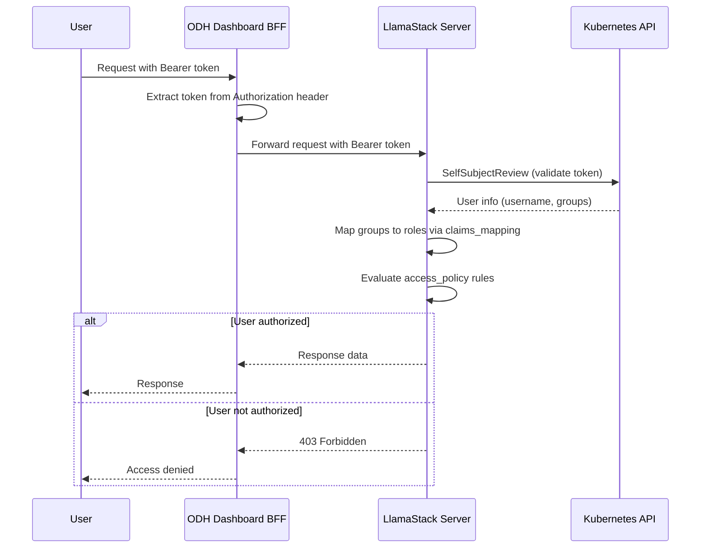

# RBAC Endpoint Filtering Configuration

This guide explains how to configure Role-Based Access Control (RBAC) endpoint filtering for LlamaStack using the Kubernetes authentication provider. RBAC enables access control on LlamaStack endpoints based on OpenShift roles and role bindings.

## Overview

LlamaStack supports RBAC through the Kubernetes authentication provider, which:

- Validates bearer tokens against the Kubernetes API server using SelfSubjectReview
- Maps Kubernetes groups to LlamaStack roles via `claims_mapping`
- Applies access policies based on user roles
- Supports both resource-level and route-level access control

## Quick Start

To enable RBAC with default settings in your LlamaStack configuration:

```go
config := NewDefaultLlamaStackConfig()
config.EnableRBACAuth("", "")  // Uses in-cluster defaults
```

This enables:
- **admin** group: Full access (create, read, delete)
- **system:authenticated** users: Read-only access

## Configuration Structure

### Server Auth Configuration

The auth configuration is part of the server section in your LlamaStack config:

```yaml
server:
  port: 8321
  auth:
    provider_config:
      type: kubernetes
      api_server_url: "${env.OPENSHIFT_SERVER_API_URL:=https://kubernetes.default.svc}"
      verify_tls: true
      tls_cafile: /var/run/secrets/kubernetes.io/serviceaccount/ca.crt
      claims_mapping:
        groups: roles
        username: roles
    access_policy:
      - permit:
          actions: [create, read, delete]
        when: user with admin in roles
        description: admin users have full access to all resources
      - permit:
          actions: [read]
        when: user with system:authenticated in roles
        description: authenticated users have read-only access
```

### Provider Configuration

| Field | Description | Default |
|-------|-------------|---------|
| `type` | Auth provider type | `kubernetes` |
| `api_server_url` | Kubernetes API server URL | `https://kubernetes.default.svc` |
| `verify_tls` | Enable TLS certificate verification | `true` |
| `tls_cafile` | Path to CA certificate file | `/var/run/secrets/kubernetes.io/serviceaccount/ca.crt` |
| `claims_mapping` | Maps Kubernetes claims to access attributes | `{groups: roles, username: roles}` |

### Access Policy Rules

Access rules follow a Cedar-like policy language:

```yaml
access_policy:
  - permit:                    # or 'forbid'
      principal: <user-id>     # optional: specific user
      actions: [create, read, update, delete]
      resource: <type::id>     # optional: resource pattern (e.g., model::*)
    when: <condition>          # optional: condition for rule to apply
    unless: <condition>        # optional: condition for rule to not apply
    description: <text>        # optional: human-readable description
```

#### Supported Actions

- `create` - Create new resources
- `read` - Read/list resources
- `update` - Update existing resources
- `delete` - Delete resources

#### Supported Conditions

- `user with <value> in <attr-name>` - User has value in attribute
- `user with <value> not in <attr-name>` - User does not have value
- `user is owner` - User owns the resource
- `user is not owner` - User does not own the resource
- `user in owners <attr-name>` - User shares attribute with resource owner
- `resource is unowned` - Resource has no owner

### Route Policy (Optional)

Route-level access control restricts access to specific API endpoints:

```yaml
server:
  auth:
    route_policy:
      - permit:
          paths: "/v1/chat/completions"
        when: user with developer in roles
        description: developers can access chat completions
      - permit:
          paths: ["/v1/files*", "/v1/models*"]
        when: user with admin in roles
        description: admins can access files and models routes
      - permit:
          paths: "*"
        when: user with superadmin in roles
        description: superadmins have access to all routes
```

## Go API Reference

### EnableRBACAuth

Enable RBAC with default access policy:

```go
func (c *LlamaStackConfig) EnableRBACAuth(apiServerURL, tlsCAFile string)
```

**Parameters:**
- `apiServerURL`: Kubernetes API server URL (empty for default in-cluster URL)
- `tlsCAFile`: Path to CA certificate (empty for service account CA)

**Example:**
```go
config := NewDefaultLlamaStackConfig()

// Use defaults (in-cluster)
config.EnableRBACAuth("", "")

// Custom API server
config.EnableRBACAuth("https://api.cluster.example.com:6443", "")

// Custom CA file
config.EnableRBACAuth("", "/etc/ssl/certs/custom-ca.crt")
```

### EnableRBACAuthWithCustomPolicy

Enable RBAC with custom access policy:

```go
func (c *LlamaStackConfig) EnableRBACAuthWithCustomPolicy(
    apiServerURL, tlsCAFile string,
    accessPolicy []AccessRule,
)
```

**Example:**
```go
customPolicy := []AccessRule{
    NewAccessRule(
        []string{"create", "read", "update", "delete"},
        "user with superadmin in roles",
        "superadmins have full access",
    ),
    NewAccessRule(
        []string{"read"},
        "user with viewer in roles",
        "viewers have read-only access",
    ),
}

config.EnableRBACAuthWithCustomPolicy("", "", customPolicy)
```

### SetRoutePolicy

Set route-level access policy:

```go
func (c *LlamaStackConfig) SetRoutePolicy(routePolicy []RouteAccessRule)
```

**Example:**
```go
routePolicy := []RouteAccessRule{
    NewRouteAccessRule(
        "/v1/health",
        "",  // No condition - allow all
        "health endpoint is public",
    ),
    NewRouteAccessRule(
        []string{"/v1/chat/*", "/v1/responses/*"},
        "user with developer in roles",
        "developers can access chat APIs",
    ),
}

config.SetRoutePolicy(routePolicy)
```

### Helper Functions

```go
// Create default access policy
policy := NewDefaultAccessPolicy()

// Create permit rule
rule := NewAccessRule(
    []string{"read", "update"},
    "user with editor in roles",
    "editors can read and update",
)

// Create forbid rule
forbidRule := NewForbidAccessRule(
    []string{"delete"},
    "user with admin in roles",
    "only admins can delete",
)

// Create route rule
routeRule := NewRouteAccessRule(
    "/v1/models/*",
    "user with authenticated in roles",
    "authenticated users can list models",
)

// Disable RBAC
config.DisableRBACAuth()
```

## OpenShift Integration

### Required Roles and RoleBindings

For RBAC to work properly, users must have appropriate OpenShift roles:

1. **admin** - Users in the `admin` group get full access
2. **system:authenticated** - All authenticated users get read-only access

### Example RoleBinding

```yaml
apiVersion: rbac.authorization.k8s.io/v1
kind: RoleBinding
metadata:
  name: llamastack-admin
  namespace: my-namespace
roleRef:
  apiGroup: rbac.authorization.k8s.io
  kind: ClusterRole
  name: admin
subjects:
  - kind: Group
    name: llamastack-admins
    apiGroup: rbac.authorization.k8s.io
```

## Environment Variables

The operator injects the following environment variable for RBAC:

| Variable | Description | Default |
|----------|-------------|---------|
| `OPENSHIFT_SERVER_API_URL` | Kubernetes API server URL | `https://kubernetes.default.svc` |

## Authentication Flow



## Troubleshooting

### Common Issues

#### 1. 401 Unauthorized

**Cause:** Invalid or expired token.

**Solution:**
- Verify the user is logged into OpenShift
- Check that the token is being forwarded correctly
- Ensure the Kubernetes API server URL is correct

#### 2. 403 Forbidden

**Cause:** User doesn't have required permissions.

**Solution:**
- Check user's group memberships in OpenShift
- Verify access_policy rules match expected groups
- Review claims_mapping configuration

#### 3. TLS Certificate Errors

**Cause:** CA certificate mismatch.

**Solution:**
- Verify `tls_cafile` points to correct certificate
- For in-cluster: use `/var/run/secrets/kubernetes.io/serviceaccount/ca.crt`
- For external: configure appropriate CA bundle

### Debug Logging

Enable debug logging in LlamaStack to see authentication details:

```yaml
logging:
  level: DEBUG
```

## Related Documentation

- [Authentication and Authorization Architecture](../../adr/0005-authentication-authorization-architecture.md)
- [Kubernetes Client Architecture](../../adr/0010-kubernetes-client-architecture.md)
- [LlamaStack Server Configuration](https://llama-stack.readthedocs.io/)
